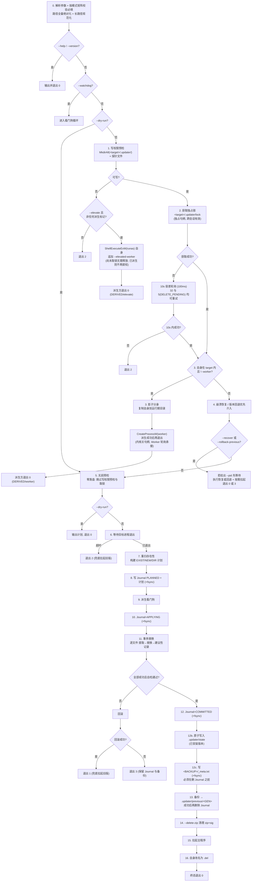

# DESIGN — 流程与边界

> 来源：源文档 §1、§2、§4、§7、§8、§13
> 本文回答：**为什么这么设计、内部状态放哪、启动顺序是什么、预检拒绝什么、安全边界画在哪。**
> 事务与恢复的正确性机制见 `TRANSACTION.md`；进程与运行期副本见 `RUNTIME.md`。

---

## 1. 前提声明：为什么是"原地替换"（本设计的复杂度来源）

行业主流采用的是**稳定入口 + 版本目录**（Omaha 的 Constant Shell + `Application\<version>\`、Squirrel/Velopack 的执行 stub + `current\`、MSIX 的不可变版本包）。在该模式下，"多文件事务 / 半新半旧 / 回滚对账 / 自更新锁"这些问题**从结构上不存在**。

本设计走的是**原地替换**。这不是偏好，而是**约束条件逼出来的选择**：

| 约束 | 说明 |
| :--- | :--- |
| 安装目录内含用户数据 | `config/`、`userdata/`、`logs/` 就在安装目录内（`.updatekeep` 的存在即是证据）。版本目录方案要求把这些移出，**等于让应用配合改布局 + 迁移数据** |
| 安装器不由本工具掌控 | 既有 Go 版即为原地覆盖语义；版本目录方案需重做安装器与首次安装流程 |
| 需要与既有行为连续 | 调用方契约、`.updatekeep` 语义、目录布局均保持不变 |
| 版本目录在用户可写目录下有新攻击面 | 新版目录可被本地进程预先创建/污染，并非纯收益 |

**因此**：事务子系统（Journal / 备份对账 / 三层恢复 / 保留上一版本）是**原地替换的必要成本**，不是过度设计。复杂度约束（`SCOPE.md` §4 / `PLAN.md` §1）即是为了让这份成本**不转化为可靠性风险**。

**退出通道（留档）**：若将来允许改造安装布局（数据目录外移 + 引入入口 stub + 版本目录），可迁移到"稳定入口 + 版本目录"模式，届时**整个事务子系统可被删除**——预计代码量减少过半。这是本设计预留的唯一根本性简化路径。

---

## 2. 内部状态与运行时副本的存放位置

一个自然的想法是：**把这些杂七杂八的目录都挪到 AppData，别污染 target**。结论是**只能部分采纳**，因为有三个不可协商的约束。

### 2.1 三个约束

**约束一：事务三件套必须与 target 同卷（硬约束，不是偏好）**

`ReplaceFileW` 要求**替换文件、被替换文件、备份文件三者同卷**（微软文档明文）。因此：

- 暂存文件与备份目录**必须**落在 target 所在卷；
- 若 target 在 `D:\`（工具/游戏装在数据盘很常见）而 `%LOCALAPPDATA%` 在 `C:\` → **跨卷 → `ReplaceFileW` 直接失败**。这不是性能问题，是功能不可用。

**约束二：Journal / 状态文件必须跨用户可见（可靠性约束）**

`%LOCALAPPDATA%` 是**按用户**隔离的。若把 recovery 锚点放在那里：

- **per-machine 安装 + 多用户**场景下，用户 A 的更新被中断 → journal 落在 A 的 profile；用户 B 启动应用 → **看不到 journal → 不会自愈 → 直接运行半更新的程序**。这正好摧毁"任何时刻断电均可确定性收敛"的承诺；
- 同理，`.updater/state` 是**降级防护的判定依据**。放在用户可写的 profile 里 → **普通用户可自行改写版本号，绕过降级防护**。放进 target 则受与程序本体相同的 ACL 保护。

**约束三：绝不用 Roaming（`%APPDATA%`）**

`%APPDATA%` 在域环境中会被**漫游同步到服务器**。把一份旧版本备份（可能几十上百 MB）放进漫游目录，会拖垮登录与组策略；且**无任何收益**。凡"本机、可丢弃、体积可能较大"的内容一律放 `%LOCALAPPDATA%`。

### 2.2 反例辨析：`%LOCALAPPDATA%` 下那一堆 `*-updater` 目录不能作为反证

一个很有力的经验反驳是：**"Notion、Joplin、LM Studio、Vortex、千问、ChatGLM、Coze 这些成熟项目的 updater 目录都在 `%LOCALAPPDATA%`，所以放那里没问题。"**

这个观察本身完全正确，但它证明的是**另一个结论**。那些目录的语义是**下载缓存**，不是事务状态：

| 事实 | 证据 |
| :--- | :--- |
| 目录名来自 `electron-builder` 的默认配置项 `updaterCacheDirName`，值是 `<应用名>-updater` | `app-update.yml` 的 `updaterCacheDirName` 字段；`@joplinapp-desktop-updater`、`@standardnotesinner-desktop-updater` 这种带 scope 的命名正是该规则处理 scoped 包名的结果 |
| 目录内容 = **下载下来的安装包** + 元数据 | `%LOCALAPPDATA%\<name>-updater\pending\` 下是 `*.exe` 与 `update-info.json` |
| 这些内容**丢了可以重建** | 重下一次即可，**不影响已安装的应用** |

所以它支持的是"把可丢弃的运行时副本与缓存放 `%LOCALAPPDATA%`"——方向本来就是对的；它**不构成**"journal / backup 放 `%LOCALAPPDATA%` 也安全"的论据，因为两类内容的失败代价完全不同：

| | 下载缓存（业界惯例放 LocalAppData） | 事务状态（本设计放 target） |
| :--- | :--- | :--- |
| 丢失后 | 重新下载，用户无感 | **应用可能停在半新半旧状态且无自愈入口** |
| 跨用户可见性 | 不需要 | **必须**（否则另一个用户启动时看不到未完结事务） |
| 可被普通用户改写的影响 | 无（顶多重新下载） | **降级防护被绕过** |

另外两点值得一并说清，避免把"大厂都这么做"读成"没有风险"：

1. **真正替换文件的是 NSIS 安装器，不是 electron-updater。** 该模式把落地工作委托给安装器，而 NSIS 是**原地覆盖、同样没有回滚**。所以在"更新中途失败"这个维度上，它们是**接受风险**（失败了让用户重跑安装器），而不是比本设计更强。本设计选择把这条补上——代价正是需要一个同卷、跨用户可见的事务锚点。
2. **这个模式本身是已知脆弱的。** electron-updater 生态里流传最广的坑之一就是"**必须先清空 `pending` 目录，否则更新会失败**"（多篇实践文章都在给出"每次更新前 `fs.emptyDir(pending)`"的补丁）。缓存目录的语义模糊与残留问题，正是这类目录的典型病症。

> 顺带一提：同一批 Electron 应用还把 `IndexedDB` / `Local Storage` / `GPUCache` 之类塞进 `%APPDATA%`（Roaming），这在企业漫游 profile 环境里是公认的臃肿来源——**恰好印证了约束三**。

**验证方式（可自行核对）**

```powershell
Get-ChildItem "$env:LOCALAPPDATA" -Directory -Filter '*-updater' | ForEach-Object {
  "[$($_.Name)]"
  Get-ChildItem $_.FullName -Recurse -File -ErrorAction SilentlyContinue |
    Select-Object -First 6 -ExpandProperty Name
}
```

若输出以 `pending/`、`*.exe`、`update-info.json` 为主，即证实这些是下载缓存而非事务状态。

### 2.3 结论：按文件类型分工

| 内容 | 位置 | 决定性理由 |
| :--- | :--- | :--- |
| `journal`、`state`、`lock`、`backup/`、`tmp/`、`previous/` | **`<target>/.updater/`**（合并为**单一**隐藏目录） | 同卷（约束一）+ 跨用户可见与防篡改（约束二） |
| 影子 Worker / 看门狗的可执行副本、`.del` 残骸 | **`%LOCALAPPDATA%\<basename>-updater\<hash8>\runtime\`** | 与生态惯例（`<name>-updater`）一致，**一眼可读**；且与下载缓存同样"可丢弃" |
| 日志 | 默认同 base 目录下 `logs\`，`--log` 可覆盖 | 不与被清理工具盯上的 `%TEMP%` 混放；按 target 分目录 |
| 进度文件 | 由应用侧指定（`--progress-file`，**opt-in**）；不指定则不写 | 需应用侧可读，故由应用决定位置；updater 不擅自创建文件 |
| **绝不用** | `%APPDATA%`（Roaming） | 约束三 |

```text
base = %LOCALAPPDATA%\<sanitized(target 目录名)>-updater\<hash8>\
       · sanitized：去除非法字符、截断至 40 字符；不可用时取 "updater-rs"
       · hash8     ：sha256(canonical target) 前 8 个十六进制字符
                     —— 用于区分"同名的不同安装路径"（如 C:\A\MyApp 与 D:\B\MyApp）
       · base 内另放 target.txt 记录完整原始路径（人读/排障）
```

**位置选择必须先校验，不能假定 `%LOCALAPPDATA%` 可用**：`%LOCALAPPDATA%` 在企业环境中同样可能被**文件夹重定向**到网络共享，而**从网络路径运行 exe 可能被策略禁止、且极慢**——这比 `%TEMP%` 的风险更严重。因此运行时目录的选取是一个**有序列 + 校验**的过程（详见 `RUNTIME.md` §4.2），而不是硬编码一个环境变量。

### 2.4 把散落的保留名合并为单一 `.updater/` 目录

早期版本在 target 根下引入了 6 个保留名。合并后：

```
<target>/
├── .updater/                  ← 唯一的内部目录（Hidden + System）
│   ├── journal                     事务日志（仅未完结事务期间存在）
│   ├── state                       已安装版本（稳态下唯一常驻文件）
│   ├── lock                        独占锁（仅运行期存在，DELETE_ON_CLOSE）
│   ├── backup/<GEN>/               事务备份（仅事务期间存在）
│   ├── tmp/<GEN>/                  暂存文件（仅事务期间存在）
│   └── previous/<GEN>/             保留的上一版本（受 TTL 约束）
├── .updatekeep
└── ...（应用文件）
```

**稳态下 target 根的内部增量从 6 项降为 1 项**（`.updater/`，且隐藏）：`journal`/`lock`/`backup`/`tmp` 平时根本不存在，`state` 是唯一常驻文件，`previous/` 可用 `--previous-ttl-days 0` 关闭。

这个改动**同时降低复杂度与降低侵入性**：

| 收益 | 说明 |
| :--- | :--- |
| 保留名规则从 6 条降为 1 条 | 拦截逻辑只剩"`.updater` 精确名 + `.updater/` 前缀"，**漏拦截的机会显著下降**（I9 更易保证） |
| GC 只扫一个目录 | 陈旧代清理逻辑收敛到单点 |
| 目录属性只设一处 | Hidden + System 只需设 `.updater/` |
| 调用方清理白名单只需加 1 项 | 布局变化提示从 5 条路径降为 1 条 |
| 无迁移负担 | **本工具尚未实施**，没有存量数据目录需要兼容——现在改是零成本 |

### 2.5 明确否掉的两种方案

| 方案 | 否掉理由 |
| :--- | :--- |
| 事务目录放 `%LOCALAPPDATA%` | 违反约束一（跨卷直接失败）与约束二（跨用户不可见、状态可被普通用户篡改） |
| 事务目录放 target 的**同级**目录（`<target>\..\<App>.updater\`） | 同卷满足，但需要**父目录写权限**。`C:\Program Files\MyApp` 的父目录通常需要管理员权限，而写入 target 本身可能不需要——于是会出现"能更新但因建不了目录而失败"的荒谬情形。若为此加"先试同级、失败再退回"的分支，等于在**最关键的子系统**上引入两条路径，违反"禁止第二套实现" |

---

## 3. 术语

| 术语 | 含义 |
| :--- | :--- |
| **主实例** | 用户直接启动、未带任何内部标记的 updater 进程 |
| **Worker** | 运行期目录中的影子工作副本（`--worker`），实际执行更新 |
| **看门狗** | 运行期目录中的恢复副本（`--watchdog`），监视 Worker 是否正常收尾 |
| **运行期目录** | `<base>\runtime\` = `%LOCALAPPDATA%\<目标目录名>-updater\<hash8>\runtime\`，存放 Worker/看门狗副本与残骸 |
| **派生方 / 终态进程** | 派生方 = 交棒后退出者（其退出码不承载真实结果）；终态进程 = 实际决定结果者 |
| **事务** | 从 Journal 写入 `PLANNED` 到 `COMMITTED` 的一段文件改动区间 |
| **GEN（事务代号）** | 全局唯一字符串 `<yyyymmddThhmmss>-<pid>`，用于隔离备份与临时目录 |
| **内部保留名** | **一项目录**：`<target>/.updater/`（其内含 `journal` / `state` / `lock` / `backup/` / `tmp/` / `previous/`）。包内元数据 `updater.manifest` 永不落盘。<br/>**拦截规则**：**精确名 `.updater`** 加 **`.updater/` 前缀**，大小写不敏感——精确名不可省，否则包内裸文件 `.updater` 会与同名目录争抢 |
| **目标进程** | `--pid` 指定的、更新前需等待其退出的主程序 |

---

## 4. 启动序列（唯一权威流程）

### 4.1 三条铁律

1. **一次性标记**：`--worker`、`--elevated-worker`、`--watchdog` 出现即代表该派生已发生，**绝不再派生同类进程**，杜绝无限递归。**提权分支同样受本铁律约束**：其判定条件是"**非任何派生标记**"而**不是** `!--worker`——否则提权后仍不可写时会反复 `runas` 自身，形成**无限 UAC 递归**（`RUNTIME.md` §2.1）。
2. **顺序固定**：`取锁 → 提权 → 分身 → 恢复 → 预检 → 等待 → 计划落盘 → 看门狗 → 事务 → 拉起`。提权必须早于分身（UAC 交互不能在多级临时副本中反复弹出）；恢复必须早于预检（自愈现场优先于新事务）。
3. **先落盘计划，再改动任何文件**：`EXIST`/`NEW`/`DIR` 集合必须在第一个文件动作之前 fsync 完成——这是崩溃窗口（"动作已完成但记录未落盘"）得以封闭的根基。

### 4.2 流程图



> 流程图修正记录：① 原文档 mermaid 中节点 ID `P` 被定义两次（"写权限预检"与"派生看门狗"），mermaid 取**最后一次**标签，渲染后"写权限预检"会显示成"派生看门狗"、两条语义被合并——现改为 `PROBE` / `WD` / `LCK` 三个独立 ID；② `--dry-run` 的短路**提到取锁之前**（与"零落盘"一致）；③ 提权守卫改为"非任何派生标记"（原为 `!--worker`，会漏掉 `--elevated-worker`）。

### 4.3 关键实现约束

- **顺序调整：写权限预检置于取锁之前。** 理由：
  - 锁文件位于 `.updater/` 内，而创建该目录本身就需要 target 的写权限——若先取锁，"目标不可写"会表现为锁错误，**提权分支永远不会被触发**；
  - 预检通过后才取锁，使"提权"分支**不需要先释放锁**（提权发生在持锁之前），**从流程中彻底移除了早期的"`CloseHandle(锁)` 再派生"这一步**，相应地把顺序歧义一并消掉；
  - 并发影响：两个实例可能同时预检（各自创建 `.updater/` 与随机名临时文件，幂等无冲突），随后在取锁处正常互斥。
- **写权限预检的形态**：`MkdirAll(<target>/.updater)` → 在其内创建随机名文件 → 删除。任一步失败即判"不可写"。**同时验证了目录创建与文件写入两种能力**，且不产生任何根级临时文件（预检成功后 `.updater/` 本就该存在，稳态无多余残留）。`--dry-run` 跳过本步**与取锁**（保持"零落盘"语义：预检会创建 `.updater/`、取锁会写入 `lock` 文件，两者都与零落盘冲突）。
- **锁为独占锁文件**：`CreateFileW(<target>/.updater/lock, GENERIC_READ | GENERIC_WRITE, dwShareMode = 0, ..., OPEN_ALWAYS, FILE_ATTRIBUTE_HIDDEN | FILE_FLAG_DELETE_ON_CLOSE, NULL)`，句柄持有至进程退出。
  - 取代 `Local\` 命名互斥量：后者按**会话**隔离，快速用户切换下同一目录可能被两个会话同时更新；锁文件在 target 内，**跨会话有效**，且不需要 `SeCreateGlobalPrivilege`（标准用户即可）。
  - `FILE_FLAG_DELETE_ON_CLOSE` 使文件在句柄关闭时自动消失；进程被强杀时由内核关闭句柄，**因此不会留下陈旧锁**（这是选择锁文件而非互斥量的另一个理由）。
  - **打开失败的两种码都必须进轮询**：`ERROR_SHARING_VIOLATION(32)` 是"被另一个实例持有"；`ERROR_ACCESS_DENIED(5)` 在 DELETE_ON_CLOSE 语义下还包含"上一个持有者刚关闭句柄、目录项处于 **delete pending**"这一瞬态（Windows 把内核的 `STATUS_DELETE_PENDING` 固定映射为 5）。两者**一律按可重试处理**，绝不能因为"5 看起来像权限问题"就直接判死退出。用例 `lockfile_delete_pending_retry`。
  - **为什么不改成"普通独占锁文件"**：去掉 DELETE_ON_CLOSE 后锁文件会**永久残留**（0 字节），直接打破"稳态只有 `state`"的承诺与用例 `single_internal_dir_steadystate`；且陈旧锁文件一旦带上当前用户不可写的 ACL，会把**永久性权限失败伪装成暂时性冲突**。保留 DELETE_ON_CLOSE 时，上述瞬态只影响毫秒级窗口，且由"5 也可重试"完全覆盖。
- **所有角色**（主实例 / Worker / 看门狗 / `--recover` / `--rollback-previous`）走**同一个** `lockfile::acquire`，失败均进入 10s 容差轮询（100ms 间隔），**32 与 5 同等对待**。超时处置：主实例与 Worker → 退出 2；`--recover` / `--rollback-previous` → 退出 2（持有者会自行执行 L3 恢复，本次不动作）；看门狗 → 区分"Worker 已退出"与"安全超时"两种情形后处置（`TRANSACTION.md` §1.4）。
- **锁的释放顺序**：**不再"先关闭锁句柄再派生 Worker"**。改为：主实例**先 `CreateProcessW(Worker)` 成功**，随后主实例正常退出，锁句柄由内核关闭（DELETE_ON_CLOSE 下锁文件同时消失）；Worker 依靠**既有的 10s 容差轮询**承接锁。理由：原设计在两次调用之间留下 **50–300ms 的无主窗口**，外部实例可在此期间抢先取锁（两份评审均独立指出）。见流程图 I1 与 `RUNTIME.md` §3。提权路径本来就发生在取锁之前，无此问题。
- **恢复/回退路径与运行中的目标进程**：`--recover` 与 `--rollback-previous` 若给出 `--pid > 0`，**先等待目标进程退出再动作**；未给出时若回滚撞 `32` 且重试耗尽 → 按"**稍后重试**"处理（保留 Journal、退出 3），**不得据此判定现场损坏**（真实施工现场是健康的，只是应用还占用着文件）。
- Worker **不再执行提权判定**（写权限已在主实例对 target 探测通过）。
- `--wait-derived` 为真且自身位于 target 内 → 强制不等待 + WARNING（`CONTRACT.md` §2.2）。

---

## 5. 无损预检（全部前置）

**原则**：关闭用户正在运行的程序是有严重业务副作用的动作。所有静态规则、密码学验签、格式校验必须在其之前全部完成，预检失败时用户程序**完全不受打扰**。

### 5.1 单句柄锁定

预检与事务**必须使用同一个已打开的文件对象**，否则"验签通过"与"实际解压的内容"之间存在 TOCTOU 窗口，签名这一安全边界形同虚设。

```text
1. h = CreateFileW(<abs zip>, GENERIC_READ, FILE_SHARE_READ, NULL,
                   OPEN_EXISTING, FILE_ATTRIBUTE_NORMAL, NULL)
     · 共享模式只给 FILE_SHARE_READ——不共享写、不共享删除
       ⇒ 窗口期内任何进程都无法改写/替换/删除该文件，从根上关闭 TOCTOU
     · 打开失败（含已被独占占用）→ 退出 2
2. 签名验证：以 h 顺序读取全部字节（100% 覆盖）
3. SHA256（若提供）：可在同一遍读取中一并计算
4. SeekFile(h, 0) → 用同一 h 构造 ZIP 读取器，解析中央目录
5. 事务阶段复用同一 h 解压（SeekFile 定位各条目数据区）
6. `--delete-zip` 前**显式关闭 h**（否则因无 FILE_SHARE_DELETE 而删除失败）
```

`--sig` 文件同样以共享读方式打开一次并读取完毕即可（其内容一次性载入内存，无 TOCTOU 窗口）。

### 5.2 预检检查清单（顺序固定）

| 序 | 检查 | 失败退出码 | 要点 |
| :--- | :--- | :--- | :--- |
| 1 | 单句柄打开 zip | 2 | §5.1 |
| 2 | 签名验证 | 2 | §6，**先于一切文件解析** |
| 3 | SHA256（若提供） | 2 | 同一次读取 |
| 4 | ZIP 中央目录解析 | 2 | 压缩方法约束见下 |
| 5 | `--strip` 剥离 + 重复条目拦截 | 2 | **先 strip、再归一化、再大小写不敏感去重**（§5.4） |
| 6 | Zip Slip 校验（字符串层） | 2 | §7.3 |
| 7 | **包清单解析** `updater.manifest` | 2 | §5.4。清单内容已包含在签名覆盖范围内 |
| 8 | **版本与降级校验** | 2 | §5.4。读 `.updater/state` 比较；低于当前版本拒绝 |
| 9 | 包内 EXE/DLL Authenticode（可选） | 2 | §6.4，仅当传 `--verify-authenticode` |
| 10 | 保护清单过滤 | — | `.updatekeep` + `--keep` + 内部保留名（§7.1） |
| 11 | `--require` 完整性 | 2 | **存在即可**，允许 0 字节 |
| 12 | 物理路径逃逸校验（分级） | 2 | §7.4：逃逸即拒绝；解析失败仅 WARNING |
| 13 | zip bomb **声明值预筛** | 2 | 见下 |
| 14 | 磁盘可用空间 | 2 | 见下 |
| 15 | `--dry-run` 输出计划 | 0 | 到此结束 |

**压缩方法约束**：仅接受 `method ∈ {0 (Store), 8 (Deflate)}` 且未加密（无 general purpose bit 0 / bit 6）。其余一律拒绝——既避免引入未被使用的解码路径（bzip2/zstd/lzma/AES），也是体积控制的一部分。

**zip bomb 双层防护**

| 层 | 依据 | 触发时 | 退出码 |
| :--- | :--- | :--- | :--- |
| **预筛（预检阶段）** | 中央目录**声明值**：累计 uncompressed size、单条目声明比值 | 超过 `--max-uncompressed`；或单条目声明比值 > **2000:1** → **立即拒绝** | `2`（零改动） |
| **权威（事务阶段）** | **流式实测累计字节数**（唯一权威量） | 超过 `--max-uncompressed` → 中止 → 回滚 | `1`（已改动，已回滚） |

声明值不可信（可被构造为谎报），但代价极低，可作为廉价的早退；**权威判定必须在流式解压时进行**——只有那时才能得到真实字节数。两层都保留，测试矩阵对两层分别断言。

> **比值阈值的取值依据（重要）**：Deflate 的理论压缩比上限是 **1032:1**（一次匹配最多输出 258 字节，长度码与距离码各至少 1 bit，故 8 bit 输入最多对应 1032 字节输出；见 zlib 官方技术说明、PNG 规范书与 zlib 作者 Mark Adler 的答复），并且**"一兆字节的零"这类合法数据实测即可逼近 1000:1**。因此 **1000:1 阈值落在物理上限之下**，会误杀含大段重复字节的**合法包**。处置：① 比值门槛抬到物理上限之上（**2000:1**），只保留"廉价早退"作用；② **权威防线只留绝对字节上限 `--max-uncompressed`**——它才对应磁盘/内存的真实风险。

**磁盘空间预检**

```text
需要空闲 = Σ(待写文件的解压后大小) + max(单个待写文件的解压后大小) + 64 MiB
```

理由：备份是同卷 rename（不额外占空间）；逐文件串行替换使任一时刻只多一个大文件；`+64 MiB` 为 Journal/日志/元数据余量。用 `GetDiskFreeSpaceExW` 查询 target 所在卷。

> **保留上一版本不增加峰值占用**：备份与保留目录都是**同卷重命名**，旧文件本就占用其空间；新版内容的空间需求已包含在 `Σ(待写文件的解压后大小)` 中。因此该公式无需调整——这一点在设计上是刻意的，避免"新增能力"偷偷改变资源约束。

### 5.3 版本号比较语义

| 规则 | 内容 |
| :--- | :--- |
| 语法 | 仅接受 `主.次.补` 或 `主.次.补-预发布`；数字段为十进制整数（禁止空段、禁止非数字段）；**不支持** `+build` 元数据与省略补段的 `1.2` 形式——遇到即拒绝（退出 2），不做"尽力猜测" |
| 数字段比较 | 1→3 段逐段**数值**比较（`1.10.0 > 1.9.0`），绝不用字符串比较 |
| 缺段 | 数字段不足 3 段的输入按语法规则**已拒绝**，因此不存在"补 0"的模糊区间（`1.2` 不会与 `1.2.0` 等价比较） |
| 预发布后缀 | 全部数字段相等时：**有后缀者 < 无后缀者**（`1.5.0-beta.1 < 1.5.0`） |
| 两侧都有后缀 | 按 `.` 分段逐个比较：全数字段按**数值**比较，含字母段按 **ASCII 字典序**，**数字段 < 字母段**；前缀全部相同者，段数少的小 |
| 定位 | Tier 1（只读判定，最坏结果只是"拒绝"），必须有独立单元测试覆盖上表全部边界 |

> 采用"拒绝而非宽容解析"的理由与 Journal 解析一致：**版本比较是降级防护的判定依据**，此处宽容解析等于给"重放旧包"留后门。

### 5.4 包清单与安装状态

#### 5.4.1 版本与降级校验

**问题**：早期设计完全不读版本号。因此一个**更旧的、仍带有效签名的包**可以被重放，把应用退回存在已知漏洞的版本；供应链侧的旧版回退攻击同理。

```text
输入：
  pkg_ver    = 包清单 updater.manifest 的 version（已由签名覆盖）
  cur_ver    = <target>/.updater/state 的 version（唯一来源）
  min_ver    = --min-version（可选，调用方设定）
  min_from   = 包清单的 MIN_UPGRADABLE_FROM（可选，打包侧声明）

判定（顺序执行，任一拒绝即退出 2）：
1. 清单缺失              → 跳过本组校验 + WARNING（保持对无清单旧包的兼容）
2. 版本号格式非法        → 拒绝（语法见 §5.3）
3. pkg_ver < min_ver     → 拒绝（供应链回退防护）
4. cur_ver < min_from（仅当 cur_ver 已知且清单声明了该字段）
                         → 拒绝（版本跳跃过大：该包未声明支持从如此旧的版本直接升级）
   ※ 这是 MIN_UPGRADABLE_FROM 的唯一消费者。
   ※ cur_ver 未知时本条件无法判定 → 不拒绝、记 WARNING（"无证据不拒绝"）
5. pkg_ver < cur_ver     → 拒绝，除非给出 --allow-downgrade
6. pkg_ver == cur_ver    → 允许 + WARNING（支持"同版本修复重装"）
7. pkg_ver > cur_ver     → 通过
8. cur_ver 未知（状态文件缺失/损坏）→ 允许 + WARNING，并在提交时补写状态
```

#### 5.4.2 包清单 `<zip 根>/updater.manifest`

文本格式，一行一条，**随 zip 一起被签名覆盖**（解析复用 §5.1 的同一文件句柄）：

```
MANIFEST:1
VERSION:1.5.0
MIN_UPGRADABLE_FROM:1.0.0
FILE:app.exe|1048576|3b1f...（64 位十六进制 sha256）
FILE:data\icudtl.dat|5242880|9c2a...
DIR:plugins\newdir
```

- `VERSION` / `MIN_UPGRADABLE_FROM`：三点式版本号。后者的含义是"**本包要求的最低可升级起始版本**"，即 `cur_ver < MIN_UPGRADABLE_FROM` 时拒绝安装；
- `FILE:<rel>|<size>|<sha256>`：**逐文件**哈希与大小，用于提交前自检；
- `DIR:<rel>`：纯目录条目（无需哈希）；
- 该文件**不落盘**（进入内部保留名，作为"包内元数据"）；
- 由打包脚本生成（见 `TESTING.md` §4）；缺失时退化为 Go 版行为（全部哈希校验改为仅 `--require` + PE 头）。

**`<rel>` 的路径基准与规范化（缺了这段会导致跨平台打包的包必然自检失败）**

`FILE:` / `DIR:` 的相对路径以**包内 zip 条目路径**为基准——分隔符按 zip 规范为 `/`，且是**剥离 `--strip` 之前**的路径。updater 侧必须按下列三条处理：

1. **归一化**：解析时把 `/` 与 `\` 统一为 `\`，并以**大小写不敏感**方式比对。打包侧可能在 Linux CI 上执行（PowerShell `[IO.Path]::GetRelativePath` 在 Linux/pwsh 下产出 `/`），而 Windows 侧拼接用 `\`——不归一化就会出现"清单里的条目在磁盘上找不到"，进而**误触发全量回滚**。
2. **strip 映射**：与磁盘目标路径比对（含提交前哈希复核）时，**对清单路径施加同一 `--strip` 规则**后再比较；映射后落到 target 之外的条目视为无效条目（拒绝，退出 2，而不是"跳过检查"）。
3. **去重与拦截的顺序**：先施加 strip、再归一化，然后做大小写不敏感去重与内部保留名拦截。顺序颠倒会让 `A/b.dll` 与 `a\B.DLL` 这类变体漏过去。

#### 5.4.3 安装状态 `<target>/.updater/state`

由 updater 自己写入，**唯一**的"当前已安装版本"来源：

```
STATE:1
VERSION:1.5.0
GEN:20260914T161230-18422
INSTALLED_AT:2026-09-14T16:12:31+08:00
```

- 写入方式：临时文件 + `sync_data()` + `MoveFileExW(REPLACE_EXISTING)` **原子替换**（Tier 0 写法）；
- 写入时机：`COMMITTED` 之后；
- 崩溃补写：因 `TOVER` 已在 `PLANNED` 阶段 durable，恢复层在 `COMMITTED` 分支中**补写**该文件，消除"目录是新版、状态记旧版"的窗口；
- 属内部保留名，绝不随包更新，也绝不删除。

---

## 6. 签名闭环（fail-closed）

### 6.1 公钥内嵌与轮换

```rust
/// 发布公钥在编译期固化。空列表表示本构建不要求签名（仅限内部/调试构建）。
/// 列表支持"过渡版本同时接受新旧签名"，从而实现密钥轮换（见下）。
pub const RELEASE_PUBLIC_KEYS: &[[u8; 32]] = &[
    [/* 当前主密钥 */],
    // [/* 轮换期临时保留的旧密钥 */],
];

/// 是否允许运行期通过 --allow-unsigned 跳过验签。发布构建必须为 false。
pub const ALLOW_UNSIGNED_AT_BUILD: bool = false;
```

**验签语义**：包的 `.sig` 只需能被**列表中任一**公钥验证通过即可。

> **⚠️ 发布前置（阻断项）**：当前构建的 `RELEASE_PUBLIC_KEYS` 为**空**，即 `unsigned-build`——**签名安全边界为 0**，仅可用于内部与调试。正式对外发布前，必须填入真实发布公钥（并走完下面的轮换流程）；否则"签名 fail-closed"这一承诺在实机上不成立。

**密钥轮换流程（写入运维规范）**

| 步 | 动作 |
| :--- | :--- |
| 1 | 生成新密钥对；用**旧私钥**签发一个"过渡版本"，该版本的 `RELEASE_PUBLIC_KEYS` 同时含**新旧**公钥 |
| 2 | 用旧私钥签发该过渡版本（老客户端才认得它）→ 发布 |
| 3 | 待客户端普遍升到过渡版本后，后续版本可只用**新私钥**签发，公钥列表收缩为新密钥 |
| 4 | 过渡期需覆盖"最慢的客户端"，因此**保留旧公钥的版本至少发布一轮** |

若跳过此流程直接换密钥，**所有旧客户端将永久无法再接受更新**（只能让用户重装）——这是必须写进文档的操作风险。

> `--version` 输出公钥指纹（取列表首项的前 8 字节十六进制），便于现场核对"客户端信的是哪把钥匙"。

### 6.2 策略

| `RELEASE_PUBLIC_KEYS` | 行为 |
| :--- | :--- |
| 非空 | **签名强制**。缺 `.sig` → 退出 2；签名不能被列表内任一公钥验证 → 退出 2。**不存在任何运行期绕过路径** |
| 空 | 不验签，启动时输出 WARNING，并在 `--version` 中标记 `unsigned-build` |

`--allow-unsigned`：仅当 `ALLOW_UNSIGNED_AT_BUILD == true` 时才被识别；否则**忽略并记录 WARNING**（不报错，保证跨版本脚本不因多传参数而失败）。

> 早期设计中的"若存在签名配置，签名验证作为最高等级防线"是 fail-open：攻击者删除 `.sig` 即绕过。签名验证的价值全部来自**不可绕过**。

### 6.3 签名载体与验证范围

- 路径：`--sig` 指定，或默认 `<zip 路径>.sig`；
- 格式：64 字节 Ed25519 原生二进制，或 128 字符 Hex（自适应识别）；
- 覆盖范围：zip 文件的 **100% 原始字节**；
- **验证范围与解压范围的一致性由 §5.1 的单句柄锁定保证**——这是签名从"形式校验"变成"真实安全边界"的前提；
- 用途区分：签名是**真实性**防线（不可伪造）；`--sha256` 是调用方传入的**完整性**防线（同侧可篡改）。二者不可互相替代。

### 6.4 Authenticode 立场（Phase 7 搁置）

**我们签的是"包"，不是"二进制"。** 这两件事在 Windows 上是不同的信任通道：

| 通道 | 防的是什么 | 谁在看 |
| :--- | :--- | :--- |
| 包签名（Ed25519） | 包被篡改、被替换、来源不可信 | 只有我们自己 |
| **Authenticode（代码签名）** | 二进制来源与完整性 | **Windows SmartScreen、杀毒软件、企业策略** |

Velopack 的官方文档直白指出"强烈建议代码签名，否则应用可能被标记为病毒"。而**本工具会替换可执行文件**——正是杀软与 SmartScreen 的重点观察对象。因此：

1. **要求（构建侧，非代码）**：`updater.exe` 自身、以及更新包内的所有 EXE/DLL，都应使用 **Authenticode 代码签名**。这一步不做任何代码改动，但**直接影响用户能否顺利更新**；应写入打包流程与发布检查单。
2. **可选（代码侧，纵深防御，Phase 7 搁置）**：`--verify-authenticode <publisher-substring>` 会用 `WinVerifyTrust` 校验包内**每个 EXE/DLL** 的 Authenticode 签名有效，且签名者主体名包含给定子串（如 `CN=YourCompany`）。搁置原因：**无代码签名证书，条件不具备**；当前构建对该参数一律 fail-closed 拒绝（退出 2），不静默忽略。
   - 编译期开关：cargo feature **`authenticode`（默认关闭）**，避免未签名阶段白白增加体积与依赖；
   - 运行期开关：不传 `--verify-authenticode` 时不生效；
   - 定位：**纵深防御**，不替代包签名（包签名才是主边界）。用途是"万一包的私钥泄露，攻击者仍无法用未签名二进制替换你的 EXE"；
   - 属 Tier 1（只读判定）：失败 → 拒绝并退出 2。

---

## 7. 保护语义与路径安全

### 7.1 三层保护（优先级从高到低）

| 优先级 | 来源 | 说明 |
| :--- | :--- | :--- |
| 1 | **`<target>/.updater/`（整棵子树） + 裸 `.updater`** | **唯一的落盘保留名**：`.updater/` 及其下全部内容禁止被写入、覆盖或删除，也不随包更新。<br/>**包内元数据**（只读取、**永不落盘**）：`updater.manifest`。<br/>**不可被 `--keep` 取消**，planner 与 apply **两处**拦截（纵深防御，I9）。<br/>**拦截规则为两条**：① **精确等于 `.updater` 的条目**；② **以 `.updater/` 为前缀的条目**。两条都**大小写不敏感**。<br/>①不可省——否则包内一个**裸文件** `.updater`（不带斜杠）不会被前缀规则命中，落盘时与同名目录争抢，报 `ERROR_ACCESS_DENIED(5)` 并触发整包回滚；而它又不是"攻击"，只是一个命名冲突，用一条精确匹配就能干净消灭 |
| 2 | **updater 自身路径** | 仅当当前进程的可执行文件**确实位于 target 内**时生效 |
| 3 | **`.updatekeep` + `--keep`** | 用户保护清单 |

**关于第 2 条的重要变化**：Go 版中"自身在 target 内 ⇒ 该路径被保护"意味着**它永远无法被更新**。本设计起，正常工作流中实际执行的是**运行期目录**中的 Worker，**自身不在 target 内**，因此 `target/updater.exe` 可被 zip 正常覆盖——**这就是自更新能力的来源**。第 2 条保留为兜底不变量：仅在分身机制异常（Worker 仍在 target 内运行，例如运行期目录回退到 `%TEMP%` 且 target 恰在 `%TEMP%` 下这类退化情形）时命中，此时保护它是唯一正确选择。

### 7.2 `.updatekeep` 语义（与 Go 版完全一致）

- 位置 `<target>/.updatekeep`，随应用打包；`#` 开头为注释，空行忽略；
- 以 `/` 或 `\` 结尾 ⇒ 保护整棵子树（如 `userdata/`）；
- 含 `*?[` ⇒ glob，匹配完整相对路径、basename 或任一上级目录；
- 不含通配符 ⇒ 精确匹配该文件，或作为目录前缀（`config` 命中 `config/x.json`）；**故意不做 basename 匹配**，避免 `config` 误伤 `config.ini`；
- 大小写不敏感（NTFS 语义）；
- 命中即**既不覆盖也不删除**；包内不存在于 target 的文件一律不删除；
- `.updatekeep` 自身亦受保护。

### 7.3 路径安全

**Zip Slip（字符串层）**

- 拒绝以 `/` 或 `\` 开头的绝对路径；
- 拒绝盘符形式（第 2 字符为 `:`）；
- 归一化后拒绝 `..` 及 `../` 前缀；
- 归一化后二次确认 `dst` 落在 target 内（大小写不敏感前缀比对）。

**物理路径逃逸（内核层，防 Junction / Symlink）**

- 对每个待写文件的**父目录**：`CreateFileW(dir, 0, FILE_SHARE_*, NULL, OPEN_EXISTING, FILE_FLAG_BACKUP_SEMANTICS, NULL)` 取目录句柄；
- `GetFinalPathNameByHandleW` 取系统解析后的**规范物理路径**；
- 比对：必须严格位于 target 的规范物理路径之下；
- 父目录尚未存在时**向上回溯到最近的存在祖先**校验，并在 `MkdirAll` 之后对新建目录再校验一次；
- 比对前双方统一规范形式（去 `\\?\` 前缀、统一分隔符、大小写不敏感）。**判定分级见 §7.4**。

**长路径**

- 所有传给**裸 Win32 API**（`CreateFileW` / `ReplaceFileW` / `MoveFileExW` / `GetFinalPathNameByHandleW` / `CopyFileExW`）的路径必须经 `to_verbatim()`：先去除已有的 `\\?\`，再对驱动器绝对路径加 `\\?\`、对 UNC 加 `\\?\UNC\`；
- **`to_verbatim()` 的前置规范化（四条缺一不可）**：`\\?\` 前缀的语义是"**关闭 Win32 的路径解析**"——它不做分隔符转换、不解析 `.` / `..`、不裁剪尾随空格与点。因此必须在加前缀**之前**完成：
  1. **强制绝对化**（相对路径在 verbatim 语义下不会被解析）；
  2. **分隔符统一为 `\`**（zip 条目一律以 `/` 分隔，把含 `/` 的路径直接当 verbatim 路径使用行为不确定）；
  3. **消除 `.` 与 `..` 段**（否则它们会原样送进内核，而不是被解析掉——这也会让 §7.3 的字符串层防越界失效）；
  4. **去掉尾随空格与尾随点**（否则会产生"看起来同名却打不开"的路径）；
- **保持单一路径**：不要"按路径长度决定加不加前缀"。条件化会在 Tier 0 内引入**两条行为路径**（违反"禁止第二套实现"），而且把"路径正确性"变成"与长度相关的不确定行为"——与确定性取向相反。Phase 0 追加实测项来消化风险：`\\?\` 前缀下 `ReplaceFileW` / `MoveFileExW` / `CopyFileExW` / `GetFinalPathNameByHandleW` 的实际表现（`PLAN.md` §3），失败时也只允许"在同一个函数内为该 API 记录例外"，不允许出现第二个路径构造函数；
- Rust `std::fs` 会自动加前缀，**不可**依赖它处理裸 Win32 调用；
- 同时提供 `longPathAware` manifest 声明。

### 7.4 物理路径校验的分级策略

早期设计的规则是"任一侧规范化失败即判不通过（fail-closed）"。**这过度了**：解析失败只说明"该文件系统不支持该查询"（网络盘、个别第三方 FS），**不构成越界证据**；而代价是这些环境下**完全无法更新**。同时，若安装目录本身对当前用户可写，本地攻击者已具备等价权限，该防护在此情形下的边际收益有限。

改为**按证据强度分级**：

| 情形 | 判定 | 理由 |
| :--- | :--- | :--- |
| 解析**成功**，且规范物理路径**逃出 target** | **拒绝**，退出 2 | 这是真正的攻击特征（Junction/Symlink 越界），保持 fail-closed |
| 解析**成功**，路径在 target 内 | 通过 | — |
| 解析**失败**（文件系统/网络盘不支持） | **WARNING + 继续** | 无越界证据。字符串层校验（§7.3）已通过，父目录亦已确认存在于 target 内 |
| `--strict-path-check` 已指定 | 解析失败也**拒绝** | 高安全场景的显式选择；由调用方按环境决定 |

**设计立场**：**有越界证据就拒绝，绝不"看到可疑就放行"**。改变的是"无证据"时的默认取向——从"拒绝"改为"记录并继续"，因为"不支持的功能"与"攻击"是两回事，把它当攻击处理会让自己在合法环境里不可用。

**残余风险的如实记录**：在解析失败且目标位于**用户可写**位置时，理论上存在"本地同权限进程预置 reparse point"的窗口。这一风险与"本地同权限进程直接改写 target 文件"同级——**攻击者已无需绕过本工具**。因此该降级是可接受的；需要更高保证的场景请开启 `--strict-path-check`。
