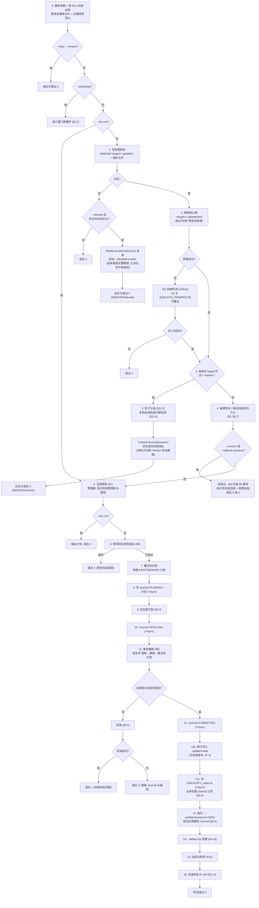

# Rust 版极简 Windows 自动更新器 (updater-rs) 架构设计 v4.3

> 文档版本：v4.3.0 (Implementation Baseline)
> 日期：2026-09-14
> 基线：`rust-updater-architecture-design-v4.2.md`（v4.2 中未被本版修订的正文继续有效；v4.2 原文件已备份至 `temp/backups/`）
> 输入：① v4 的第二轮外部评审（H1–H4 / M1–M5 / L1–L6，已在 v4.1 落地）；② 主流 updater 先例调研与设计再审视（`updater-prior-art-and-design-recheck.md`）；③ **v4.2 的三方独立评审合并结果（见 §0.5）**
> 状态：**实现基线（唯一权威版本）**
>
> **v4.3 与 v4.2 的关系**：本版只做"评审合并后的修订"，**不改变任何架构决策**（事务模型、三层恢复、签名边界、锁语义、路径安全均原样保留）。变更分三类：**补规格缺口 / 收敛已判定为高风险的子能力 / 修正文档内部矛盾与残留文本**。所有变更逐条列在 §0.5，含三处**与评审意见不同的技术裁定**。

---

## 0. 本版处理说明

### 0.1 v4.2 相对 v4.1 的改动总览（历史记录）

> 本节与 §0.2–§0.4 是 v4.2 的历史改动说明，保留备查。其中凡把 `--rollback-previous`、`--rm-shutdown`、`--splash` 描述为"首发能力 / 可选参数"的表述，**一律以 §0.5 的 v4.3 状态为准**（前者暂缓、后两者已删除）。

v4.1 的工程质量已高于行业同类工具。v4.2 只做三类改动：**补 3 项 P0 缺口 / 降 2 处过度设计 / 固化"复杂度不换可靠性"的约束**。

#### A. 新增能力（来自先例调研的缺口）

| 编号 | 内容 | 理由（行业对照） | 落户章节 |
| :--- | :--- | :--- | :--- |
| **N1** | 包清单 `updater.manifest`（`version` / `min_upgradable_from` / 逐文件 sha256）+ 安装状态 `.updater/state` | 我们此前**完全没有版本概念**，无法阻止"重放一个更旧的合法签名包"。Tauri 有版本比较表、MSIX 默认阻止装旧版本、Omaha 有版本目标 | §3.1 §7.3 §6.4 |
| **N2** | 降级防护：`version < 当前` 默认拒绝，`--allow-downgrade` 放行；同版本允许 + WARNING | 同上 | §3.1 §7.2 |
| **N3** | **保留上一版本**：提交后 `<BACKUP>` 转为 `.updater/previous/<GEN>/`（默认 TTL 7 天），新增 `--rollback-previous` | Squirrel 明文"保留当前 + 上一版，**目的是回滚**"。v4.1 在提交时把旧文件全删，导致"新版一启动就崩则无路可退" | §6.6 §6.7 |
| **N4** | Restart Manager **诊断**（32/5 时列出占用者）+ 可选 `--rm-shutdown` | 这是 Windows 解决"文件被占用"的**标准 API**（MSI/VS/Office 均使用）。v4.1 遇 32 只能盲重试，日志中无占用者信息 | §9.2 |
| **N5** | Authenticode 立场：updater 自身与 payload 二进制应签名；可选 `--verify-authenticode <publisher>` 做纵深校验 | 我们签的是**包**不是**二进制**。而"会替换可执行文件的程序"正是杀软与 SmartScreen 的重点观察对象 | §8.4 |
| **N6** | 进度可见：`--progress-file <path>` + 应用侧"正在更新"提示；可选 `--splash` | 主流方案（Squirrel / Omaha / Velopack）都有进度反馈；v4.1 是完全无声的，大包 + 杀软扫描时用户会以为程序崩了 | §12.1 |
| **N7** | 跨会话并发：由 `Local\` 互斥量改为 `<target>/.updater/lock` 独占锁文件 | `Local\` 按会话隔离，快速用户切换下同一目录可能被两个会话同时更新 | §4 |
| **N8** | 密钥轮换：公钥改为**列表**，过渡版本同时接受新旧签名 | v4.1 换密钥即导致所有旧客户端永久失联 | §8.1 |
| **N9** | 与 `RegisterApplicationRestart` 的协同约定写入集成契约 | 避免"系统重启"与"updater 拉起"重复启动 | §5.4 §12 |
| **N10** | 内部状态合并为**单一隐藏目录** `<target>/.updater/` | 原设计在 target 根散落 6 个保留名。合并后**拦截规则从 6 条降为 1 条**（漏拦截机会下降）、GC 只扫一处、调用方白名单只需 1 项——**同时降低复杂度与降低侵入性** | §1.2 |
| **N11** | 运行时副本（Worker/看门狗/`.del`）与日志从 `%TEMP%` 迁至 `%LOCALAPPDATA%\updater\` | 避免被存储感知/清理工具回收；"复制自身到临时目录再 detached 运行"是恶意软件行为特征，对杀软极不友好 | §1.2 §11.6 |

> **关于"把内部目录放到 AppData"这一设想的评估结论**：**只能部分采纳**——运行时副本与日志可以（且应当）移出；**journal / state / lock / backup / tmp / previous 必须留在 target 内**，因为 ① `ReplaceFileW` 硬性要求同卷（target 在 `D:` 而 `%LOCALAPPDATA%` 在 `C:` 时直接失败），② `%LOCALAPPDATA%` 按用户隔离，会让"多用户 per-machine 安装"的崩溃自愈失效，且使降级防护的判定依据可被普通用户改写。完整论证见 **§1.2**。

#### B. 降级过度设计

| 编号 | 原设计 | 问题 | 改为 |
| :--- | :--- | :--- | :--- |
| **D1** | 物理路径校验在**解析失败**时 fail-closed | 解析失败只说明"网络盘/异常文件系统"，**不构成越界证据**；代价是这类路径上完全无法更新 | **分级**：解析成功且**逃出 target** → 拒绝；解析**失败** → WARNING + 继续（字符串层已校验）；新增 `--strict-path-check` 恢复全严格 | 
| **D2** | `--pid-image` 参数 | 句柄等待已覆盖 PID 重用，该参数只改善日志措辞 | 删除参数，改为用 `--launch` 推导后写日志 |

#### C. 实施节奏调整

| 编号 | 原计划 | 调整为 |
| :--- | :--- | :--- |
| **D3** | 看门狗（L2）与 `--wait-derived` 属主线能力 | 看门狗**移至 Phase 5 且可延后发布**（它是"防 updater 自身被杀"的加固，不是可用性前提）；`--wait-derived` 标注为**实验开关** |
| **D4** | 代码分布在 Phase 1–6 | 新增 §0.2「复杂度约束」，把"可信内核分层 / 不变量守恒 / 单一路径复用 / 逐项可缩回"作为**强制工程约束** |

---

### 0.2 复杂度约束：新增能力不得降低可靠性（强制）

> 本节是 v4.2 的**最高优先级约束**。任何后续改动若与之冲突，以本节为准。
> 背景：本项目**一次性投入、长期直接使用**，因此"功能更全"的收益低于"永不出错"的收益。**复杂度是可接受的成本，但必须以可验证的方式把它隔离在安全区外。**

#### 0.2.1 可信内核分层（Trusted Core Tiering）

按"能否影响磁盘数据的正确性"把代码分成三层。**分层决定审慎程度与测试要求**。

| Tier | 范围 | 允许的写法 | 测试要求 |
| :--- | :--- | :--- | :--- |
| **Tier 0**<br/>不可错 | 恢复/回滚、Journal 读写、锁、原子替换、路径校验、状态文件写入 | **仅 `std` + 少量 Win32 直调**；**禁止** 异步 / 多线程 / `trait object` / 泛型抽象 / 隐式错误吞没；全部顺序化、直白展开 | 分支覆盖 100%；每条不变量（0.2.2）至少 1 条测试；每个失败分支至少 1 次**故障注入**验证 |
| **Tier 1**<br/>只读判定 | 预检：签名、SHA256、ZIP 解析、keep 匹配、清单校验、版本比较、磁盘空间、路径校验 | 允许适度抽象 | 错误路径必须全部走"拒绝执行"（fail-closed），且必须证明**不改动磁盘** |
| **Tier 2**<br/>友好性 | 进度文件、日志格式、GC、`.del` 清理、RM 诊断、Authenticode 可选校验 | 无限制 | **必须**附带一条"该功能失效时 Tier 0/1 判定不变"的测试 |

**硬规则**：**任何 Tier 2 失败一律降级为 WARNING，绝不允许改变退出码或事务结果。** 这保证新增的"锦上添花"功能不会成为新的故障源。

#### 0.2.2 不变量守恒清单（Invariants）

以下不变量是 v4.1 已确立的正确性骨架。**v4.2 的每一项新增能力都必须逐条对照，确认不破坏，并为每条不变量补一条回归测试。**

| ID | 不变量 | v4.2 的新增能力是否触碰 |
| :--- | :--- | :--- |
| **I1** | 在 `STAGE:COMMITTED` fsync **之前**，回滚总能恢复旧版 | N3（保留上一版本）需证明它只发生在 COMMITTED 之后 |
| **I2** | 在 `STAGE:COMMITTED` fsync **之后**，**绝不**回滚 | N3 的"转移失败"分支必须遵守：只能 WARNING，不得触发回滚 |
| **I3** | 备份（此时为"保留目录"）**成功转移之前不得删除 Journal** | N3 需把"删除备份"改为"转移备份"，并保持同等的顺序保证 |
| **I4** | 恢复只作用于**本 GEN** | N3 的 GC 规则必须只清理 TTL 到期且未被引用的代 |
| **I5** | 任何 Tier 2 功能失败不改变退出码与事务结果 | N4/N6/N5 全部需附"失效不影响判定"测试 |
| **I6** | 无 Journal 时 target 状态**确定**（提交已完成或从未开始） | N3 的保留目录**不是** Journal，不参与该判定；`--rollback-previous` 必须写**新事务** |
| **I7** | 替换只在**同卷**内进行 | N3 的保留目录必须与 target 同卷（放在 target 内即满足） |
| **I8** | 验签与解压作用于**同一文件对象** | N1 的清单读取必须复用同一句柄（不得按路径重新打开） |
| **I9** | **内部保留名永不被写入** | N1/N3/N7 新增的保留名必须同步加入两层拦截点 |
| **I10** | 回滚是**幂等**的 | N3 的 `--rollback-previous` 必须复用同一段恢复代码，不得另写一份 |

#### 0.2.3 单一路径复用（禁止第二套实现）

正确性最容易被"看起来相似的第二个实现"破坏。以下能力**必须复用已有唯一实现**，禁止另写：

| 能力 | 唯一实现 | 复用方式 |
| :--- | :--- | :--- |
| 版本回退（N3） | `journal::recover` 的"从源目录还原"例程 | 抽出 `restore_from(source_dir, added_list)`，被 §6.5 R1 与 `--rollback-previous` **共同调用** |
| 版本状态读取 | `.updater/state` | **唯一**的"当前版本"来源；禁止任何代码再从其它线索推导版本 |
| 事务提交/回滚判定 | Journal 的 `STAGE` | `--rollback-previous` 也必须写 Journal（产生新事务），不得绕过 |
| 锁 | `.updater/lock` 独占句柄 | 主实例 / Worker / 看门狗 / `--recover` 全部走同一个 `lockfile::acquire` |

#### 0.2.4 逐项可缩回（Feature Fallback）

每一项新增能力都必须**独立可关闭**，以便现场出问题时可快速退回 v4.1 行为，而不必回滚整个版本：

| 能力 | 关闭方式 | 关闭后行为 |
| :--- | :--- | :--- |
| N1/N2 版本与降级防护 | 包内无 `updater.manifest` | 跳过版本判定 + WARNING，其余不变（保持对旧包的兼容） |
| N3 保留上一版本 | `--previous-ttl-days 0` | 退回"提交后立即删除备份"的 v4.1 行为 |
| N4 RM 诊断 | 编译期 feature `restart-manager`（默认开） | 关闭后 32/5 走原有重试/回滚。**v4.3：该 feature 只门控诊断——清场分支（`--rm-shutdown`）已删除**（§0.5 / §9.2） |
| N5 Authenticode | 编译期 feature `authenticode`（默认**关**） | 关闭后无此项；开启后仍需传 `--verify-authenticode` 才生效 |
| N6 进度 | 不传 `--progress-file` | 完全回到无声更新（**v4.3：`--splash` 已删除**） |
| N7 锁文件 | 无开关（正确性依赖） | — |

#### 0.2.5 规模与依赖预算（Complexity Budget）

| 预算项 | 上限 | 超出时 |
| :--- | :--- | :--- |
| Tier 0 **产品代码**行数（含注释；**不含** `#[cfg(test)]` 之后的测试代码） | **2600 行** | CI 记 **WARN** 并触发架构评审，**不允许**直接实施。**不硬失败**——Tier 0 同时被要求 100% 分支覆盖与逐不变量故障注入，测试与注释本身占量可观，硬卡只会逼出"压缩排版 / 硬标 Tier 1"的变形操作（§0.5） |
| 直接依赖 crate 数量 | **7 个** = `windows-sys`（微软官方 Win32 绑定）+ **6 个第三方**（`zip` / `flate2` / `pico-args` / `ed25519-compact` / `sha2` / `log`） | 新增 crate 需评审；优先用已有 crate 的 feature。**守卫必须用 `cargo metadata` 统计直接依赖**（§17.2） |
| 并发原语（线程 / 异步 / 事件循环） | **0 个** | 禁止引入，CI **硬失败**。看门狗是**独立进程**，不是线程 |
| Tier 0 中的非 Win32 间接层 | 0 层 | 禁止，CI **硬失败**（唯一例外：`#[cfg(test)]` 下的测试薄包装，见 §17.5） |

#### 0.2.6 每个新增能力的交付清单（Definition of Done 补充）

任何新增能力在合并前必须同时具备：

1. **分层声明**（Tier 0/1/2）；
2. **不变量对照结论**（逐条说明是否触碰 I1–I10）；
3. **至少一条故障注入测试**（人为使其失败，断言系统行为仍符合契约）；
4. **至少一条"关闭后行为"测试**（对应 0.2.4 的缩回开关）；
5. **若为 Tier 2，附加一条"失效不影响 Tier 0/1 判定"的测试**；
6. **（v4.3 新增）注入点必须落在 §17.5 定义的钩子形态内**——`#[cfg(test)]` 薄包装；**不得**为了可测性在 Tier 0 生产代码里引入抽象层（§0.2.5 最后一行）。

> 这六条是 v4.2/v4.3 把"复杂度"与"可靠性"隔离开的**主要手段**：复杂度被允许增长，但每一份新增复杂度都被强制要求证明自己**不会污染正确性**。

---

### 0.3 v4.1 相对 v4 的改动清单（保留备查）

| 编号 | 问题 | 级别 | v4.1 处置 |
| :--- | :--- | :--- | :--- |
| **H1** | 文件动作成功但 Journal 记录未落盘 → 回滚不完整 | 高 | **采纳 + 改良**：① 计划（`EXIST`/`NEW`/`DIR` 集合）在改动前**一次性落盘并 fsync**；② 回滚改为以**备份目录对账**为主，不再依赖逐文件记录的完备性；③ 备份/临时目录按**事务代号 GEN 隔离**，杜绝陈旧备份被误还原。见 §5.2 / §6.5 |
| **H2** | 退出码契约与派生路径自相矛盾 | 高 | **采纳 + 改良**：新增 `--wait-derived`；契约显式区分"派生方的 0"与"终态进程的 0"，并给出三条判定真实结果的途径。**不采用**"默认等待派生链"——它会长期占用自身映像句柄，反而摧毁自更新。见 §3.2 |
| **H3** | 暂存文件 `FILE_ATTRIBUTE_HIDDEN` 传播到正式文件 | 高 | **采纳，机制修正**：`ReplaceFileW` 会合并**被替换文件**的属性，覆盖分支一般不受影响；真正暴露的是 `MoveFileExW` 新增分支。修法改为"暂存文件移入独立隐藏**目录**、文件本身用 `FILE_ATTRIBUTE_NORMAL`"。见 §6.2 |
| **H4** | 验签与解压非同一次打开（TOCTOU） | 高 | **采纳 + 加强**：全程**锁定同一文件句柄**，并以 `FILE_SHARE_READ`（不共享写/删）打开，从根上阻止窗口期内被替换。见 §7.1 / §8.3 |
| **M1** | `--args` 与 `quote_arg` 矛盾 | 中 | 采纳：`--args` 的**整个 flag 与其值**从 token 列表移除，按原文末尾拼接。见 §11.3 |
| **M2** | zip bomb 退出码自相矛盾 | 中 | 采纳 + 分层：预检按**声明值**拒绝 → 退出 2；事务中**流式实测**超限 → 回滚 → 退出 1。见 §7.2 |
| **M3** | 主实例 / `--recover` 取锁失败行为未定义 | 中 | 采纳：所有角色统一 10s 容差轮询，并明确各自失败分支与退出码。见 §4 / §3.2 |
| **M4** | 提交后崩溃 → 程序永远不会被拉起 | 中 | 采纳：看门狗与 `--recover` 在 `COMMITTED` 且 GC 成功后**执行拉起**。见 §5.3 / §5.4 |
| **M5(a)** | §4 与 §10.2 提权时序相反 | 中 | 采纳：v4.2 进一步**把写权限预检置于取锁之前**，于是提权发生时尚未持锁，**"先释放锁再派生"这一步被整体删除**，歧义不复存在。见 §4 / §10.2 |
| **M5(b)** | 回滚无重试策略、1177 未定义 | 中 | 采纳：回滚同样走 `--write-retries`；单文件失败**不中断**其余；全部尽力后统一判定，失败则保留现场退出 3。见 §6.5 |
| **M5(c)** | `lpEnvironment = NULL` 注释错误 | 中 | 采纳：降权路径**显式传递调用方环境块**，不依赖 API 默认语义。见 §10.3 |
| **M5(d)** | `WAIT_ABANDONED` 对进程句柄不成立 | 中 | 采纳：删除该分支。见 §9 |
| **M5(e)** | `CreateFileW` 参数示例写错 | 中 | 采纳：修正签名。见 §6.2 |
| **M5(f)** | 未使用 feature / 读侧 feature 未验证 | 中 | 采纳：删 `Win32_System_ProcessStatus`、`Win32_System_LibraryLoader`；读侧 feature 与 `opt_size` 列入 Phase 1 实构建验证。见 §14.1 |
| **M5(g)** | §11.2 "提权实例" 未定义 | 中 | 采纳：判定条件明确为 `--elevated-worker` **标记**，禁止用完整性级别反推。见 §11.2 |
| **M5(h)** | 物理路径校验 fail-closed 的兼容性代价 | 中 | 采纳：写入已知限制，**不提供关闭开关**（安全边界不妥协），错误信息必须指明原因。见 §13.4 |
| **L1** | 回滚不清理新建目录 | 低 | 采纳：Journal 记录 `DIR:`，回滚逆序删空目录；测试断言改为"文件层面 100% 复原"。见 §6.5 |
| **L2** | `--require` 要求 `size > 0` | 低 | 采纳：改为"存在即可"，0 字节合法。见 §6.4 |
| **L3** | 看门狗 PID 重用竞态 | 低 | 采纳：增加映像路径比对（`--watch-image`）。见 §5.3 |
| **L4** | 日志并发写入 | 低 | 采纳：共享追加模式 + **单行一次性 `WriteFile`**。见 §15 |
| **L5** | Journal 逐行 fsync 的性能 | 低 | **已由 H1 新方案消解**：计划一次 fsync、阶段迁移 fsync、逐文件记录降级为建议性。见 §5.2.1 |
| **L6** | `--delete-zip` 失败行为未定义 | 低 | 采纳：WARNING，不影响退出码。见 §12 |

### 0.4 未采纳的意见与理由

| 意见 | 不采纳的理由 |
| :--- | :--- |
| H1 建议的"每文件 `WANT`/`DONE` 双记录 + 逐次 fsync" | 方向正确但代价过高（每文件 2 次 `FlushFileBuffers`，数千文件时不可接受）。v4.1 用"**计划一次落盘 + 备份目录对账**"达到同等覆盖，并把逐文件记录降级为建议性——正确性不再依赖它们 |
| H1 建议的"无条件还原备份目录中所有内容" | 单独使用**不安全**：若上一事务提交成功但备份删除失败，残留旧备份会在下一事务的回滚中被还原，导致文件**回退到更早版本**。必须配合 `GEN` 代号隔离 |
| H2 建议的"主实例等待 worker 并传递退出码" | 对**分身路径不可行**：主实例自身就是 `target\updater.exe`，持续存活会占用自身映像句柄，使 `target/updater.exe` 无法被替换 → **直接摧毁自更新能力**。改为可选 `--wait-derived`，并在该冲突场景强制关闭 |
| M2 建议的"把 zip bomb 用例预期改为 1" | 只改预期会丢掉一层有效防护。改为**分层**：声明值预筛（退出 2）+ 流式实测（退出 1），两个用例分别对应两层 |
| M5(h) 建议的"取不到物理路径时退化为字符串校验" | 这会把 fail-closed 变成 fail-open，等于取消该防护。**v4.3 校正**：v4.2 此处残留的"更新将拒绝执行"表述已与 §13.4 的 D1 分级相冲突，实际口径是**分级**——解析**成功且逃出 target** → 拒绝；解析**失败** → WARNING + 继续（字符串层校验 §13.3 已通过）；高安全场景用 `--strict-path-check` 恢复全严格。见 §13.4 |

---

### 0.5 v4.3 修订总览（三方评审合并结果）

> 来源：对 v4.2 的三份独立评审（`docs/temp/rust-updater-reviews.txt` 两份 + 第三份以对话形式给出），合并核验记录见 `docs/temp/rust-updater-review-verification-20260914.md`。
> 判定原则：**只采纳能在文档内部或 Win32/Deflate 事实层面被验证的条目**；三处与评审意见不同的技术裁定单列在下（§0.5.3）。

#### 0.5.1 已采纳的修订（按章节）

| # | 修订 | 章节 | 来源 |
| :--- | :--- | :--- | :--- |
| R1 | 事务循环内**三处** `MkdirAll`：`dst` 父目录、`<BACKUP>/<rel>` 父目录、`<TMPDIR>/<rel>` 父目录（原文档只有第一处；`ReplaceFileW` 与 `CreateFileW(CREATE_NEW)` 都不会自动建父目录） | §6.2 | 评审一/三 |
| R2 | 分身路径**取消"先 `CloseHandle(锁)` 再派生"**：改为派生成功后由主实例退出、内核收尾，Worker 用既有 10s 容差轮询承接（消除 50–300ms 无主窗口） | §4 / §11.2 | 评审一/二/三 |
| R3 | 锁错误码**显式映射**：32（共享冲突）与 5（`DELETE_PENDING` 的 Win32 映射）**都进 10s 轮询**；保留 `FILE_FLAG_DELETE_ON_CLOSE`（见 §0.5.3） | §4 | 评审一/三 + 本文裁定 |
| R4 | `updater.manifest` 路径**统一斜杠 + 大小写不敏感**；并规定**清单路径基准 = 包内 zip 路径（strip 之前）**，哈希复核/去重/拦截都按同一 strip 规则映射 | §7.4 / §6.4 | 三份一致 |
| R5 | **删除 `--splash`**（无解码器载体、与"事件循环 0"冲突、与进度文件价值重叠） | §3.1 / §12.1 / §16 / §17.1 | 三份一致 |
| R6 | **删除 `--rm-shutdown`**：Restart Manager 只保留只读诊断；`restart-manager` feature 的粒度修正为"只门控诊断" | §9.2 / §3.1 / §16 | 三份一致 |
| R7 | Tier 0 预算 **1600 → 2600 行产品代码（WARN，不硬失败）**；依赖口径 **6 → 7 个直接依赖**（`windows-sys` + 6 第三方）；禁令检查改**硬失败并先去注释** | §0.2.5 / §15 / §17.2 | 三份一致 |
| R8 | `--recover` 的"应用启动自检"从**推荐**升为**硬性集成契约**（这是"任意时刻崩溃均可确定性收敛"的前提；L2 可延后，本契约不可选） | §5.4 / §1 / §19 | 评审二（升 P0） |
| R9 | 看门狗**命中安全超时**（Worker 仍存活）时**不得**判为"已有新实例接管"：改为放弃守护、记 WARNING 并**明确标注降级 L3** | §5.3 | 评审二（升 P0） |
| R10 | 看门狗**参数透传集合补齐**：`--previous-ttl-days`、`--write-retries`、`--write-delay-ms`、`--timeout`、`--delete-zip`（并在该分支定义 `--delete-zip` 不执行） | §5.3 | 评审三 |
| R11 | 内部保留名拦截补**裸 `.updater`**：精确名 + 前缀两条规则（否则包内裸文件与同名目录冲突，落盘报 5 并整包回滚） | §13.1 / §2 | 评审三 |
| R12 | `SessionId == 0` 时**禁止**降权失败后回退到常规 `CreateProcessW` 拉起（会以 System 在无桌面会话静默启动）；改为记 ERROR、不拉起、退出码按 §3.2 | §10.3 | 评审三 |
| R13 | `_meta.txt` 规格补全：**必须在删除 Journal 之前**写入，`ADDED` 只取 PLANNED 阶段的**权威 `NEW` 集合**（∩"备份中不存在同名文件"），**禁止**取运行期建议性记录；`restore_from(source_dir, excludes)` 的排除契约一并写明 | §6.6 / §6.5 | 评审三 + 本文（独立同源） |
| R14 | §6.6 步骤 3/4 矛盾修正：`previous` 转移失败时**保留 Journal 且跳过删除**，由下次启动的 `COMMITTED` 分支幂等收尾 | §6.6 | 评审二 |
| R15 | zip bomb **比值阈值 1000:1 → 2000:1**（抬到 Deflate 物理上限 1032:1 之上），权威层只留**绝对字节上限** | §7.2 | 本文（§0.5.3） |
| R16 | `fs_unsupported_reject` 拆为两个用例（默认不拒绝 / `--strict-path-check` 下拒绝）；§0.4 中残留的相反表述同步修正 | §17.1 / §0.4 | 评审二 |
| R17 | 提权条件补 `!--elevated-worker`：**杜绝"提权后仍不可写 → 反复 runas 自身"的无限 UAC 递归** | §4 / §10.1 | 本文 |
| R18 | 恢复/回退路径支持 `--pid` 等待；未给 `--pid` 时回滚撞 32 视为"稍后重试"，不得据此判现场损坏 | §5.4 / §4 | 本文 |
| R19 | §6.4 提交前自检的**被校验集合**明确为"计划内实际写入的文件"（受保护/跳过项不参与，否则 `.updatekeep` 这类"随包发布但永不覆盖"的文件会让自检必然失败） | §6.4 | 本文 |
| R20 | `to_verbatim()` 补**四条前置规范化**（绝对化、分隔符统一 `\`、消除 `.`/`..`、去尾随空格与点），并明确**保持单一路径、不做长度条件化** | §13.3 | 本文（驳回评审一的解法） |
| R21 | `MIN_UPGRADABLE_FROM` 补消费者：`cur_ver < MIN_UPGRADABLE_FROM` → 拒绝 | §7.3 | 评审二 |
| R22 | 版本号比较规则**写死为可测语义**（数字段逐段、缺段补 0、预发布后缀 < 同号正式版、两预发布按 semver 子集比较、其余语法一律拒绝） | §7.3 | 评审三 |
| R23 | Journal `TARGET` 比对**先规范化**（去 `\\?\`、统一分隔符、大小写不敏感、去尾随分隔符），避免等价路径被误判为"跨应用"而退出 3 | §5.2.3 | 评审三 |
| R24 | Journal 两处 `### 7.2` 重编号为 §7.2 / §7.3 / §7.4；补 `### 9.1` | §7 / §9 | 评审二 + 本文 |
| R25 | **流程图重画**：修 mermaid 节点 `P` 重复定义（渲染后"写权限预检"会被覆盖为"派生看门狗"）、`--dry-run` 短路画到取锁之前、提权守卫与分身次序同步 | §4 | 本文（评审二只发现 dry-run 缺项） |
| R26 | 参数契约补 **§3.3 必填矩阵**（`--recover`/`--rollback-previous`/`--watchdog` 不需要 `--zip`；`--zip` 标为"模式相关必需"） | §3.1 / §3.3 | 评审二 |
| R27 | 默认重试预算 `10×300ms → 20×500ms`（单文件约 10s），并说明理由（占用者多为杀软/同步盘，秒级不足；失败代价是整包回滚） | §3.1 / §6.3 | 本文 |
| R28 | 残留文本清理：`--pid-image`、`mutex_*` 用例名、`互斥量名一致` 断言、§16 ⚠️ 计数与"八处"脱钩、`--zip` 必需、`--previous-ttl-days` 语义 | §16 / §17.1 / §3.1 | 评审二 |
| R29 | `--rollback-previous` **暂缓实现**（首发不交付），但 `previous/` 保留 + `_meta.txt` 仍在 Phase 4；补"触发路径 + 防重装"契约 | §6.7 / §19 / §18 | 评审三（折中） |
| R30 | 新增 **§17.5 故障注入钩子形态**（`#[cfg(test)]` 薄包装 + 外部注入清单），解除"要注入 vs Tier 0 禁间接层"的张力 | §17.5 / §0.2.6 | 评审二 |
| R31 | 掉电承诺措辞限定为"进程终止 + 掉电（依赖 NTFS 元数据日志）"，并记入残余 | §1 / §6.5 | 本文 |
| R32 | CI 守卫脚本重写：`cargo tree` 树形字符计数在中文 Win10 + PS 5.1 下会因代码页解码失败**恒为 0（静默失效）**；改为 `cargo metadata`；Tier 0 口径拆分产品/测试代码 | §17.2 | 本文 + 评审三（仅指出 crate 数） |
| R33 | 测试用例矩阵校正：改名（`*_mutex_*` → `*_lock_*`）、拆分（`fs_unsupported_reject`）、删除（`splash_*`、`rm_shutdown_*`）、新增（提权递归、锁 DELETE_PENDING、`_meta.txt` 权威来源、清单归一、Session 0、fork 无锁窗口等） | §17.1 | 三方合并 |
| R34 | Phase 0 追加实测项：`\\?\` 前缀下 `ReplaceFileW`/`MoveFileExW`/`CopyFileExW`/`GetFinalPathNameByHandleW` 的表现 | §14.1 / §19 | 评审三 |

#### 0.5.2 与评审意见不同的三处技术裁定

| 争点 | 两份评审的主张 | 本文裁定与理由 |
| :--- | :--- | :--- |
| 锁文件是否保留 `FILE_FLAG_DELETE_ON_CLOSE` | 评审一与评审三都主张**去掉**，改普通独占锁文件，理由是 `DELETE_PENDING` 会返回 `ACCESS_DENIED(5)` 而非 32 | **保留**。① 错误码差异用"5 同样进轮询"即可完全覆盖（评审诉求已被满足）；② 去掉后锁文件**永久残留 0 字节**，直接打破 §17.1 `single_internal_dir_steadystate`（稳态 `.updater/` 只允许 `state`）与 §1.2 的"平时不存在"承诺；③ 残留文件还引入一类新风险：陈旧锁文件若带上了当前用户不可写的 ACL，会把**永久性权限失败伪装成暂时性冲突**。保留 DELETE_ON_CLOSE 则"崩溃后不留锁"由内核保证 |
| zip bomb 的"1000:1"比值阈值 | 评审二（并自纠）与评审三均认为"Deflate 物理极限约 200:1，1000:1 不可达，不会误杀" | **两处都错**。Deflate 的理论压缩比上限是 **1032:1**（一次匹配最多 258 字节、最少 2 bit；zlib 官方技术说明、PNG 规范书与 zlib 作者 Mark Adler 的答复均可查），且"一兆字节的零"这类**合法**数据实测即可逼近 1000:1。故 1000:1 落在物理上限**之下**，会误杀合法包（预检拒 2，或走到流式层回滚退出 1）。v4.3 把门槛抬到 2000:1，并把权威防线收敛为绝对字节上限 |
| `to_verbatim()` 是否应"按长度条件化"加前缀 | 评审一主张只在 >240 字符时加；评审三主张保持单一路径 + Phase 0 实测 | **采纳评审三**。真正的缺口是"加前缀前的规范化"（§13.3 四条），而不是前缀的适用条件；条件化会在 Tier 0 引入两条行为路径，违反 §0.2.3 |

#### 0.5.3 未采纳 / 已降级

| 项 | 处置 |
| :--- | :--- |
| 评审一"`--rollback-previous` 属于最大过度设计，建议彻底不实现" | **降级为暂缓而非取消**：`previous/` 保留是廉价元操作（rename）且对"新版启动即崩"有实际价值；回退引擎复用 `restore_from`，风险可控。首发用"重下旧包 + `--allow-downgrade`"兜底（§18） |
| 评审一"分身路径由主实例等待 Worker 并回传退出码"（H2 复议） | 不采纳，理由沿 §0.4（占用自身映像句柄会摧毁自更新） |
| 评审三"看门狗 COMMITTED 分支的 `--delete-zip` 需要有明确语义" | 采纳为**否定语义**：看门狗**不执行** zip 清理（Tier 2 友好性动作，且可能已被 Worker 删过，避免第二个删除者） |
| "断电即可确定性收敛"的绝对表述 | 收窄为"进程终止 / 掉电（依赖 NTFS 元数据日志）"，Windows 无应用层目录 fsync 承诺，记入 §6.5 残余 |

---

## 1. 概述与核心目标

为 Windows 桌面端（Flutter / Tauri / Go / C++ 原生程序）提供**单文件、极小体积、零外部运行时依赖、崩溃可自愈**的独立自动更新器。

| 目标 | 指标 |
| :--- | :--- |
| 单文件 | 仅 `updater.exe`，无 DLL、无外部配置 |
| 体积 | 目标区间 **400–750 KB**，CI 强制守卫（§17.2） |
| 依赖 | **7 个直接依赖** = `windows-sys` + 6 个第三方 crate，全部最小 feature（§0.2.5） |
| 一致性 | 单次更新内 **全量成功或全量回退**，无"半新半旧" |
| 崩溃自愈 | **任意时刻**被强杀/终止/掉电（依赖 NTFS 元数据日志；不含应用层目录 fsync 承诺）均可确定性收敛（§5）——**前提是调用方遵守 §5.4 的启动自检硬性契约** |
| 契约兼容 | 完全兼容 Go 版 CLI 与 `.updatekeep` 语义（差异见 §16） |

**非目标**：增量更新、二进制差分、多目标并行、卸载功能、网络下载（由调用方负责）。

### 1.1 前提声明：为什么是"原地替换"（本设计的复杂度来源）

行业主流采用的是**稳定入口 + 版本目录**（Omaha 的 Constant Shell + `Application\<version>\`、Squirrel/Velopack 的执行 stub + `current\`、MSIX 的不可变版本包）。在该模式下，"多文件事务 / 半新半旧 / 回滚对账 / 自更新锁"这些问题**从结构上不存在**。

本设计走的是**原地替换**。这不是偏好，而是**约束条件逼出来的选择**：

| 约束 | 说明 |
| :--- | :--- |
| 安装目录内含用户数据 | `config/`、`userdata/`、`logs/` 就在安装目录内（`.updatekeep` 的存在即是证据）。版本目录方案要求把这些移出，**等于让应用配合改布局 + 迁移数据** |
| 安装器不由本工具掌控 | 既有 Go 版即为原地覆盖语义；版本目录方案需重做安装器与首次安装流程 |
| 需要与既有行为连续 | 调用方契约、`.updatekeep` 语义、目录布局均保持不变 |
| 版本目录在用户可写目录下有新攻击面 | 新版目录可被本地进程预先创建/污染，并非纯收益 |

**因此**：v4.2 的事务子系统（Journal / 备份对账 / 三层恢复 / 保留上一版本）是**原地替换的必要成本**，不是过度设计。§0.2 的复杂度约束即是为了让这份成本**不转化为可靠性风险**。

**退出通道（留档）**：若将来允许改造安装布局（数据目录外移 + 引入入口 stub + 版本目录），可迁移到"稳定入口 + 版本目录"模式，届时**整个事务子系统可被删除**——预计代码量减少过半。这是本设计预留的唯一根本性简化路径。

### 1.2 内部状态与运行时副本的存放位置（N10 / N11）

一个自然的想法是：**把这些杂七杂八的目录都挪到 AppData，别污染 target**。结论是**只能部分采纳**，因为有三个不可协商的约束。

#### 约束一：事务三件套必须与 target 同卷（硬约束，不是偏好）

`ReplaceFileW` 要求**替换文件、被替换文件、备份文件三者同卷**（微软文档明文）。因此：

- 暂存文件与备份目录**必须**落在 target 所在卷；
- 若 target 在 `D:\`（工具/游戏装在数据盘很常见）而 `%LOCALAPPDATA%` 在 `C:\` → **跨卷 → `ReplaceFileW` 直接失败**。这不是性能问题，是功能不可用。

#### 约束二：Journal / 状态文件必须跨用户可见（可靠性约束）

`%LOCALAPPDATA%` 是**按用户**隔离的。若把 recovery 锚点放在那里：

- **per-machine 安装 + 多用户**场景下，用户 A 的更新被中断 → journal 落在 A 的 profile；用户 B 启动应用 → **看不到 journal → 不会自愈 → 直接运行半更新的程序**。这正好摧毁"任何时刻断电均可确定性收敛"的承诺；
- 同理，`.updater/state` 是**降级防护的判定依据**。放在用户可写的 profile 里 → **普通用户可自行改写版本号，绕过降级防护**。放进 target 则受与程序本体相同的 ACL 保护。

#### 约束三：绝不用 Roaming（`%APPDATA%`）

`%APPDATA%` 在域环境中会被**漫游同步到服务器**。把一份旧版本备份（可能几十上百 MB）放进漫游目录，会拖垮登录与组策略；且**无任何收益**。凡"本机、可丢弃、体积可能较大"的内容一律放 `%LOCALAPPDATA%`。

#### 反例辨析：`%LOCALAPPDATA%` 下那一堆 `*-updater` 目录不能作为反证

一个很有力的经验反驳是：**"Notion、Joplin、LM Studio、Vortex、千问、ChatGLM、Coze 这些成熟项目的 updater 目录都在 `%LOCALAPPDATA%`，所以放那里没问题。"**

这个观察本身完全正确，但它证明的是**另一个结论**。那些目录的语义是**下载缓存**，不是事务状态：

| 事实 | 证据 |
| :--- | :--- |
| 目录名来自 `electron-builder` 的默认配置项 `updaterCacheDirName`，值是 `<应用名>-updater` | `app-update.yml` 中的 `updaterCacheDirName` 字段；`@joplinapp-desktop-updater`、`@standardnotesinner-desktop-updater` 这种带 scope 的命名正是该规则处理 scoped 包名的结果 |
| 目录内容 = **下载下来的安装包** + 元数据 | `%LOCALAPPDATA%\<name>-updater\pending\` 下是 `*.exe` 与 `update-info.json` |
| 这些内容**丢了可以重建** | 重下一次即可，**不影响已安装的应用** |

所以它支持的是 **N11（把可丢弃的运行时副本与缓存放 `%LOCALAPPDATA%`）**——我的方向本来就是对的；它**不构成**"journal / backup 放 `%LOCALAPPDATA%` 也安全"的论据，因为这两类内容的失败代价完全不同：

| | 下载缓存（业界惯例放 LocalAppData） | 事务状态（本设计放 target） |
| :--- | :--- | :--- |
| 丢失后 | 重新下载，用户无感 | **应用可能停在半新半旧状态且无自愈入口** |
| 跨用户可见性 | 不需要 | **必须**（否则另一个用户启动时看不到未完结事务） |
| 可被普通用户改写的影响 | 无（顶多重新下载） | **降级防护被绕过** |

另外两点值得一并说清，避免把"大厂都这么做"读成"没有风险"：

1. **真正替换文件的是 NSIS 安装器，不是 electron-updater。** 该模式把落地工作委托给安装器，而 NSIS 是**原地覆盖、同样没有回滚**。所以在"更新中途失败"这个维度上，它们是**接受风险**（失败了让用户重跑安装器），而不是比本设计更强。本设计选择把这条补上——代价正是需要一个同卷、跨用户可见的事务锚点。
2. **这个模式本身是已知脆弱的。** electron-updater 生态里流传最广的坑之一就是"**必须先清空 `pending` 目录，否则更新会失败**"（多篇实践文章都在给出"每次更新前 `fs.emptyDir(pending)`"的补丁）。缓存目录的语义模糊与残留问题，正是这类目录的典型病症。

> 顺带一提：同一批 Electron 应用还把 `IndexedDB` / `Local Storage` / `GPUCache` 之类塞进 `%APPDATA%`（Roaming），这在企业漫游 profile 环境里是公认的臃肿来源——**恰好印证了约束三**（Roaming 只放必须跨机同步的小数据）。

**验证方式（可自行核对）**：

```powershell
Get-ChildItem "$env:LOCALAPPDATA" -Directory -Filter '*-updater' | ForEach-Object {
  "[$($_.Name)]"
  Get-ChildItem $_.FullName -Recurse -File -ErrorAction SilentlyContinue |
    Select-Object -First 6 -ExpandProperty Name
}
```

若输出以 `pending/`、`*.exe`、`update-info.json` 为主，即证实这些是下载缓存而非事务状态。

#### 结论：按文件类型分工

| 内容 | 位置 | 决定性理由 |
| :--- | :--- | :--- |
| `journal`、`state`、`lock`、`backup/`、`tmp/`、`previous/` | **`<target>/.updater/`**（N10：合并为**单一**隐藏目录） | 同卷（约束一）+ 跨用户可见与防篡改（约束二） |
| 影子 Worker / 看门狗的可执行副本、`.del` 残骸 | **`%LOCALAPPDATA%\<basename>-updater\<hash8>\runtime\`**（N11） | 与生态惯例（`<name>-updater`）一致，**一眼可读**；且与下载缓存同样"可丢弃" |
| 日志 | 默认同 base 目录下 `logs\`，`--log` 可覆盖 | 不与被清理工具盯上的 `%TEMP%` 混放；按 target 分目录 |
| 进度文件 | 由应用侧指定（`--progress-file`，**opt-in**）；不指定则不写 | 需应用侧可读，故由应用决定位置；updater 不擅自创建文件 |
| **绝不用** | `%APPDATA%`（Roaming） | 约束三 |

**命名向生态惯例靠拢**（N11 修订）：既然 `%LOCALAPPDATA%\<name>-updater\` 已是事实标准，我们沿用它以便排障时一眼辨认：

```text
base = %LOCALAPPDATA%\<sanitized(target 目录名)>-updater\<hash8>\
       · sanitized：去除非法字符、截断至 40 字符；不可用时取 "updater-rs"
       · hash8     ：sha256(canonical target) 前 8 个十六进制字符
                     —— 用于区分"同名的不同安装路径"（如 C:\A\MyApp 与 D:\B\MyApp）
       · base 内另放 target.txt 记录完整原始路径（人读/排障）
```

**位置选择必须先校验，不能假定 `%LOCALAPPDATA%` 可用**（自我修正）：`%LOCALAPPDATA%` 在企业环境中同样可能被**文件夹重定向**到网络共享，而**从网络路径运行 exe 可能被策略禁止、且极慢**——这比 `%TEMP%` 的风险更严重。因此运行时目录的选取是一个**有序列 + 校验**的过程（详见 §11.6），而不是硬编码一个环境变量：

```text
候选顺序：base\runtime\  →  %TEMP%\updater-runtime\<hash8>\  →  失败则不分身
每个候选取条件：可写 + 能创建并删除探针文件 + GetDriveTypeW(根) == DRIVE_FIXED
```

#### N10：把散落的保留名合并为单一 `.updater/` 目录

v4.1/4.2 早期版本在 target 根下引入了 6 个保留名。合并后：

```
<target>/
├── .updater/                  ← 唯一的内部目录（Hidden + System）
│   ├── journal                     事务日志（仅未完结事务期间存在）
│   ├── state                       已安装版本（稳态下唯一常驻文件）
│   ├── lock                        独占锁（仅运行期存在，DELETE_ON_CLOSE）
│   ├── backup/<GEN>/               事务备份（仅事务期间存在）
│   ├── tmp/<GEN>/                  暂存文件（仅事务期间存在）
│   └── previous/<GEN>/             保留的上一版本（受 TTL 约束）
├── .updatekeep
└── ...（应用文件）
```

**稳态下 target 根的内部增量从 6 项降为 1 项**（`.updater/`，且隐藏）：`journal`/`lock`/`backup`/`tmp` 平时根本不存在，`state` 是唯一常驻文件，`previous/` 可用 `--previous-ttl-days 0` 关闭。

这个改动**同时降低复杂度与降低侵入性**（这正是 §0.2 想要的方向）：

| 收益 | 说明 |
| :--- | :--- |
| 保留名规则从 6 条降为 1 条 | 拦截逻辑只剩"`.updater/` 前缀"，**漏拦截的机会显著下降**（I9 更易保证） |
| GC 只扫一个目录 | 陈旧代清理逻辑收敛到单点 |
| 目录属性只设一处 | Hidden + System 只需设 `.updater/` |
| 调用方清理白名单只需加 1 项 | §16 的"布局变化"提示从 5 条路径降为 1 条 |
| 无迁移负担 | **本工具尚未实施**，没有存量数据目录需要兼容——现在改是零成本 |

#### N11：运行时副本移出 `%TEMP%`

`%TEMP%` 有三个问题：① 存储感知/清理工具/CCleaner 会回收（虽不能删除运行中的映像，但会在"复制完成→拉起"的窗口内删除，也会让 `.del` 残骸的去留不可控）；② "把自己复制到临时目录再 detached 运行"是**教科书级的恶意软件行为特征**，对杀软/EDR 极不友好（Velopack 文档亦强调未签名临时目录 exe 的误报问题）；③ `%TEMP%` 可能被重定向到奇怪的卷。

改放 `<base>\runtime\`（即 `%LOCALAPPDATA%\<目标目录名>-updater\<hash8>\runtime\`）后：目录语义明确（不是"垃圾"）、不参与任何系统清理策略、与生态惯例（`<name>-updater`）一致、并按 target 隔离。位置选择改为**有序候选 + 逐项校验**（可写 + 本地固定盘），见 §11.6。

#### 明确否掉的两种方案

| 方案 | 否掉理由 |
| :--- | :--- |
| 事务目录放 `%LOCALAPPDATA%` | 违反约束一（跨卷直接失败）与约束二（跨用户不可见、状态可被普通用户篡改） |
| 事务目录放 target 的**同级**目录（`<target>\..\<App>.updater\`） | 同卷满足，但需要**父目录写权限**。`C:\Program Files\MyApp` 的父目录通常需要管理员权限，而写入 target 本身可能不需要——于是会出现"能更新但因建不了目录而失败"的荒谬情形。若为此加"先试同级、失败再退回"的分支，等于在**最关键的子系统**上引入两条路径，违反 §0.2.3 |

---

## 2. 术语

| 术语 | 含义 |
| :--- | :--- |
| **主实例** | 用户直接启动、未带任何内部标记的 updater 进程 |
| **Worker** | 运行期目录（§11.6）中的影子工作副本（`--worker`），实际执行更新 |
| **看门狗** | 运行期目录中的恢复副本（`--watchdog`），监视 Worker 是否正常收尾 |
| **运行期目录** | `<base>\runtime\` = `%LOCALAPPDATA%\<目标目录名>-updater\<hash8>\runtime\`，存放 Worker/看门狗副本与残骸（N11，§11.6） |
| **派生方 / 终态进程** | 派生方 = 交棒后退出者（其退出码不承载真实结果）；终态进程 = 实际决定结果者 |
| **事务** | 从 Journal 写入 `PLANNED` 到 `COMMITTED` 的一段文件改动区间 |
| **GEN（事务代号）** | 全局唯一字符串 `<yyyymmddThhmmss>-<pid>`，用于隔离备份与临时目录 |
| **内部保留名** | **一项目录**：`<target>/.updater/`（其内含 `journal` / `state` / `lock` / `backup/` / `tmp/` / `previous/`）。包内元数据 `updater.manifest` 永不落盘。<br/>**拦截规则（v4.3 明确）**：**精确名 `.updater`** 加 **`.updater/` 前缀**，大小写不敏感——精确名不可省，否则包内裸文件 `.updater` 会与同名目录争抢（§13.1） |
| **目标进程** | `--pid` 指定的、更新前需等待其退出的主程序 |

---

## 3. 命令行参数与退出码契约

```text
updater.exe --pid <PID> --zip <ZIP> --target <DIR> --launch <EXE> [options]
```

### 3.1 参数清单

| 参数 | 类型 | 默认 | 说明 |
| :--- | :--- | :--- | :--- |
| `--pid` | int | 0 | 目标进程 PID。>0 时在**全部无损预检通过后**等待其退出 |
| `--zip` | string | **模式相关必需** | 更新包路径（相对或绝对，内部绝对化）。普通更新必需；`--recover` / `--rollback-previous` / `--watchdog` 不需要（必填矩阵见 §3.3） |
| `--sig` | string | "" | 签名文件路径。空 = `<zip 路径>.sig` |
| `--target` | string | 必需 | 目标安装根目录（**所有模式都必需**） |
| `--launch` | string | **模式相关必需** | 更新后拉起的主程序（相对 target 或绝对）。需要"改完就拉起"的模式必需；`--watchdog` 为可选（§3.3） |
| `--args` | string | "" | 附加给主程序的命令行参数。**作为原始片段直接拼接**（豁免转义，见 §11.3） |
| `--keep` | string[] | [] | 追加保护规则（支持 glob，可重复） |
| `--keep-file` | string | `.updatekeep` | 保护清单文件名（位于 target 根） |
| `--require` | string[] | [] | 包内必须存在的相对路径（缺失即拒绝），可重复。**存在即可，允许 0 字节** |
| `--strip` | int | 0 | 剥离包内前 N 层目录 |
| `--timeout` | int | 60 | 等待目标进程退出超时秒数 |
| `--write-retries` | int | 20 | 单文件替换 / 还原的重试次数（回滚路径同样适用）。**v4.3：10 → 20**，理由见 §6.3 |
| `--write-delay-ms` | int | 500 | 重试间隔毫秒。**v4.3：300 → 500**（单文件约 10s；占用者多为杀软扫描 / 同步盘 / 索引服务，秒级重试不足——§6.3） |
| `--max-uncompressed` | int(MiB) | 2048 | 允许的累计解压总量上限（zip bomb 防护） |
| `--delete-zip` | bool | false | 更新成功后删除 zip 与 sig（失败仅 WARNING） |
| `--dry-run` | bool | false | 仅输出计划：不落盘、不写 Journal、不派生看门狗 |
| `--elevate` | bool | false | target 不可写时请求 UAC 提权重启（仅主实例生效） |
| `--keep-elevation` | bool | false | 提权实例拉起主程序时跳过降权 |
| `--wait-derived` | bool | false | **实验开关**：派生方等待派生链终态并回传真实退出码。默认关闭（理由见 §3.2） |
| `--sha256` | string | "" | 期望的 zip SHA256（弱校验，与签名互补） |
| `--allow-downgrade` | bool | false | 允许安装**低于**当前已安装版本**的包。默认拒绝（防重放旧版） |
| `--min-version` | string | "" | 调用方额外设定的版本下限；包内版本低于此值即拒绝（防供应链回退） |
| `--rollback-previous` | bool | false | **回退模式（v4.3 暂缓实现，见 §6.7）**：用保留的上一版本还原 target（复用事务引擎）。只需 `--target` |
| `--previous-ttl-days` | int | 7 | **非最新代**的保留目录其 mtime 超过该天数后被 GC 删除；`0` = 提交后立即删除（回到 v4.1 行为）。<br/>**语义精确化（v4.3）**：实际效果是"**最新 1 个永驻** + 至多一个 TTL 内的次新代"——TTL **不约束最新代**（§5.2.2） |
| `--recover` | bool | false | **恢复模式**：仅凭 Journal 执行自愈，只需 `--target`（§5.4） |
| `--skip-hash-verify` | bool | false | 跳过提交前逐文件哈希复核（默认复核，见 §6.4） |
| `--strict-path-check` | bool | false | 物理路径校验恢复"全严格"模式：解析失败也拒绝（§13.4） |
| `--progress-file` | string | "" | 进度文件路径；应用侧可轮询以显示"正在更新"（§12.1） |
| `--verify-authenticode` | string | "" | 校验包内每个 EXE/DLL 的 Authenticode 签名，且签名者须包含该子串（§8.4，需编译期 `authenticode`） |
| `--allow-unsigned` | bool | false | 允许缺失签名。**仅调试构建生效**，发布构建忽略并告警（§8.2） |
| `--log` | string | "" | 日志路径，默认 `<base>\logs\updater-<ts>.log`（N11，base 见 §11.6） |
| `--silent` | bool | false | 兼容性保留参数（GUI 子系统无窗口，恒静默） |
| `--debug-console` | bool | false | 调试：`AttachConsole(ATTACH_PARENT_PROCESS)` |
| `--help` / `-h` | bool | — | 打印用法，退出码 0 |
| `--version` | bool | — | 打印版本 + 内嵌公钥指纹，退出码 0 |
| `--worker` | bool | false | **内部**：影子工作进程（一次性标记） |
| `--elevated-worker` | bool | false | **内部**：由 `--elevate` 派生（一次性标记） |
| `--watchdog` | bool | false | **内部**：恢复看门狗 |
| `--watch-pid` | int | 0 | **内部**：看门狗监视的 Worker PID |
| `--watch-image` | string | "" | **内部**：Worker 的预期映像路径（PID 重用核验，§5.3） |

`--help` / `--version` 优先级最高：出现即执行并退出，不做任何其它初始化。

### 3.2 退出码契约（修正 H2）

v4 曾声称"退出码按目录最终状态穷尽划分"。但**分身与提权路径下该声称不成立**：派生方带 `0` 退出，真实结果由派生进程决定且无法回传。v4.1 不再回避，把两种语义分开定义。

| 码 | 终态进程的含义 | 派生方的含义 |
| :--- | :--- | :--- |
| `0` | 已提交并成功拉起主程序；或 `--dry-run` / `--help` / `--version` / `--recover` / `--rollback-previous` 正常结束（`--recover` 的"正常"含"已完成回滚"与"无 Journal 可恢复"，`--rollback-previous` 的"正常"含"无保留版本可退"） | **已成功交棒**（分身或提权已发起）；真实结果**不由此码承载** |
| `1` | 未提交且回滚成功，已兜底拉起旧版 | — |
| `2` | 尚未改动任何文件即中止：参数 / 预检 / 签名 / 哈希失败、目录不可写、等待目标进程超时、**取锁超时**（32 与 5 两种打开失败都进轮询，轮询结束才算超时，§4） | 派生失败（复制自身失败、UAC 被取消等），目录零改动 |
| `3` | 其它非预期终态：回滚失败、已提交但收尾或拉起失败、拒绝恢复 | — |

**判定真实结果的三条途径**（调用方与运维应以此为准）

1. **Journal 存在性**：`<target>/.updater/journal` 不存在 ⇒ 上次事务已提交并清理；存在 ⇒ 有未完结事务，须由 `updater.exe --recover --target <dir>` 处理。
2. **日志终止行**：每次运行在日志末尾写入 `END: COMMITTED | ROLLED_BACK | ABORTED | DERIVED(<角色>)`。
3. **`--wait-derived`**：需要精确退出码时显式开启。

**为什么 `--wait-derived` 默认关闭**：分身路径下，主实例本身就是 `target\updater.exe`。若它持续存活等待 Worker，将长期占用自身映像句柄，使 `target/updater.exe` **无法被替换**，直接摧毁自更新能力。因此：

- 默认关闭，保证自更新可用；
- 显式开启后若检测到自身位于 target 内 → **强制降级为不等待** 并记 WARNING（两者不可兼得）；
- 自身位于 target 外时，等待安全且推荐（CI/脚本可拿到真实退出码）。

### 3.3 模式与必填参数矩阵（v4.3 新增）

`--zip` / `--launch` 的"必需"是**按模式**判定的（v4.2 把两者一律标为"必需"，与 §5.4、§6.7 的"只需 `--target`"自相矛盾）。启动序列（§4）在任何动作之前先按本表校验，缺项 → 退出 2。

| 模式（判定条件） | `--target` | `--zip` | `--sig` | `--launch` | 其它 |
| :--- | :--- | :--- | :--- | :--- | :--- |
| 普通更新（主实例 / Worker） | 必需 | **必需** | 可选（默认 `<zip>.sig`） | **必需**（提交前自检第 4 项依赖它，§6.4） | `--pid` / `--keep` / `--require` / `--strip` 等可选 |
| `--dry-run` | 必需 | **必需** | 可选 | **必需** | 与普通更新相同，但**零落盘**：跳过写权限预检与取锁（§4） |
| `--recover` | 必需 | 不使用 | 不使用 | 可选（给了才拉起） | `--pid` 可选（§5.4） |
| `--rollback-previous`（v4.3 暂缓） | 必需 | 不使用 | 不使用 | 可选 | `--pid` 可选 |
| `--watchdog`（内部） | 必需 | 不使用 | 不使用 | 可选（由 Worker 透传） | `--watch-pid` / `--watch-image` 必需 |
| `--help` / `--version` | 不需要 | 不需要 | 不需要 | 不需要 | 出现即执行并退出 0（§3.1） |

> **"不使用"的含义**：这些模式**不读取**相应参数；若调用方仍传了，按忽略处理并记 WARNING，**不报错**（与 `--allow-unsigned` 的口径一致，§8.2——保证跨版本脚本不会因多传参数而失败）。

---

## 4. 启动序列（唯一权威流程）

**三条铁律**

1. **一次性标记**：`--worker`、`--elevated-worker`、`--watchdog` 出现即代表该派生已发生，**绝不再派生同类进程**，杜绝无限递归。**提权分支同样受本铁律约束**：其判定条件是"**非任何派生标记**"而**不是** `!--worker`（v4.2 的写法漏掉 `--elevated-worker` → 提权后仍不可写时会反复 `runas` 自身，形成**无限 UAC 递归**，见 §10.1）。
2. **顺序固定**：`取锁 → 提权 → 分身 → 恢复 → 预检 → 等待 → 计划落盘 → 看门狗 → 事务 → 拉起`。提权必须早于分身（UAC 交互不能在多级临时副本中反复弹出）；恢复必须早于预检（自愈现场优先于新事务）。
3. **先落盘计划，再改动任何文件**：`EXIST`/`NEW`/`DIR` 集合必须在第一个文件动作之前 fsync 完成——这是 H1 得以封闭的根基。



> **流程图的三处 v4.3 修正**：① v4.2 的 mermaid 中节点 ID `P` 被定义两次（"1. 写权限预检" 与 "9. 派生看门狗"），mermaid 取**最后一次**标签，渲染后"写权限预检"节点会显示成"派生看门狗"、两条语义被合并成同一个节点——现改为 `PROBE` / `WD` / `LCK` 三个独立 ID；② `--dry-run` 的短路**提到取锁之前**（与"零落盘"一致，§4 约束）；③ 提权守卫改为"非任何派生标记"（原为 `!--worker`，会漏掉 `--elevated-worker`，见 §10.1）。

**关键实现约束**

- **顺序调整：写权限预检置于取锁之前**（N10 的连带简化）。理由：
  - 锁文件位于 `.updater/` 内，而创建该目录本身就需要 target 的写权限——若先取锁，"目标不可写"会表现为锁错误，**提权分支永远不会被触发**；
  - 预检通过后才取锁，使"提权"分支**不需要先释放锁**（提权发生在持锁之前），**从流程中彻底移除了 v4.2 早期"CloseHandle(锁) 再派生"这一步**，相应地把 M5(a) 那处顺序歧义一并消掉；
  - 并发影响：两个实例可能同时预检（各自创建 `.updater/` 与随机名临时文件，幂等无冲突），随后在取锁处正常互斥。
- **写权限预检的形态**：`MkdirAll(<target>/.updater)` → 在其内创建随机名文件 → 删除。任一步失败即判"不可写"。**同时验证了目录创建与文件写入两种能力**，且不产生任何根级临时文件（预检成功后 `.updater/` 本就该存在，稳态无多余残留）。`--dry-run` 跳过本步**与取锁**（保持"零落盘"语义：预检会创建 `.updater/`、取锁会写入 `lock` 文件，两者都与零落盘冲突）。
- **锁为独占锁文件（N7）**：`CreateFileW(<target>/.updater/lock, GENERIC_READ | GENERIC_WRITE, dwShareMode = 0, ..., OPEN_ALWAYS, FILE_ATTRIBUTE_HIDDEN | FILE_FLAG_DELETE_ON_CLOSE, NULL)`，句柄持有至进程退出。
  - 取代 `Local\` 命名互斥量：后者按**会话**隔离，快速用户切换下同一目录可能被两个会话同时更新；锁文件在 target 内，**跨会话有效**，且不需要 `SeCreateGlobalPrivilege`（标准用户即可）。
  - `FILE_FLAG_DELETE_ON_CLOSE` 使文件在句柄关闭时自动消失；进程被强杀时由内核关闭句柄，**因此不会留下陈旧锁**（这是选择锁文件而非互斥量的另一个理由）。
  - **打开失败的两种码都必须进轮询（v4.3 明确）**：`ERROR_SHARING_VIOLATION(32)` 是"被另一个实例持有"；`ERROR_ACCESS_DENIED(5)` 在 DELETE_ON_CLOSE 语义下还包含"上一个持有者刚关闭句柄、目录项处于 **delete pending**"这一瞬态（Windows 把内核的 `STATUS_DELETE_PENDING` 固定映射为 5）。两者**一律按可重试处理**，绝不能因为"5 看起来像权限问题"就直接判死退出。用例 `lockfile_delete_pending_retry`。
  - **为什么不改成"普通独占锁文件"（评审建议，本文不采纳）**：去掉 DELETE_ON_CLOSE 后锁文件会**永久残留**（0 字节），直接打破 §1.2 的"稳态只有 `state`"承诺与 §17.1 `single_internal_dir_steadystate`；且陈旧锁文件一旦带上当前用户不可写的 ACL，会把**永久性权限失败伪装成暂时性冲突**。保留 DELETE_ON_CLOSE 时，上述瞬态只影响毫秒级窗口，且由"5 也可重试"完全覆盖。详见 §0.5.2。
- **所有角色**（主实例 / Worker / 看门狗 / `--recover` / `--rollback-previous`）走**同一个** `lockfile::acquire`（§0.2.3），失败均进入 10s 容差轮询（100ms 间隔），**32 与 5 同等对待**。超时处置：主实例与 Worker → 退出 2；`--recover` / `--rollback-previous` → 退出 2（持有者会自行执行 L3 恢复，本次不动作）；看门狗 → 按 §5.3 第 3 步**区分"Worker 已退出"与"安全超时"两种情形**后处置。
- **锁的释放顺序（v4.3 修正）**：**不再"先关闭锁句柄再派生 Worker"**。改为：主实例**先 `CreateProcessW(Worker)` 成功**，随后主实例正常退出，锁句柄由内核关闭（DELETE_ON_CLOSE 下锁文件同时消失）；Worker 依靠**既有的 10s 容差轮询**承接锁。理由：v4.2 的"先关锁再派生"在两次调用之间留下 **50–300ms 的无主窗口**，外部实例可在此期间抢先取锁（两份评审均独立指出）。见流程图 I1 与 §11.2。提权路径本来就发生在取锁之前，无此问题。
- **恢复/回退路径与运行中的目标进程（v4.3 补充）**：`--recover` 与 `--rollback-previous` 若给出 `--pid > 0`，**先按 §9 等待目标进程退出再动作**；未给出时若回滚撞 `32` 且重试耗尽 → 按"**稍后重试**"处理（保留 Journal、退出 3），**不得据此判定现场损坏**（真实施工现场是健康的，只是应用还占用着文件）。
- Worker **不再执行提权判定**（写权限已在主实例对 target 探测通过）。
- `--wait-derived` 为真且自身位于 target 内 → 强制不等待 + WARNING（§3.2）。

---

## 5. 崩溃恢复：三层闭环

### 5.1 三层职责

| 层 | 机制 | 覆盖场景 | 时效 |
| :--- | :--- | :--- | :--- |
| **L1** | 进程内错误处理：任一步失败 → 立即回滚（§6.5） | 可捕获的 IO 失败、替换失败、自检不通过 | 立即 |
| **L2** | **恢复看门狗**：detached 独立进程，Worker 被强杀/崩溃后接管 | `taskkill /f`、panic abort、杀软终止、进程树被清 | 秒级 |
| **L3** | **冷启动自愈**：任意 updater 启动（含 `--recover`）优先介入。**其可靠性依赖调用方遵守 §5.4 的硬性集成契约**（应用启动时若发现 Journal 即同步执行 `--recover`）——否则 L2 被延后发布时，"确定性收敛"承诺不成立 | 看门狗亦被杀、系统断电、长期遗留 | 下次启动 |

三层共用同一段恢复代码（`journal::recover`），并以 **Journal + 磁盘实际状态**为唯一事实来源，因此天然幂等：任意层可在任意时刻重复执行而结果收敛。

### 5.2 Journal 规范（`.updater/journal`）

位置：`<target>/.updater/journal`。行式文本、UTF-8、LF 结尾。

```
JOURNAL:3
GEN:20260914T161230-18422
TARGET:C:\App
BACKUP:C:\App\.updater\backup\20260914T161230-18422
TMPDIR:C:\App\.updater\tmp\20260914T161230-18422
TOVER:1.5.0
STAGE:PLANNED
EXIST:app.exe
EXIST:data\icudtl.dat
NEW:newfeature.dll
DIR:plugins\newdir
STAGE:APPLYING
MOVED:app.exe
ADDED:newfeature.dll
STAGE:COMMITTED
```

> `JOURNAL` 版本号随格式变更递增（v4.1 为 `2`，本版为 `3`）。版本未知一律**拒绝恢复**并退出 3，绝不"尽力猜测"——恢复路径不接受任何形式的宽容解析。

#### 5.2.1 两类记录：权威集与建议集（H1 的核心）

| 类别 | 记录 | 落盘时机 | 承载正确性 |
| :--- | :--- | :--- | :--- |
| **权威** | `JOURNAL` / `GEN` / `TARGET` / `BACKUP` / `TMPDIR` / `TOVER` / `EXIST` / `NEW` / `DIR` | **PLANNED 阶段一次性写入并 fsync**，此后不再修改 | **是**——恢复的唯一权威依据 |
| **权威** | `STAGE:*` | 每次阶段迁移**单独追加并 fsync** | **是** |
| **建议** | `MOVED` / `ADDED` / `DIRDONE` | 追加写，**不逐行 fsync**，仅在阶段迁移与收尾时统一 flush | **否**——仅供诊断与进度显示 |

`TOVER`（目标版本）是 N1 引入的记录：它在**任何文件动作之前**即已 durable，因此即使在"COMMITTED 之后、`.updater/state` 写入之前"崩溃，恢复层也能把已安装版本补写成正确值，不会出现"目录是新版、状态文件记着旧版"的不一致。

**为什么建议集不承载正确性**：若文件动作已完成而记录尚未落盘（断电/强杀窗口），依赖记录的回滚会漏掉该文件并留下"半新半旧"。v4.1 的解法是让回滚**不依赖**这些记录：

- **覆盖类（`EXIST` 中的路径）**：回滚通过**备份目录对账**判定——备份目录里有什么就还原什么。备份是 `ReplaceFileW` 在同一原子操作中产出的，**内容天然与磁盘状态一致**，不存在"动作成功但备份没生成"的窗口。
- **新增类（`NEW` 中的路径）**：删除判定所需的信息已由 `PLANNED` 阶段的**权威集**持久化，且发生在任何文件动作之前。

因此"任意时刻断电均可确定性收敛"这一承诺**在实现层面成立**（v4 不成立，这正是 H1）。

#### 5.2.2 目录隔离：GEN 代号（对 H1 原建议的关键加固）

`BACKUP` 与 `TMPDIR` 均带 `GEN` 子目录：

```
<target>/.updater/backup/<GEN>/...
<target>/.updater/tmp/<GEN>/...
```

理由：若不加隔离，一旦"上一事务提交成功但备份删除失败"留下陈旧备份，下一事务在"无条件还原备份目录全部内容"策略下会把文件**回退到更早版本**。带 `GEN` 后：

- 恢复只在本事务的 `<BACKUP>` 内对账，绝不触碰其它代；
- 陈旧代由 GC 规则清理（在任意 updater 启动时执行，失败仅 WARNING）：
  - `.updater/backup/*` 与 `.updater/tmp/*`：**不被任何现存 Journal 引用**且 **mtime 早于 24 小时** → 删除；
  - `.updater/previous/*`（N3）：**保留最新 1 个**；其余在 **mtime 超过 `--previous-ttl-days`（默认 7 天）** 后删除。
  - GC 只按上述三条规则动作，**不解析、不推断、不"尽力恢复"**；`--previous-ttl-days 0` 时该目录不再产生。

#### 5.2.3 耐久性与鲁棒性

- Journal 句柄在事务期间保持打开；`PLANNED`、`APPLYING`、`COMMITTED` 三次迁移均执行 `sync_data()`（等价 `FlushFileBuffers`），**成功后才执行对应的文件动作**。
- 允许尾行截断：解析时忽略无法识别行；`STAGE` 取最后一条**成功解析**的记录。
- 拒绝恢复（退出 3 并保留现场）：`JOURNAL` 版本未知、`TARGET` 与 `--target` 不符、`BACKUP`/`TMPDIR` 不在 `target` 内。
  - **比对前必须规范化（v4.3 补充）**：去 `\\?\` 前缀、分隔符统一为 `\`、**大小写不敏感**、去掉尾随分隔符。否则 `c:\app` 与 `C:\App\` 这类**等价路径**会被判为"跨应用误伤"而拒绝恢复并退出 3——那是把一次正常的自愈变成灾难态。用例 `journal_target_case_insensitive`。
  - `BACKUP`/`TMPDIR` 的"在 target 内"判定同样在规范化之后进行（同时防止把外部目录当成本事务的备份树来还原）。
- **不使用 JSON**：崩溃路径不应引入解析器依赖（serde 全套约 +100–200 KB，手写 JSON 解析徒增攻击面）。

### 5.3 恢复看门狗（L2）

**派生时机**：`PLANNED` 已 fsync 之后、`STAGE:APPLYING` 之前（§4 步骤 9）。这样看门狗在**任何文件动作之前**就已存在。

**派生方式**：把自身复制为 `<运行期目录>\upd-watchdog-<GEN>.exe`（§11.6），然后：

```text
upd-watchdog-<GEN>.exe --watchdog --target <abs> --watch-pid <Worker PID>
                        --watch-image <Worker 映像绝对路径>
                        [--launch <abs>] [--args <原始片段>] [--log <abs>]
                        [--keep-elevation] [--elevated-worker]
                        --previous-ttl-days <N>                      ← v4.3 补齐
                        --write-retries <N> --write-delay-ms <N>      ← v4.3 补齐
                        --timeout <N>                                ← v4.3 补齐
```

**参数透传集合（v4.3 补齐）**：看门狗会**独立执行**收尾（§6.6）与回滚（§6.5），因此凡影响这两条路径的参数**必须透传**——否则看门狗用默认值、与 Worker 的取值分叉（例如 Worker 传 `--previous-ttl-days 0`，看门狗按默认 7 天保留，行为不一致且难以复现）。

| 必须透传 | 不需要透传 | 说明 |
| :--- | :--- | :--- |
| `--previous-ttl-days`、`--write-retries`、`--write-delay-ms`、`--timeout`、`--launch`、`--args`、`--log`、`--keep-elevation`、`--elevated-worker`、`--pid` | `--zip`、`--sig`、`--require`、`--keep`、`--strip`、`--sha256`、`--min-version`、`--allow-downgrade`、`--dry-run`、`--elevate` | 右侧这些只服务于"发起一次新更新"，而收尾与回滚只依赖 Journal 里已有的权威记录（TOVER / EXIST / NEW / DIR） |

**`--delete-zip` 在看门狗分支的语义（v4.3 明确为"不执行"）**：看门狗**不清理 zip**——它是 Tier 2 友好性动作，且 zip 可能已被 Worker 删除；允许看门狗也去删会出现"两个删除者"，风险高于收益。残留交给调用方或下次运行（`--delete-zip` 失败本来就只记 WARNING，§12）。

创建参数：`DETACHED_PROCESS | CREATE_NEW_PROCESS_GROUP`，`bInheritHandles = FALSE`，`lpCurrentDirectory = target`。

**看门狗循环**

```text
1. 安全超时上限 = --timeout + 600s（防孤儿永久驻留）
2. OpenProcess(SYNCHRONIZE | PROCESS_QUERY_LIMITED_INFORMATION, FALSE, watch_pid)
     拿不到句柄 → 视为 Worker 已退出，进入 3
     拿到句柄   → QueryFullProcessImageNameW 比对 --watch-image（修正 L3）：
                   不匹配 ⇒ PID 已被复用，视为 Worker 已退出，进入 3（不白等超时）
                   匹配   ⇒ WaitForSingleObject(handle, 安全超时)
                             · WAIT_OBJECT_0 → Worker 已退出，进入 3
                             · WAIT_TIMEOUT  → 命中安全上限、**Worker 仍存活** → 进入 3T
3T.（安全超时路径：v4.3 新增，修正 v4.2 的判读错误）
     记 WARNING "看门狗安全超时（--timeout+600s）已到而 Worker 仍存活"，**放弃守护**，
     写日志终止行、自身改名 .del 后退出；日志中**明确标注"降级为 L3"**。
     ※ 绝不能在此处去取锁、再据其成败推断"已有新实例接管"：Worker 仍存活时它自己
       就持着锁，取锁失败**恰恰证明 Worker 没死**。按 v4.2 的写法会静默丢掉 L2 覆盖，
       且文档没有说明已降级——这是必须修掉的一处语义错误。
3. 尝试获取锁（10s 轮询，32/5 均可重试）
     失败 ⇒ Worker 已退出却仍取不到锁 → 判为"已有新 updater 接管"，自身改名 .del 后退出
     成功 ⇒ 进入 4
4. 读 Journal，按 STAGE 分支：
     · 不存在             → 无事可做
     · STAGE:COMMITTED    → **完成收尾**（按 §6.6 的顺序，幂等，含 v4.3 新增的 _meta.txt 步骤）：
                              ① 用 TOVER 补写/校正 .updater/state
                              ② 写 <BACKUP>/_meta.txt（ADDED 取自 Journal 的权威 NEW 集合）
                              ③ 备份 → .updater/previous/<GEN>（或按 TTL 删除）
                              ④ 删除 Journal ← **仅当 ② 与 ③ 都成功**
                            **全部成功后执行拉起主程序**（修正 M4）
     · PLANNED / APPLYING → 执行回滚（§6.5）
                            **回滚成功后执行拉起主程序**（旧版完整可用）
     拉起失败 → ERROR 日志（不影响看门狗自身退出）
5. 释放锁，写日志终止行，自身改名 .del，退出
```

**为什么看门狗可以拉起而 v4 不行**：若 Worker 在 `COMMITTED` 之后、拉起之前被杀，结果是"目录已是健康新版、用户却永远看不到应用启动"，且 Journal 被 GC 后再无自愈入口。`COMMITTED` + 自检通过意味着目录状态**完全确定**，此时拉起是安全的，且是唯一能补救该窗口的动作。

**为何不会重复拉起**：Worker 正常收尾顺序为"`COMMITTED` → 写 `_meta.txt` → 转移备份 → 删 Journal → 清理 zip → 拉起 → 自改名 → 退出"，即 Worker 退出时 Journal 已不存在。看门狗只在 Worker **退出之后**（`WAIT_OBJECT_0` 分支）动作，故不会重复拉起。

派生失败（磁盘满/被杀软拦截）→ 记录 WARNING 并继续，系统降级到 L3，不阻断更新。

### 5.4 `--recover` 恢复模式（应用侧入口）

```text
updater.exe --recover --target <DIR> [--pid <PID>] [--launch <EXE>] [--args <S>] [--timeout N] [--log PATH]
```

- 仅需 `--target`；**不读 `--zip`、不要求 `--sig`**，一切依据 Journal 自证。
- 流程：绝对化 → **确保 `.updater/` 存在** → 取锁（失败 → 退出 2）→ **若给出 `--pid` 先按 §9 等待目标进程退出** → §5.3 第 4 步的判定（含**成功后拉起**）→ 退出。
- **退出码**：恢复动作成功执行完毕（含"无 Journal 可恢复"）→ `0`；恢复本身失败（IO 错误、Journal 与 `--target` 不符）→ `3` 且保留现场。取锁超时除外（`2`）。不产生 `1`。
- **与运行中目标进程的关系（v4.3 补充）**：未给 `--pid` 时，若目标程序仍在运行，回滚会撞 `ERROR_SHARING_VIOLATION(32)`；重试耗尽后按"**稍后重试**"处理（保留 Journal、退出 3），**不代表现场损坏**——待应用退出后再次执行即可收敛。
- 用途：
  1. **应用启动自检（硬性集成契约，v4.3 由"推荐"升级）**：主程序每次启动时，若检测到 `<target>/.updater/journal` 存在，**必须**先同步执行 `updater.exe --recover --target <dir>` 并等待其退出码，再继续自身启动。
     > **为什么是硬性契约**：§1 承诺"任意时刻被强杀/终止/掉电均可确定性收敛"，而 L3 的触发条件是"**任意 updater 启动**"——这由调用方决定。L2 看门狗又被列为**可延后发布**（§19）。因此"L2 缺失 + 调用方不集成启动自检"这个组合会让承诺不成立：Worker 在 `APPLYING` 阶段被杀后，目录停在半更新状态，而下次被拉起的是**半新半旧的程序**。二者**至少落实一项**：要么本契约不可选，要么 L2 不可延后（本文选择前者，并在 §17.1 `inv_I6_*` 与 §17.3 中把它作为 DoD 项）。
  2. 与 L2 共同覆盖"看门狗也被杀"的场景；
  3. 运维手工修复。

---

## 6. 事务替换

### 6.1 为什么用 `ReplaceFileW`

放弃"先移走旧文件 → 再写新文件"，因为那会产生"旧版已走、新版未落"的**应用不存在窗口**。`ReplaceFileW` 在内核层一步完成"替换 + 旧文件挪至备份"，消灭该窗口，并**原子地产出**回滚所需的备份——这一点是 §5.2.1 备份对账策略成立的前提。

### 6.2 单文件替换流程

对每个待写文件 `rel`（非目录、未命中保护）：

```text
1. dst = <target>/<rel>
2. 确保 **dst 的父目录**存在（MkdirAll；新建目录在计划阶段已登记 DIR:<rel>，
   创建成功时追加建议性记录 DIRDONE:<rel>）
2b. bak = <BACKUP>/<rel> → **确保 bak 的父目录存在**（MkdirAll）      ← v4.3 修复（R1）
   ※ ReplaceFileW **不会**创建 lpBackupFileName 的父目录：目录缺失时直接失败
     （ERROR_PATH_NOT_FOUND(3) / ACCESS_DENIED(5)）并触发整包回滚。
   ※ bak 侧目录属事务私有结构，**不登记**进 Journal 的 DIR 集合——
     DIR 只用于"回滚时逆序删空目录"，且仅作用于 target 侧（§6.5 R1.D）。
3. tmp = <TMPDIR>/<rel>            ← 与 dst 同卷；文件属性 NORMAL
   **同样先确保其父目录存在**（CreateFileW(CREATE_NEW) 不会创建目录）  ← v4.3 修复（R1）
4. CreateFileW(tmp, GENERIC_WRITE, 0, NULL, CREATE_NEW,
               FILE_ATTRIBUTE_NORMAL, NULL)          ← 修正 M5(e) 的参数错位
   流式写入解压数据（同步累计实际字节数 → 超 --max-uncompressed 立即失败）
   FlushFileBuffers(tmp)  →  CloseHandle(tmp)
5. 在**此刻**判定 dst 是否存在（不用计划期的结论）：
   ├─ 存在且为普通文件
   │     ReplaceFileW(dst, tmp, <BACKUP>/<rel>,
   │                  REPLACEFILE_IGNORE_MERGE_ERRORS, NULL, NULL)
   │     成功 → 追加 MOVED:<rel>
   ├─ 存在但为目录 → 立即失败（触发回滚）
   └─ 不存在
         若 rel ∈ NEW   → MoveFileExW(tmp, dst, MOVEFILE_REPLACE_EXISTING)
                          成功 → 追加 ADDED:<rel>
         若 rel ∈ EXIST → 该路径在等待期间被外部删除：
                          先 MoveFileExW(tmp, dst, MOVEFILE_REPLACE_EXISTING)
                          成功 → 追加 ADDED:<rel>（回滚按 §6.5 残余说明处理）
6. 建议性记录按阶段迁移或收尾时 flush（不逐行 fsync，见 §5.2.1）
```

**暂存位置的唯一硬约束是"同卷"，不是"同目录"**。因此把所有暂存文件集中到 `<target>/.updater/tmp/<GEN>/`：

- 满足 `ReplaceFileW` 的同卷要求（B7）；
- **不再对文件设置 `FILE_ATTRIBUTE_HIDDEN`**（修正 H3）：隐藏属性只加在 `.updater/tmp` 与 `.updater/backup` **目录**上（`SetFileAttributesW` 作用于目录，不传播到文件）；
- 目标树在事务期间保持干净，崩溃残留集中一处，便于 GC。

**H3 的机制澄清**：`ReplaceFileW` 会"合并**被替换文件**的信息（属性与 ACL）到替换文件"，因此覆盖分支一般不会把 `tmp` 的隐藏属性带过去；真正会传播的是 `MoveFileExW` 分支（新增文件）。v4.1 用"隐藏目录 + 文件属性 NORMAL"同时消除两条路径的风险，无需在改名前额外 `SetFileAttributesW`。

**执行顺序**：按 zip 条目顺序**串行逐文件**（提取 → 替换 → 记录），不做"先全部提取再全部替换"。峰值额外占用约为单文件大小。

**备份目录**：`<BACKUP>` = `<target>/.updater/backup/<GEN>`，结构镜像 `rel`；目录属性 Hidden + System。

### 6.3 ReplaceFileW 的真实语义与错误码

**澄清**：`ReplaceFileW` 并不比普通替换"更容忍文件被占用"。实现上它以 `GENERIC_READ | DELETE | SYNCHRONIZE` 打开被替换文件并要求 `FILE_SHARE_DELETE`；只要另有进程以**不共享删除**的方式打开（杀软、备份工具、编辑器、同步盘），立即失败 `ERROR_SHARING_VIOLATION (32)`。其真实优势只有两点：**原子性**与**无空窗期**。

**硬约束**：替换文件、被替换文件、备份文件**必须同卷**。

| 错误码 | 含义 | 处置 |
| :--- | :--- | :--- |
| `0` | 成功 | 追加 `MOVED` / `ADDED` |
| `32` `ERROR_SHARING_VIOLATION` | 被其它进程占用 | **可重试**（`--write-retries` / `--write-delay-ms`） |
| `5` `ERROR_ACCESS_DENIED` | 权限不足 | **可重试**（次数同 `--write-retries`）；仍失败 → 该文件失败。**注意：锁文件路径下的 5 还可能表示 `DELETE_PENDING` 瞬态**（§4），在锁那一侧必须按可重试处理 |
| `1175` `ERROR_UNABLE_TO_REMOVE_REPLACED` | 被替换文件无法删除 | **可重试**；两文件均保持原名 |
| `1176` `ERROR_UNABLE_TO_MOVE_REPLACEMENT` | 替换文件无法改名 | 重试；重试前确认 dst 与 tmp 均仍存在 |
| `1177` `ERROR_UNABLE_TO_MOVE_REPLACEMENT_2` | 替换文件无法移走，但已继承原文件流 | **不盲目重试**：状态已半迁移，立即失败并触发回滚（旧文件已在备份名下，可被 §6.5 对账还原） |
| 其它 | — | 立即失败并触发回滚 |

**重试预算（v4.3 调整）**：默认 `--write-retries 20` × `--write-delay-ms 500` ≈ **单文件 10 秒**（v4.2 为 `10 × 300ms` ≈ 3 秒）。

- 理由：真实占用者多是**杀软实时扫描、同步盘（OneDrive 等）、索引服务、编辑器自动保存**，其持锁时间常在数秒到数十秒量级；而"重试耗尽"的代价是**整包回滚 + 用户可见的更新失败**（§6.5），用 3 秒去赌对方尽快放手并不划算。文档自己已在 §9.2 承认这类场景是主要支持成本来源，默认值应与之一致。
- **间隔固定**：Tier 0 不允许随机化或复杂退避——不确定的等待会让崩溃窗口测试（§17.1 A 组）无法复现。
- **回滚使用同一组参数**（§6.5），避免出现"回滚比安装更急"的错位。
- 仍未成功时，应优先依据 §9.2 的 RM 诊断定位占用者，而不是继续加大重试。

### 6.4 提交前自检

在把 Journal 切到 `COMMITTED` 之前必须全部通过。**这是"全量回滚"承诺的最后一道闸门**，因此采取"宁可回滚，不可带病提交"的立场。

| 序 | 检查 | 依据 | 失败后果 |
| :--- | :--- | :--- | :--- |
| 1 | **逐文件哈希复核**（默认开启） | 包清单 `files[].sha256`，**校验集合见下** | 回滚 |
| 2 | **逐文件大小复核** | 包清单 `files[].size` | 回滚 |
| 3 | **`--require` 全量复核** | 调用方声明 | 回滚（存在即可，**允许 0 字节**） |
| 4 | **`--launch` 入口校验** | PE 结构 | 回滚（存在、可读、`MZ` + `e_lfanew` 处 `PE\0\0`） |
| 5 | **解压总量一致** | 规划预期 | 回滚（防截断与静默短写） |
| 6 | **包内 EXE/DLL Authenticode**（可选，§8.4） | `--verify-authenticode` | 回滚 |

**被校验集合的定义（v4.3 补充，第 1/2 项）：校验集合 = "计划内**实际写入**的文件"，不是"清单里的全部条目"。** 必须排除以下三类，否则会出现"自己把自己的包判成坏包"：

1. **受保护而被跳过**的条目——最典型的是 `<target>/.updatekeep`：它**随应用打包**（§13.2），但按保护语义"命中即既不覆盖也不删除"，磁盘上留的是**旧内容**。若把它纳入复核，任何"新版改了 `.updatekeep`"的合法包都会自检失败 → 整包回滚（且每次重试都失败）。同类还有 `.updatekeep` / `--keep` 命中的任意文件、以及内部保留名。
2. **`--strip` 剥离后与清单路径不同名**的条目——比对前按 §7.4 的"清单路径基准"施加**同一 strip 规则**映射，映射不到的一律不进集合。
3. 清单中存在、但**不在本次计划内**（例如同路径大小写变体已被去重折叠）的条目。

> 换言之：复核的作用是"证明我写下去的东西没被改坏"，不是"证明包与磁盘完全一致"——后者是打包侧的职责。

**关于第 1 项的取舍（N1 带来的可靠性收益）**：v4.1 在此处只校验 `MZ` 幻数——一个**被截断或静默短写的 DLL** 完全可能通过。有了包清单后，我们可以在提交前**逐文件重算哈希**，把"磁盘写坏 / 杀软改写 / 静默短写"这类问题从"应用下次启动时崩溃"变成"本次更新即回滚"。

- 代价：提交前需要重读一遍已写入的文件（分页缓存通常命中，代价可接受）；
- 逃生开关：`--skip-hash-verify`（用于超大包或诊断场景）——**但它必须记 WARNING，且 `/report` 与 `END` 行中标注 `unverified`**，避免"静默降级"。

任一项失败 → 触发回滚，退出 1（回滚失败则 3）。

### 6.5 回滚算法（备份对账 + 权威计划集）

```text
输入：Journal（未提交）、GEN、TARGET、BACKUP、TMPDIR、EXIST / NEW / DIR 集合

Phase R1 — 对账（覆盖阶段，不依赖建议性记录）
  A. 备份目录对账：枚举 <BACKUP> 子树中的全部文件（相对路径 P），逐个还原：
       <TARGET>/P 存在 → ReplaceFileW(<TARGET>/P, <BACKUP>/P, NULL, ...)
       不存在           → MoveFileExW(<BACKUP>/P, <TARGET>/P, 0)
     ※ 本段即 **restore.rs 的唯一还原例程 restore_from()**（§0.2.3）：
       §6.7 的 --rollback-previous 调用的是**同一个函数**，不得另写一份。
     ※ **函数签名固定为 `restore_from(source_dir, excludes)`**（v4.3 补充）：
       `excludes` 由调用方给出——§6.5 R1 传空集，§6.7 传 `{_meta.txt}`
       （`previous/<GEN>/` 内除旧版本文件外还有 `_meta.txt`，它**不是**待还原内容）。
       **不得**在函数内部按调用方身份分支，否则就出现了"第二套实现"（I10 的幂等同源会被打破）。
     每个操作独立执行 --write-retries 次重试（--write-delay-ms 间隔）。
     ※ 备份目录中只有事务前的旧版本，无条件还原本就正确；
       即使动作已完成而记录丢失（H1 窗口），还原同样正确：覆盖新版、回到旧版。
  B. 新增集合清理：对每个 NEW:<rel>
       若 <BACKUP>/<rel> **不存在**（未被 A 处理，说明它是纯新增）
         且 <TARGET>/<rel> 存在 → 删除
       （若 <BACKUP>/<rel> 存在，说明 apply 期已降级为覆盖类，由 A 处理，此处必须跳过）
  C. 临时目录清理：删除 <TMPDIR> 全树
  D. 目录清理：对 DIR 集合**逆序**删除空目录（非空则跳过，修正 L1）

Phase R2 — 收敛判定
  全部成功 → 删除 <BACKUP>（应已空）→ 删除 <TARGET>/.updater/journal → 返回"回滚成功"
  否则     → **保留 Journal 与 <BACKUP>** → 返回"回滚未完成"
             （后续 L2/L3 可继续尝试；Journal 存在是继续收敛的唯一入口）

重试与容错策略（修正 M5(b)）
  · 每个文件操作独立重试，**单个文件失败不中断其余文件**——尽力最大化恢复面积；
  · 全部尝试完毕后若仍有失败项 → 判为"回滚未完成"（退出 3），保留现场；
  · 1177 在回滚中出现 → 记为本次重试失败并继续重试；重试耗尽后标记该文件失败，
    不中止其它文件；
  · R1.A 的失败不影响 B/C/D 的执行（B 依赖"备份中不存在"这一存在性判定，而非计数）。

幂等性：任意一步重复执行结果收敛。A 中已还原的条目（备份侧文件已消失）在下次运行时自然跳过；
B 中已删除的文件再次删除是无操作。

退出码映射：回滚成功 → 1（并兜底拉起旧版）；回滚未完成 → 3（保留现场、**不拉起**）。
L2/L3 触发的回滚不直接产生进程退出码，由所在进程按 §5.3 / §5.4 规则退出。
```

**已知残余（如实记录，不宣称绝对完美）**

1. **"计划为 `EXIST`，但 apply 时已被外部删除"** 的路径：会被记为 `ADDED`，但备份目录中无对应条目，`EXIST` 集合又不参与删除判定 → 回滚后该新文件留在原位（应用自己删了旧文件、我们补了新文件）。判定为可接受：存在性变更由应用自身造成，且留在原位的是包内同版本的正确文件，不构成"半新半旧"。
2. **空目录残留**：`DIR` 集合之外的目录（例如包内纯目录条目父链上的中间目录）可能残留空壳，不影响运行，由下次更新覆写或人工清理。
3. **掉电语义的边界（v4.3 补充）**："任意时刻收敛"实际建立在"内核随进程终止关闭句柄" + "NTFS 元数据日志保证目录项操作的原子性/顺序"之上。Windows **不提供应用层可用的目录 fsync**，因此"目录项持久化顺序"不被应用层担保。把承诺表述为"进程被强杀/终止"是准确的；把它读作"任意掉电时序下目录项顺序均可证明"则超出本设计的担保范围（§1 与 §5.1 的措辞已按此收窄）。
4. **回滚期间的"假性失败"（v4.3 补充）**：目标程序仍在运行时，回滚会因 `32` 重试耗尽而判"回滚未完成"（保留 Journal、退出 3）。**此时现场是健康的**，只是文件被占用；用 `--recover --pid <PID>` 等待应用退出后重试即可收敛（§5.4）。因此**调用方不应把退出码 3 直接等同于"目录已损坏"**——它同时覆盖"拉不起来"与"暂时回滚不动"两类情形。

### 6.6 提交收尾：保留上一版本与 Journal 删除顺序

```text
1. STAGE:COMMITTED 追加并 fsync          ← 提交点，此后绝不回滚（I2）
2. 原子写入 <target>/.updater/state（内容含 TOVER 与 GEN）
     失败 → 重试 3 次 × 200ms；仍失败 → WARNING + END 行标注
     （可安全容忍：Journal 的 TOVER 仍 durable，下次启动由恢复层补写，§5.2.1）
2b. 若 --previous-ttl-days > 0：写入 <BACKUP>/_meta.txt（**必须在删除 Journal 之前**）
     VERSION:<TOVER>
     TSA:<提交时间>
     ADDED:<rel>    ← 逐条来自 Journal 的**权威 NEW 集合**，且仅取
                      "备份目录中不存在同名文件"的条目
                      （与 §6.5 R1.B 的存在性判定同源；理由见下方铁律）
     fsync 后关闭。写入失败 → WARNING，**并且不得删除 Journal**
3. 处置 <BACKUP>（N3 保留上一版本）
   ├─ --previous-ttl-days == 0 → 删除（v4.1 行为）
   └─ 否则 → MoveFileExW 重命名为 <target>/.updater/previous/<GEN>
        成功 → 4
        失败（句柄延迟释放）→ 重试 5 次 × 200ms
            成功 → 4
            仍失败 → WARNING，**保留 COMMITTED Journal**，然后**跳到 5**
4. 删除 Journal —— **仅当步骤 2b 与步骤 3 都成功**时执行；
   任一步失败都必须**跳过本步**，交由下次启动的 §5.3 COMMITTED 分支幂等收尾
5. 继续后续步骤（清理 zip、拉起主程序）—— 已提交绝不回滚
```

**铁律（I3）**：`<BACKUP>` **成功转移（或删除）之前不得删除 Journal**。否则一旦失败，下次启动无 Journal 可依，备份目录将**永久泄漏**且无任何线索。

**铁律（v4.3 补充）：`_meta.txt` 也必须在删除 Journal 之前落盘，且其 `ADDED` 只能取自权威集。** `ADDED` 决定"回退时该删哪些"新版独有文件"。运行期的 `ADDED:` / `MOVED:` 行属**建议集**（不逐行 fsync，崩溃即丢，§5.2.1），若据其生成 `_meta.txt`，一旦该记录在崩溃中丢失，回退完成后就会留下**新版独有的孤儿文件**——这正是 I1/I2 要防的"半新半旧"。因此：

- `ADDED` 必须来自 PLANNED 阶段已 durable 的**权威 `NEW` 集合**；
- 并须与"备份目录中是否已有同名文件"做**存在性判定**（与 §6.5 R1.B 同一逻辑），避免把"apply 期已降级为覆盖类"的条目误记为新增；
- `_meta.txt` 本身位于 `<BACKUP>` 内，会被 §6.5 R1.A 的"枚举全部文件"扫到，因此 §6.7 调用 `restore_from` 时必须传入 `excludes = {_meta.txt}`（§6.5 的函数签名）。

**为什么"转移"与"删除"风险相同却更好**：`MoveFileExW` 同卷重命名是元数据操作，与删除同样轻量，但它**保留了旧版本**——把"新版启动即崩"从**事故**降级为**可自愈事件**（§6.7）。这正是 Squirrel "保留当前 + 上一版用于回滚"的做法。

**与 GEN 的配合**：若第 3 步反复失败，残留的是"带 `GEN` 的代目录 + COMMITTED Journal"，下次启动由 §5.2.2 的 GC 规则或 §5.3 的 COMMITTED 分支清理，二者都只作用于被引用的代。

### 6.7 版本回退 `--rollback-previous`（N3）

**目的**：当新版本本身有缺陷（启动即崩、功能不可用）时，能在**不重新下载包**的前提下退回上一版本。这是行业主流方案（Squirrel）具备而我们此前缺失的能力。

> **v4.3 状态：本能力暂缓实现（首发不交付）。** 首发仍**保留** `previous/` 备份与 `_meta.txt`（§6.6 步骤 2b / 3）——它只是同卷 rename，代价极低，且对"新版启动即崩"有实际的灾难备查价值。坏版本的兜底路径改用 §18 的"**重下旧包 + `--allow-downgrade`**"。本节规格完整保留，作为延后实现的依据。
> 判定依据：§19 的"可延后"原则是"**其缺失不会导致目录损坏**"——`previous/` 缺失时最坏情况是"回退需要重新下载"，不是"目录损坏"。这与看门狗 L2 的可延后判定同源。

**关键设计：复用事务引擎，不写第二套回滚（§0.2.3）**

```text
updater.exe --rollback-previous --target <DIR> [--launch <EXE>] [--args <S>] [--log PATH]
```

```text
1. 取锁（同一个 lockfile::acquire）
2. 定位来源：<target>/.updater/previous/ 下 GEN 最大的一个目录，读取其 <GEN>/_meta.txt
     _meta.txt 内容（提交时由 §6.6 写入）：
       VERSION:<回退后应显示的版本>
       ADDED:<rel>            ← 本次（即"上一版本→当前版本"那次更新）新增的文件，
                                 回退时需删除，否则会留下新版独有的文件
       TSA:<提交时间>
   若不存在保留目录 → 日志 INFO "无保留版本可退"，退出 0
3. 构建 plan：
     · 来源目录中的每个文件（除 _meta.txt）→ 覆盖写 target（走 §6.2 的同一套 ReplaceFileW 流程）
     · _meta.txt 中的每个 ADDED:<rel>       → 删除 target/<rel>
4. 执行：写 Journal(PLANNED/APPLYING) → 应用 plan → §6.4 自检 → COMMITTED
     ※ 会产生新的 <BACKUP>，提交后按 §6.6 转入 .updater/previous/<新GEN>
       ⇒ 因此回退本身也是**可再回退**的（可来回切换），且当前版本被自动保留
5. 恢复 .updater/state 为 _meta.txt 的 VERSION
6. 清理来源目录（已还原，不再需要）
7. 按 §12 拉起主程序
```

**为什么必须写 Journal**：回退本身也是一次多文件替换，同样可能被强杀/断电。若绕过事务引擎，我们就有了**第二条需要独立证明正确性的恢复路径**——这正是 §0.2.3 明令禁止的。复用后，`--rollback-previous` 自动获得三层恢复、备份对账、GEN 隔离的全部保障。

**已知边界（如实记录）**：
- 只能回退**一次**（到最近一次提交前）。更早的版本已按 TTL 清理；
- 若上一版本是"首次安装"（即没有更早的版本），则不存在保留目录，回退报告"无保留版本可退"；
- 回退不还原用户数据（用户数据从未被更新触碰）。
- **代选择（v4.3 补充）**：取 `previous/` 下 `_meta.txt` 中 `TSA` **最新**的代；`GEN` 字典序仅作为 `_meta.txt` 缺失时的回退手段（系统时钟回拨会让字典序失真，选错代意味着回退到更早的版本）。选中的 GEN 必须写进日志。
- **触发路径（v4.3 补充契约）**：updater **不会自行回退**（I6 明确 `previous/` 不参与恢复判定），因此**必须由调用方提供触发点**。推荐：应用连续 N 次启动失败（或启动后 N 秒内崩退）即调用 `updater.exe --rollback-previous --target <dir>`。若调用方不提供触发点，"启动即崩"的现场将没有任何可自动执行的救援动作。
- **防重装（v4.3 补充契约）**：回退后 `.updater/state` 的版本变低，而**同一个坏包仍满足 `pkg_ver > cur_ver`** → 下一次更新会把它**再装一遍**（形成"回退 → 被覆盖 → 再回退"的循环）。因此回退必须与"否决该版本"配对：调用方用 `--min-version` 钉住被否决的版本，或由服务端撤回该版本（kill switch 属服务端职责，§16 / 附录 B）。
- **回退也可被强杀**：回退本身走同一套事务（写 Journal、有 `<BACKUP>`、有自检），因此 L1/L2/L3 三层恢复同样适用；回退事务提交后也会产生自己的 `previous/<新GEN>` 与 `_meta.txt`，这使"回退可再回退"成立——但两代的 `_meta.txt` 都按 §6.6 步骤 2b 的规则生成（`ADDED` 取自该次事务的权威 `NEW` 集合）。

---

## 7. 无损预检（全部前置）

**原则**：关闭用户正在运行的程序是有严重业务副作用的动作。所有静态规则、密码学验签、格式校验必须在其之前全部完成，预检失败时用户程序**完全不受打扰**。

### 7.1 单句柄锁定（修正 H4）

预检与事务**必须使用同一个已打开的文件对象**，否则"验签通过"与"实际解压的内容"之间存在 TOCTOU 窗口，签名这一安全边界形同虚设。

```text
1. h = CreateFileW(<abs zip>, GENERIC_READ, FILE_SHARE_READ, NULL,
                   OPEN_EXISTING, FILE_ATTRIBUTE_NORMAL, NULL)
     · 共享模式只给 FILE_SHARE_READ——不共享写、不共享删除
       ⇒ 窗口期内任何进程都无法改写/替换/删除该文件，从根上关闭 TOCTOU
     · 打开失败（含已被独占占用）→ 退出 2
2. 签名验证：以 h 顺序读取全部字节（100% 覆盖）
3. SHA256（若提供）：可在同一遍读取中一并计算
4. SeekFile(h, 0) → 用同一 h 构造 ZIP 读取器，解析中央目录
5. 事务阶段复用同一 h 解压（SeekFile 定位各条目数据区）
6. `--delete-zip` 前**显式关闭 h**（否则因无 FILE_SHARE_DELETE 而删除失败）
```

`--sig` 文件同样以共享读方式打开一次并读取完毕即可（其内容一次性载入内存，无 TOCTOU 窗口）。

### 7.2 预检检查清单（顺序固定）

| 序 | 检查 | 失败退出码 | 要点 |
| :--- | :--- | :--- | :--- |
| 1 | 单句柄打开 zip | 2 | §7.1 |
| 2 | 签名验证 | 2 | §8，**先于一切文件解析** |
| 3 | SHA256（若提供） | 2 | 同一次读取 |
| 4 | ZIP 中央目录解析 | 2 | 压缩方法约束见下 |
| 5 | `--strip` 剥离 + 重复条目拦截 | 2 | **先 strip、再归一化、再大小写不敏感去重**（§7.4 第 3 条） |
| 6 | Zip Slip 校验（字符串层） | 2 | §13.3 |
| 7 | **包清单解析** `updater.manifest` | 2 | §7.4。清单内容已包含在签名覆盖范围内 |
| 8 | **版本与降级校验** | 2 | §7.3。读 `.updater/state` 比较；低于当前版本拒绝 |
| 9 | 包内 EXE/DLL Authenticode（可选） | 2 | §8.4，仅当传 `--verify-authenticode` |
| 10 | 保护清单过滤 | — | `.updatekeep` + `--keep` + 内部保留名（§13.1） |
| 11 | `--require` 完整性 | 2 | **存在即可**，允许 0 字节 |
| 12 | 物理路径逃逸校验（分级） | 2 | §13.4：逃逸即拒绝；解析失败仅 WARNING |
| 13 | zip bomb **声明值预筛** | 2 | 见下 |
| 14 | 磁盘可用空间 | 2 | 见下 |
| 15 | `--dry-run` 输出计划 | 0 | 到此结束 |

**压缩方法约束**：仅接受 `method ∈ {0 (Store), 8 (Deflate)}` 且未加密（无 general purpose bit 0 / bit 6）。其余一律拒绝——既避免引入未被使用的解码路径（bzip2/zstd/lzma/AES），也是体积控制的一部分。

**zip bomb 双层防护（修正 M2）**

| 层 | 依据 | 触发时 | 退出码 |
| :--- | :--- | :--- | :--- |
| **预筛（预检阶段）** | 中央目录**声明值**：累计 uncompressed size、单条目声明比值 | 超过 `--max-uncompressed`；或单条目声明比值 > **2000:1** → **立即拒绝** | `2`（零改动） |
| **权威（事务阶段）** | **流式实测累计字节数**（唯一权威量） | 超过 `--max-uncompressed` → 中止 → 回滚 | `1`（已改动，已回滚） |

声明值不可信（可被构造为谎报），但代价极低，可作为廉价的早退；**权威判定必须在流式解压时进行**——只有那时才能得到真实字节数。两层都保留，测试矩阵对两层分别断言（§17.1）。

> **比值阈值的取值依据（v4.3 修正，重要）**：Deflate 的理论压缩比上限是 **1032:1**（一次匹配最多输出 258 字节，长度码与距离码各至少 1 bit，故 8 bit 输入最多对应 1032 字节输出；见 zlib 官方技术说明、PNG 规范书与 zlib 作者 Mark Adler 的答复），并且**"一兆字节的零"这类合法数据实测即可逼近 1000:1**。因此 v4.2 的 **1000:1 阈值落在物理上限之下**，会误杀含大段重复字节的**合法包**（预检直接拒 `2`；更糟的是它还会在流式层再次触发回滚、退出 `1`）。
>
> 处置：① 比值门槛抬到物理上限之上（**2000:1**），只保留"廉价早退"作用；② **权威防线只留绝对字节上限 `--max-uncompressed`**——它才对应磁盘/内存的真实风险（比值本身不构成风险：一个 1 MiB 的包即便压比 1032:1，解压后也只有 1 GiB，而绝对上限已经先把它拦住了）。
>
> 三份评审中有两份把"Deflate 物理极限"记成了约 200:1 并据此认为 1000:1 "不会误杀"——该结论**不成立**，已按上述事实纠正（§0.5.2）。

**磁盘空间预检**

```text
需要空闲 = Σ(待写文件的解压后大小) + max(单个待写文件的解压后大小) + 64 MiB
```

理由：备份是同卷 rename（不额外占空间）；逐文件串行替换使任一时刻只多一个大文件；`+64 MiB` 为 Journal/日志/元数据余量。用 `GetDiskFreeSpaceExW` 查询 target 所在卷。

> **保留上一版本（N3）不增加峰值占用**：备份与保留目录都是**同卷重命名**，旧文件本就占用其空间；新版内容的空间需求已包含在 `Σ(待写文件的解压后大小)` 中。因此该公式无需调整——这一点在设计上是刻意的，避免"新增能力"偷偷改变资源约束（§0.2）。

### 7.3 版本与降级校验（N1 / N2）

**问题**：v4.1 完全不读版本号。因此一个**更旧的、仍带有效签名的包**可以被重放，把应用退回存在已知漏洞的版本；供应链侧的旧版回退攻击同理。

```text
输入：
  pkg_ver    = 包清单 updater.manifest 的 version（已由签名覆盖）
  cur_ver    = <target>/.updater/state 的 version（唯一来源，§0.2.3）
  min_ver    = --min-version（可选，调用方设定）
  min_from   = 包清单的 MIN_UPGRADABLE_FROM（可选，打包侧声明）

判定（顺序执行，任一拒绝即退出 2）：
1. 清单缺失              → 跳过本组校验 + WARNING（保持对无清单旧包的兼容，§0.2.4）
2. 版本号格式非法        → 拒绝（语法见下）
3. pkg_ver < min_ver     → 拒绝（供应链回退防护）
4. cur_ver < min_from（仅当 cur_ver 已知且清单声明了该字段）
                         → 拒绝（**版本跳跃过大**：该包未声明支持从如此旧的版本直接升级）
   ※ v4.3 补：这是 MIN_UPGRADABLE_FROM 的**唯一消费者**。v4.2 定义了该字段却没有任何
     判定规则使用它（"死字段"），作为"唯一权威实现基线"属规格缺口。
   ※ cur_ver 未知时本条件无法判定 → 不拒绝、记 WARNING（与 §13.4"无证据不拒绝"的取向一致）。
5. pkg_ver < cur_ver     → 拒绝，除非给出 --allow-downgrade
6. pkg_ver == cur_ver    → 允许 + WARNING（支持"同版本修复重装"）
7. pkg_ver > cur_ver     → 通过
8. cur_ver 未知（状态文件缺失/损坏）→ 允许 + WARNING，并在提交时补写状态
```

**版本号比较语义（v4.3 写死为可测规则）**：

| 规则 | 内容 |
| :--- | :--- |
| 语法 | 仅接受 `主.次.补` 或 `主.次.补-预发布`；数字段为十进制整数（禁止空段、禁止非数字段）；**不支持** `+build` 元数据与省略补段的 `1.2` 形式——遇到即拒绝（退出 2），不做"尽力猜测" |
| 数字段比较 | 1→3 段逐段**数值**比较（`1.10.0 > 1.9.0`），绝不用字符串比较 |
| 缺段 | 数字段不足 3 段的输入按语法规则**已拒绝**，因此不存在"补 0"的模糊区间（`1.2` 不会与 `1.2.0` 等价比较） |
| 预发布后缀 | 全部数字段相等时：**有后缀者 < 无后缀者**（`1.5.0-beta.1 < 1.5.0`） |
| 两侧都有后缀 | 按 `.` 分段逐个比较：全数字段按**数值**比较，含字母段按 **ASCII 字典序**，**数字段 < 字母段**；前缀全部相同者，段数少的小 |
| 定位 | Tier 1（只读判定，最坏结果只是"拒绝"），必须有独立单元测试覆盖上表全部边界（§17.1 `version_compare_table`） |

> 采用"拒绝而非宽容解析"的理由与 Journal 解析一致（§5.2.3）：**版本比较是降级防护的判定依据**，此处宽容解析等于给"重放旧包"留后门。

### 7.4 包清单与安装状态（N1）

#### 包清单 `<zip 根>/updater.manifest`

文本格式，一行一条，**随 zip 一起被签名覆盖**（解析复用 §7.1 的同一文件句柄，I8）：

```
MANIFEST:1
VERSION:1.5.0
MIN_UPGRADABLE_FROM:1.0.0
FILE:app.exe|1048576|3b1f...（64 位十六进制 sha256）
FILE:data\icudtl.dat|5242880|9c2a...
DIR:plugins\newdir
```

- `VERSION` / `MIN_UPGRADABLE_FROM`：三点式版本号。后者的含义是"**本包要求的最低可升级起始版本**"，即 `cur_ver < MIN_UPGRADABLE_FROM` 时拒绝安装（消费者见 §7.3 判定第 4 条）；
- `FILE:<rel>|<size>|<sha256>`：**逐文件**哈希与大小，用于 §6.4 的提交前自检；
- `DIR:<rel>`：纯目录条目（无需哈希）；
- 该文件**不落盘**（进入内部保留名，作为"包内元数据"，§13.1）；
- 由打包脚本生成（示例见 §17.4）；缺失时退化为 v4.1 行为（全部哈希校验改为仅 `--require` + PE 头）。

**`<rel>` 的路径基准与规范化（v4.3 明确，缺了这段会导致跨平台打包的包必然自检失败）**

`FILE:` / `DIR:` 的相对路径以**包内 zip 条目路径**为基准——分隔符按 zip 规范为 `/`，且是**剥离 `--strip` 之前**的路径。updater 侧必须按下列三条处理：

1. **归一化**：解析时把 `/` 与 `\` 统一为 `\`，并以**大小写不敏感**方式比对。打包侧可能在 Linux CI 上执行（PowerShell `[IO.Path]::GetRelativePath` 在 Linux/pwsh 下产出 `/`，§17.4），而 Windows 侧拼接用 `\`——不归一化就会出现"清单里的条目在磁盘上找不到"，进而**误触发全量回滚**。
2. **strip 映射**：与磁盘目标路径比对（含 §6.4 的哈希复核）时，**对清单路径施加同一 `--strip` 规则**后再比较；映射后落到 target 之外的条目视为无效条目（拒绝，退出 2，而不是"跳过检查"）。
3. **去重与拦截的顺序**：先施加 strip、再归一化，然后做大小写不敏感去重（§7.2 预检第 5 项）与内部保留名拦截（§13.1）。顺序颠倒会让 `A/b.dll` 与 `a\B.DLL` 这类变体漏过去。

#### 安装状态 `<target>/.updater/state`

由 updater 自己写入，**唯一**的"当前已安装版本"来源：

```
STATE:1
VERSION:1.5.0
GEN:20260914T161230-18422
INSTALLED_AT:2026-09-14T16:12:31+08:00
```

- 写入方式：临时文件 + `sync_data()` + `MoveFileExW(REPLACE_EXISTING)` **原子替换**（Tier 0 写法，§0.2.1）；
- 写入时机：`COMMITTED` 之后（§6.6 第 2 步）；
- 崩溃补写：因 `TOVER` 已在 `PLANNED` 阶段 durable，恢复层在 `COMMITTED` 分支中**补写**该文件，消除"目录是新版、状态记旧版"的窗口（§5.2.1）；
- 属内部保留名，绝不随包更新，也绝不删除。

---

## 8. 签名闭环（fail-closed）

### 8.1 公钥内嵌与轮换（N8）

```rust
/// 发布公钥在编译期固化。空列表表示本构建不要求签名（仅限内部/调试构建）。
/// 列表支持"过渡版本同时接受新旧签名"，从而实现密钥轮换（见下）。
pub const RELEASE_PUBLIC_KEYS: &[[u8; 32]] = &[
    [/* 当前主密钥 */],
    // [/* 轮换期临时保留的旧密钥 */],
];

/// 是否允许运行期通过 --allow-unsigned 跳过验签。发布构建必须为 false。
pub const ALLOW_UNSIGNED_AT_BUILD: bool = false;
```

**验签语义**：包的 `.sig` 只需能被**列表中任一**公钥验证通过即可。

**密钥轮换流程（写入运维规范）**

| 步 | 动作 |
| :--- | :--- |
| 1 | 生成新密钥对；用**旧私钥**签发一个"过渡版本"，该版本的 `RELEASE_PUBLIC_KEYS` 同时含**新旧**公钥 |
| 2 | 用旧私钥签发该过渡版本（老客户端才认得它）→ 发布 |
| 3 | 待客户端普遍升到过渡版本后，后续版本可只用**新私钥**签发，公钥列表收缩为新密钥 |
| 4 | 过渡期需覆盖"最慢的客户端"，因此**保留旧公钥的版本至少发布一轮** |

若跳过此流程直接换密钥，**所有旧客户端将永久无法再接受更新**（只能让用户重装）——这是必须写进文档的操作风险。

> `--version` 输出公钥指纹（取列表首项的前 8 字节十六进制），便于现场核对"客户端信的是哪把钥匙"。

### 8.2 策略

| `RELEASE_PUBLIC_KEYS` | 行为 |
| :--- | :--- |
| 非空 | **签名强制**。缺 `.sig` → 退出 2；签名不能被列表内任一公钥验证 → 退出 2。**不存在任何运行期绕过路径** |
| 空 | 不验签，启动时输出 WARNING，并在 `--version` 中标记 `unsigned-build` |

`--allow-unsigned`：仅当 `ALLOW_UNSIGNED_AT_BUILD == true` 时才被识别；否则**忽略并记录 WARNING**（不报错，保证跨版本脚本不因多传参数而失败）。

> v3 §4.3 的"若存在签名配置，签名验证作为最高等级防线"是 fail-open：攻击者删除 `.sig` 即绕过。签名验证的价值全部来自**不可绕过**。

### 8.3 签名载体与验证范围

- 路径：`--sig` 指定，或默认 `<zip 路径>.sig`；
- 格式：64 字节 Ed25519 原生二进制，或 128 字符 Hex（自适应识别）；
- 覆盖范围：zip 文件的 **100% 原始字节**；
- **验证范围与解压范围的一致性由 §7.1 的单句柄锁定保证**——这是签名从"形式校验"变成"真实安全边界"的前提；
- 用途区分：签名是**真实性**防线（不可伪造）；`--sha256` 是调用方传入的**完整性**防线（同侧可篡改）。二者不可互相替代。

### 8.4 Authenticode 立场（N5）

**我们签的是"包"，不是"二进制"。** 这两件事在 Windows 上是不同的信任通道：

| 通道 | 防的是什么 | 谁在看 |
| :--- | :--- | :--- |
| 包签名（Ed25519） | 包被篡改、被替换、来源不可信 | 只有我们自己 |
| **Authenticode（代码签名）** | 二进制来源与完整性 | **Windows SmartScreen、杀毒软件、企业策略** |

Velopack 的官方文档直白指出"强烈建议代码签名，否则应用可能被标记为病毒"。而**本工具会替换可执行文件**——正是杀软与 SmartScreen 的重点观察对象。因此：

1. **要求（构建侧，非代码）**：`updater.exe` 自身、以及更新包内的所有 EXE/DLL，都应使用 **Authenticode 代码签名**。这一步不做任何代码改动，但**直接影响用户能否顺利更新**；应写入打包流程与发布检查单。
2. **可选（代码侧，纵深防御）**：`--verify-authenticode <publisher-substring>` 会用 `WinVerifyTrust` 校验包内**每个 EXE/DLL** 的 Authenticode 签名有效，且签名者主体名包含给定子串（如 `CN=YourCompany`）。
   - 编译期开关：cargo feature **`authenticode`（默认关闭）**，避免未签名阶段白白增加体积与依赖；
   - 运行期开关：不传 `--verify-authenticode` 时不生效；
   - 定位：**纵深防御**，不替代包签名（包签名才是主边界）。用途是"万一包的私钥泄露，攻击者仍无法用未签名二进制替换你的 EXE"；
   - 属 Tier 1（只读判定）：失败 → 拒绝并退出 2。

---

## 9. 进程等待（句柄绑定为唯一依据）

### 9.1 句柄等待（唯一依据）

```text
1. h = OpenProcess(SYNCHRONIZE | PROCESS_QUERY_LIMITED_INFORMATION, FALSE, pid)

2. h == 0 时按 GetLastError() 分流：
     ERROR_INVALID_PARAMETER(87)  → PID 不存在 ⇒ 视为已退出，日志后继续
     ERROR_ACCESS_DENIED(5)       → 权限不足，无法判定 ⇒ 进入轮询，直到 timeout
     其它                          → 进入轮询
   轮询：每 200ms 重试 OpenProcess；超过 --timeout ⇒ 退出 2（并兜底拉起）

3. h != 0 时（句柄已与目标进程内核对象绑定，天然免疫 PID 重用）：
     QueryFullProcessImageNameW(h) 取映像路径，**仅用于日志**（期望值由 --launch 推导）：
       · 与 <target>/<launch> 规范化后一致 → INFO "等待目标进程 <path>"
       · 不一致 → WARNING "PID <n> 映像为 <actual>，与 --launch 推导的 <expected> 不符
                   （可能为 PID 重用，或实际入口与 --launch 不同）；仍按句柄等待"
     WaitForSingleObject(h, remaining_ms)
       WAIT_OBJECT_0 (0)  → 已退出，继续
       WAIT_TIMEOUT (258) → 退出 2（超时，兜底拉起旧版）
     CloseHandle(h)
```

**删除 v4 中的 `WAIT_ABANDONED` 分支（修正 M5(d)）**：该状态是互斥量所有权的语义，对进程句柄不会出现。

**为什么句柄等待已足够**：`OpenProcess` 成功后句柄指向**当次**进程对象；即使该 PID 随后被复用，句柄仍指向旧对象，`WaitForSingleObject` 只在旧进程真正退出时返回。87/5 分流处理的是"已退出 / 无权限"，已覆盖 PID 重用场景的全部所需。

**v4.2 删除 `--pid-image` 参数（D2）**：该参数只能改善日志措辞，而句柄等待已经覆盖了 PID 重用的全部正确性问题。期望映像改为从 `--launch` 推导；若两者不一致，日志中的 WARNING 已足够定位（这本身就是一个有效的诊断信号：说明调用方传的 `--launch` 与实际运行入口不是同一个文件）。**删掉一个"看起来有用但不改变任何行为"的参数，是降低复杂度预算的直接手段（§0.2.5）。**

### 9.2 占用者诊断（只读）：Restart Manager（N4）

**问题**：v4.1 遇到 `ERROR_SHARING_VIOLATION(32)` / `ERROR_ACCESS_DENIED(5)` 的做法是"盲重试 `--write-retries` 次，然后回滚"。**日志里只有一个错误码，没有占用者信息**——用户看到"更新失败"，我们也定位不了是谁占着文件。对多进程应用、自举更新、被编辑器/同步盘/杀软临时持锁的场景，这是实打实的支持成本。

**Restart Manager 是 Windows 解决"文件被占用"的标准 API**（`rstrtmgr.dll`，Vista+ 内置；MSI、Visual Studio、Office 的安装程序都在用）。标准流程：

```text
RmStartSession → RmRegisterResources → RmGetList → RmShutdown
                                    →（此窗口内替换文件）
                                    → RmRestart → RmEndSession
```

**我们的定位：只读诊断，不做清场（v4.3 收敛）。** 理由——`RmShutdown` 会去关闭**所有**持有已注册资源的进程（这是它"标准"的另一面：它属于**安装程序**，交互式询问用户是它设计的一部分；而我们是**被应用静默拉起的后台更新器**），并且 `RmRestart` 无法保证用户的工作状态被完整复原（未保存的编辑、外部程序的状态）。**v4.3 直接删除 `--rm-shutdown` 分支**：v4.2 已把它默认关闭，而附录 B 早已否掉 `RmForceShutdown`——保留一个"会静默关闭用户程序"的可选分支，与本工具"**绝不伤害用户工作状态**"的立场自相矛盾。清场带来的收益（省一次用户手动重试）远小于它引入的失败模式（用户的其他程序被关、数据丢失、责任归属不清）。

```text
触发时机：事务替换中某文件经 --write-retries 重试仍失败于 32 / 5 时

1. 诊断（唯一行为，Tier 2：只写日志，绝不改变事务结果）
   RmStartSession(0, NULL, &session, key)
   RmRegisterResources(session, n, {仅本次失败的文件路径}, 0, NULL, 0, NULL)
   RmGetList(session, &n_needed, &n, list, &reboot_reason)
     · n == 0 且 reboot_reason != 0 → 记录"需重启才能释放"（不采取行动）
     · 否则逐条记录：进程名 / PID / 映像路径 / 服务名
   把占用者列表写入日志与 END 行：
     "file <rel> 被 <name>(<pid>) 占用"          ← 可诊断
   RmEndSession(session)
   → 之后照原逻辑：重试耗尽 → 回滚（行为与 v4.1 完全一致）
   ※ v4.3 删除：v4.2 的"2. 清场（仅当显式 --rm-shutdown）"整段已移除。
```

| 约束 | 说明 |
| :--- | :--- |
| 注册范围 | **只注册"本次失败的具体文件"**，绝不注册整个 target——避免牵连无关进程 |
| 不做清场 | v4.3 **删除** `--rm-shutdown`：本工具不自作主张关闭用户进程（§0.5、附录 B） |
| 不使用强制标志 | 传 `RmForceShutdown` 会强杀用户程序，与本工具"绝不伤害用户数据/工作状态"的立场冲突（代码中不得出现该标志） |
| 失败即无害 | 诊断任一步失败，回落到"重试 → 回滚"，**不引入新的失败模式** |
| 分层 | 诊断 = Tier 2（§0.2.1）：只写日志，绝不改变事务结果或退出码（I5） |
| 零新增 crate | 仅新增 windows-sys feature `Win32_System_RestartManager`（feature 名需在 Phase 1 实构建确认，§14.1） |

**为什么值得引入**：它把"更新失败，不知道谁占着"变成"更新失败，日志里写着是 `foo.exe(1234) 占用了 `data\app.dll``"。对于一个**一次性投入、长期无人值守使用**的工具，可诊断性直接决定"出问题要花多少时间修"。

---

## 10. UAC 提权与安全降权

### 10.1 判定触发

```text
提权：只在"**非任何派生标记**（!--worker 且 !--elevated-worker 且 !--watchdog）
     的写权限预检失败 且 显式给出 --elevate"时发生。
     ※ v4.3 修正：v4.2 的条件写作"主实例（!--worker）"，**漏掉了 --elevated-worker**。
       后果很严重：提权后若 target 仍不可写（ACL 显式拒绝、只读卷、受控文件夹访问、
       安装目录被安全软件锁定），提权实例自己又满足"失败的预检 + --elevate"，
       于是反复 ShellExecuteExW(runas) 自身 → **无限 UAC 递归**（用户每接受一次弹窗
       就再来一次）。这与 §4 铁律 1"一次性标记"直接矛盾。修法与用例见 §17.1
       `elevate_still_unwritable_no_recursion`：提权实例若仍不可写 → 直接退出 2。
     用户本来就以管理员身份启动 updater 时，不触发任何提权逻辑。
降权：只在 --elevated-worker 为真 且 --keep-elevation 为假 时发生。
     即"只有本次因 --elevate 而提权，才对应降权"。
```

### 10.2 提权（统一时序，修正 M5(a)）

```text
前置：本路径在"写权限预检失败"时进入，此时**尚未取得任何锁**（§4 已把预检置于取锁之前），
     因此无需任何释放动作——这也使提权实例无需等待即可取锁。

1. ShellExecuteExW(lpVerb = "runas", lpFile = 自身绝对路径,
                   lpParameters = 重建后的命令行 + " --elevated-worker",
                   SEE_MASK_NOCLOSEPROCESS)
2. 若 --wait-derived：WaitForSingleObject(hProcess, INFINITE) 并以其退出码退出
   否则：CloseHandle(hProcess)
3. 写日志终止行 END: DERIVED(elevate)，退出 0
```

- `--wait-derived` 与"自身位于 target 内"同时成立时，按 §3.2 **强制不等待**并记 WARNING。
- 用户取消 UAC（`ERROR_CANCELLED 1223`）→ 退出 2 并兜底拉起主程序。
- 提权实例自身若位于 target 内，会继续走 §4 的分身判定，派生 Worker 时**同时透传 `--elevated-worker`**。

### 10.3 降权（单一路径：Explorer 令牌复制）

**放弃 Shell COM 方案**：需额外 `Win32_System_Com` 及 COM 初始化代码（体积），UAC 下从提权进程经 COM 请求 Shell 的行为不稳定，且无法取得子进程句柄/PID，也拿不到退出码与失败原因。

```text
1. 枚举当前会话的 explorer.exe（CreateToolhelp32Snapshot + Process32NextW），
   筛选 SessionId == 当前进程 SessionId，且尽量取"外壳令牌"实例
2. OpenProcess(PROCESS_QUERY_LIMITED_INFORMATION, FALSE, explorer_pid)
3. OpenProcessToken(hProc, TOKEN_QUERY | TOKEN_DUPLICATE | TOKEN_ASSIGN_PRIMARY)
4. GetTokenInformation 核验：
     TokenSessionId      必须 == 当前进程 SessionId
     TokenIntegrityLevel 必须 == Medium (0x2000)
5. DuplicateTokenEx(hTok, TOKEN_ALL_ACCESS, NULL,
        SecurityImpersonation, TokenPrimary, &hPrimary)
6. lpEnvironment = GetEnvironmentStringsW()      ← 显式传递调用方环境块（修正 M5(c)）
     ※ 不传 NULL：CreateProcessWithTokenW 在 lpEnvironment = NULL 时的环境来源
       与 CreateProcessAsUser 的语义不同（可能取自令牌用户的 profile），
       会丢失调用方注入的环境变量（如 PATH）。显式传递可消除该差异。
       CreateProcess 系要求环境块按字母序排列；GetEnvironmentStringsW 的返回
       通常已有序，若 Phase 1 实测发现异常则改为自行排序构造。
7. CreateProcessWithTokenW(hPrimary, 0,
        lpApplicationName  = <target>/<launch 绝对化>,
        lpCommandLine      = 重建的 "<exe>" + --args 原始片段,
        dwCreationFlags    = DETACHED_PROCESS | CREATE_NEW_PROCESS_GROUP,
        lpEnvironment      = 上一步的环境块,
        lpCurrentDirectory = <target>,
        ...)
```

**容灾（不得崩溃，但绝不"带病拉起"）**：任一步失败（找不到 explorer、`ERROR_PRIVILEGE_NOT_HELD 1314`、`TokenIntegrityLevel` 非 Medium）→ 记录 WARNING（含错误码），**降级为常规 `CreateProcessW`** 以当前权限拉起主程序，确保用户至少能用上应用。

> **例外（v4.3 新增，必须实现）：`SessionId == 0` 时禁止降级拉起。**
> Session 0 是服务/无交互桌面的上下文。此处若照上面的容灾逻辑"以当前权限拉起"，会**以 System 身份在无桌面会话里静默启动一个用户看不见的应用**——用户看到的现象是"更新完程序消失了"，而系统里多了一个游离的交互式应用进程。正确处置：记 ERROR、**不拉起**，退出码按 §3.2——本次更新已提交 → `3`（"已提交但拉起失败"）；回滚/预检路径 → 维持原码（`1` / `2`）。
> 判定方式：`ProcessIdToSessionId(GetCurrentProcessId(), &sid)`，`sid == 0` 即命中；用例 `de_elevate_session0_no_launch`。这是 v4.2"任一步失败一律降级拉起"这一句话里唯一的**危险分支**（评审三指出，采纳）。

> 调用 `CreateProcessWithTokenW` 需调用方具备 `SE_IMPERSONATE_NAME`（管理员默认具备但需处于启用状态）；失败返回 1314 时直接走容灾分支。

---

## 11. 影子 Worker、看门狗与自清理

### 11.1 影子分身要解决的问题

Go 版在 `target` 内运行时只能跳过自己，**无法自更新**。Windows 下运行中的 EXE 被映射为内存镜像，阻止写入。分身让"实际干活的进程"位于**运行期目录**（§11.6，与 target 不同目录），`target` 内的 `updater.exe` 因而无锁、可作为普通文件被替换。

### 11.2 分身流程

```text
触发条件：自身路径在 <target> 内 且 未带 --worker
  ※ **注意与提权条件的区别（v4.3 强调）**：分身条件**只排除 `--worker`**——
    `--elevated-worker`（提权实例）**必须继续走分身**（否则它会用 target 内的自身去替换
    自身 → 自更新失败）；而提权条件排除**所有**派生标记（§10.1）。两处不能写成同一个条件。
1. src = 当前自身绝对路径（std::env::current_exe() 后绝对化）
2. dst = <运行期目录>\upd-worker-<GEN>.exe
       运行期目录 = <base>\runtime\，base = %LOCALAPPDATA%\<目标目录名>-updater\<hash8>\
       （N11：有序候选 + 固定盘校验，见 §11.6）
3. CopyFileExW(src, dst)（失败 → 退出 2 + 兜底拉起）
4. 重建命令行 = "<dst>" + (原 argv 去掉 argv[0] 后的 token，路径类已绝对化，
                          --args 已整体摘出)
              + " --worker"
              + (标记为提权派生 ? " --elevated-worker" : "")
              + (--wait-derived ? " --wait-derived" : "")
              + (" --args " + --args 原文，若有)
5. CreateProcessW(
     lpApplicationName  = NULL,
     lpCommandLine      = 上述命令行,
     lpAttributes       = NULL,
     bInheritHandles    = FALSE,                   ← 句柄继承会锁死锁文件
     dwCreationFlags    = DETACHED_PROCESS | CREATE_NEW_PROCESS_GROUP,
     lpEnvironment      = NULL,                    ← 普通 CreateProcessW 传 NULL 即继承
     lpCurrentDirectory = GetCurrentDirectoryW(),   ← R1/R7：绑定原 cwd
     &pi)
   ※ **不再提前释放锁（v4.3 修正）**：主实例**创建成功后随即正常退出**，锁句柄由内核关闭
     （DELETE_ON_CLOSE 下锁文件同时消失）；Worker 依靠**既有的 10s 容差轮询**承接锁。
     v4.2 在此处先 `CloseHandle(锁)` 再派生，会在两步之间留下 **50–300ms 的无主窗口**，
     外部实例可趁机抢占锁（连"谁的包被装了"都变成未定义）。删除该步骤即刻消除窗口。
6. 按 --wait-derived 决定是否等待；否则 CloseHandle(pi.hThread/hProcess)
7. 写日志终止行 END: DERIVED(worker)，退出 0
```

**"提权派生"的判定条件（修正 M5(g)）**：严格以 **`--elevated-worker` 标记为真**为准，**绝不用当前进程的令牌完整性级别反推**。原生管理员场景下该标记为假，因此不会错误附加 `--elevated-worker`，与 §10.1 及 `no_elevate_when_native_admin` 用例一致。

**`CREATE_BREAKAWAY_FROM_JOB`**：若调用方把 updater 放进了带 `JOB_OBJECT_LIMIT_KILL_ON_JOB_CLOSE` 的作业对象（部分启动器如此），父进程退出会连带杀死 Worker 与看门狗。建议在 `CreateProcessW` 失败于 `ERROR_ACCESS_DENIED` 且作业允许 breakaway 时追加该标志重试一次，并把结果记入日志。

### 11.3 参数传递：解析 + 重建 argv（修正 R1 / M1）

v3 用 `GetCommandLineW()` 原样直传以规避转义，但与两条硬需求**不可兼得**：路径必须绝对化（Worker 的 cwd 是运行期目录，与调用方 cwd 不同），日志路径必须共享（否则两个进程各写一份）。

```text
1. argv = CommandLineToArgvW(GetCommandLineW())      ← 与 CRT 一致的分词
2. 主实例解析后立即把路径类参数绝对化并规范化：
     --zip / --target / --launch / --sig / --log / --keep-file
3. 重建 token 列表：
     · 未修改的 token 直接复用第 1 步的字符串
     · 路径类参数替换为其绝对值
     · **--args 及其值整体移除**（豁免 quote_arg，单独处理，见下）
     · 末尾追加 --worker / --elevated-worker / --wait-derived（按需）
4. 对列表中的**其余** token 应用与 MSVCRT 一致的 quote_arg：
     含空格/制表符/引号/空串的 token 加引号；反斜杠紧邻引号时按 2n+1 规则加倍
5. 拼回命令行：<quote_arg(worker 路径)> + 其余 token + 末尾再拼
     "--args " + --args 的**原文**（不转义）
6. CreateProcessW 使用重建结果，lpApplicationName = NULL
```

**`--args` 的豁免（修正 M1）**：`--args` 的值本身就是"含空格的单个 token"，若走 `quote_arg` 会被整体加引号并转义，`--foo="a b" --bar` 将退化为主程序的**一个**参数，与 §3.1"原始片段直接拼接"及 `args_raw_passthrough` 用例冲突。规则是：

> `--args` 的**整个 flag 与其值**都不进入 token 列表、**永不**经过 `quote_arg`；它在命令行**最后**以原文拼接（`<exe> <其余token> --args 原文`）。调用方负责为其中的含空格参数自行加引号。

`quote_arg` 必须有单元测试，覆盖：空串、含空格、含 `"`、以 `\` 结尾、`a\"b`、`a\\"`、纯反斜杠、含 Tab、非 BMP 字符（UTF-16 代理对）。

### 11.4 自清理（三重）

| 机制 | 时机 | 说明 |
| :--- | :--- | :--- |
| 自身改名 | Worker / 看门狗收尾时 | 利用 Windows 允许重命名运行中 EXE 的特性，改为 `upd-worker-*.del` / `upd-watchdog-*.del` |
| 冷启动扫描 | 任意 updater 启动早期 | 扫描**本 target 的运行期目录**（§11.6）下的 `upd-worker-*.del`、`upd-watchdog-*.del` 并删除（占用中失败可忽略）；同时清理该目录下超过 24 小时的孤儿 `upd-*.exe`（未成功拉起即崩溃的副本） |
| 重启删除 | 改名时 | 同时 `MoveFileExW(path, NULL, MOVEFILE_DELAY_UNTIL_REBOOT)` |

**固有代价（如实说明）**：`.del` 在本次运行内必然无法删除（文件仍被映射），因此上一次的 `.del` 要等到下一次 updater 启动才被回收。**不宣称"零残留"**。

### 11.5 看门狗

见 §5.3。看门狗同样遵循 §11.4 的自清理。

### 11.6 运行期目录（N11）

影子 Worker、看门狗以及它们的 `.del` 残骸**不再放 `%TEMP%`**，按生态惯例放 `<basename>-updater` 下：

```text
base = %LOCALAPPDATA%\<sanitized(target 目录名)>-updater\<hash8>\
├── target.txt                     记录完整原始 target 路径（人读/排障用）
├── runtime\                       运行期副本（本节的候选选择对象）
│   ├── upd-worker-<GEN>.exe       事务期间的影子工作副本
│   ├── upd-watchdog-<GEN>.exe     恢复看门狗副本
│   ├── upd-worker-<GEN>.del       运行结束后自改名的残骸（下次启动回收）
│   └── upd-watchdog-<GEN>.del
└── logs\updater-<ts>.log          默认日志位置（--log 可覆盖）

sanitized：去除 Windows 非法字符、截断至 40 字符；不可用时取 "updater-rs"
hash8    ：sha256(canonical(target)) 前 8 个十六进制字符
           —— 同名不同路径的两个安装（C:\A\MyApp 与 D:\B\MyApp）不会互相干扰
```

**为什么从 `%TEMP%` 挪走**：

1. **不被系统清理策略回收**：存储感知、磁盘清理、CCleaner 之类会把 `%TEMP%` 当垃圾。虽然运行中的映像无法被删除，但存在"复制完成 → 拉起"的窗口，以及 `.del` 残骸的去留不可控；
2. **降低杀软/EDR 误报**：把自身复制到临时目录再 `DETACHED_PROCESS` 运行，是恶意软件的典型行为特征。改到语义明确的 `<name>-updater` 下可显著降低启发式命中概率（Velopack 文档亦强调未签名临时目录 exe 的误报问题）；
3. **按 target 隔离 + 一眼可读**：与 `electron-builder` 的 `updaterCacheDirName` 惯例一致，多个应用同时更新时互不干扰，排障时直接看目录名就知道属于哪个应用。

**位置选择：有序列 + 逐项校验（不可硬编码环境变量）**

`%LOCALAPPDATA%` 在企业环境中可能被**文件夹重定向**到网络共享，而**从网络路径运行 exe 可能被策略禁止、且极慢**——这比 `%TEMP%` 的风险更严重。因此选取必须校验：

```text
candidates = [ base\runtime\ ,
               %TEMP%\updater-runtime\<hash8>\ ]

for c in candidates:
    1) MkdirAll(c) 成功
    2) 在 c 内创建探针文件并删除成功（验证真实写权限）
    3) GetDriveTypeW(c 所在卷根) == DRIVE_FIXED   ← 必须本地固定盘，排除网络盘/可移动盘
    → 全部满足则选定并返回 c
全部候选失败 → 记 WARNING，分身失败（退出 2 并兜底拉起旧版）
```

这是**一个有序选择函数**，不是两条实现路径：判定条件一致、失败行为一致、结果确定。因此不违反 §0.2.3。

**日志位置的选取**与之独立且更宽松：只需"可写"（不要求 `DRIVE_FIXED`，写日志到网络盘只是慢，不影响正确性）；失败则退到 `%TEMP%`，再失败则仅 `--debug-console` 输出。日志失败**永不**影响事务结果（I5，Tier 2）。

**性质说明**：base 目录内的内容全部是**可丢弃**的（副本、残骸、日志），丢失只会让本次运行失败并回退到 L3 冷启动自愈，**不影响 target 的一致性**。因此整个 N11 属于 **Tier 2**：创建/清理/定位失败一律 WARNING，绝不改变事务结果（I5）。

---

## 12. 拉起主程序

```text
1. exe = <target>/<launch>（相对时拼接并绝对化）
2. 若 exe 不存在 → ERROR + 退出 1（不静默成功）
3. 判定权限模式：
     (--elevated-worker 为真) 且 (--keep-elevation 为假) → §10.3 降权路径
     否则                                              → 常规 CreateProcessW
     ※ SessionId == 0（服务/无桌面上下文）时**不得拉起**：记 ERROR、跳过本节的
       拉起动作，退出码按第 5 步规则（已提交 → 3；回滚/预检路径 → 维持 1/2），
       见 §10.3 的例外说明与用例 de_elevate_session0_no_launch
4. 公共参数（两条路径一致）：
     lpCommandLine      = "<exe>" + (--args 原始片段)
     dwCreationFlags    = DETACHED_PROCESS | CREATE_NEW_PROCESS_GROUP
     lpEnvironment      = NULL（常规路径继承调用方）
     lpCurrentDirectory = <target>
5. CloseHandle 进程/线程句柄，不等待；拉起失败 → ERROR（记录错误码）：
     本次更新已提交 → 退出码 3（新版已就位但用户看不到，需关注）
     本次为回滚 / 预检路径 → 维持原退出码（1 / 2）
6. 写日志终止行 END: COMMITTED | ROLLED_BACK | ABORTED
```

**`--delete-zip` 失败行为（修正 L6）**：仅记录 WARNING，**不影响退出码**。删除前必须先关闭 §7.1 的文件句柄。

**失败兜底**：更新失败（退出 1）与预检失败（退出 2）时，只要 `--launch` 可解析，均尝试拉起旧版主程序。**唯一例外是退出码 3**——目录状态不确定，拉起半损坏程序可能造成数据损坏，故只记日志不拉起。

### 12.1 进度可见与重启协同

#### 进度可见（N6，Tier 2）

**问题**：v4.1 的更新过程**完全无声**。大包 + 杀软扫描下可能持续数十秒，期间用户看到的是"应用关了，什么都没有"——很容易被当成崩溃，甚至被强行重开（重新打开的应用会读到半新文件）。主流方案（Squirrel 的进度回调与启动图、Omaha 的进度 GUI、Velopack 的 splash）都有反馈。

```text
--progress-file <path>   应用侧在退出前告知路径，updater 定期覆写：
   PHASE:PRECHECK | PLANNING | APPLYING | VERIFYING | COMMITTING | LAUNCHING
   PROGRESS:<done>/<total>
   CURRENT:<rel>            ← 当前文件（可空）
   TSA:<时间戳>
   立即实现方式：每 N 个文件或每 500ms，临时文件 + 原子替换整份内容
   （避免应用侧读到半行；也避免多进程交错）
```

> **v4.3 删除 `--splash`**。理由（三份评审一致，本文采纳）：① 它要求解码 PNG，而 §0.2.5 的依赖预算里**没有任何图像解码器**，加 `image` crate 就要触发预算评审；② 它需要一个窗口消息循环，与 §0.2.5"并发原语（线程/异步/**事件循环**）0 个"直接冲突（同源理由已在附录 B 里否掉了 Shell COM 方案）；③ 价值与进度文件高度重叠——`--progress-file` 已经覆盖"让用户知道正在更新"这一需求，而窗口只是把同一信息换个地方显示。
> 需要可视化时：**应用侧**读进度文件自行绘制（进度文件是 Tier 2，失败被完全隔离）。这样"零依赖、零并发原语"两个卖点都不必让步。

**分层约束（§0.2.1）**：进度文件是 **Tier 2**。任一步失败（路径不可写、写入被拒绝等）必须**降级为 WARNING 并继续**，绝不允许改变事务结果或退出码。这一条必须有对应测试（§17.1 `progress_failure_isolated`）。

#### 与 `RegisterApplicationRestart` 的协同（N9）

MSIX 对 Win32 应用的官方建议是"更新前调用 `RegisterApplicationRestart`，由系统负责重启"。本工具用的是**显式 `CreateProcessW` 拉起**。二者可能同时生效，导致**重复启动**。

**集成契约（写入调用方文档）**：

> 在"应用自己退出、由 updater 拉起"的更新流程中，**重启由 updater 负责**。
> 应用若出于崩溃恢复需要调用 `RegisterApplicationRestart`，必须保证：
> ① 该注册在本次"主动退出以便更新"时**被取消**（调用 `RegisterApplicationRestart(NULL, 0)`），
> ② 或确保系统重启行为与 updater 的拉起**幂等**（例如应用检测到已有实例时静默退出）。
> 推荐做法：应用以 `--updating` 参数启动时只显示"正在更新"，不打开主窗口。

---

## 13. 保护语义与路径安全

### 13.1 三层保护（优先级从高到低）

| 优先级 | 来源 | 说明 |
| :--- | :--- | :--- |
| 1 | **`<target>/.updater/`（整棵子树） + 裸 `.updater`** | **唯一的落盘保留名（N10）**：`.updater/` 及其下全部内容禁止被写入、覆盖或删除，也不随包更新。<br/>**包内元数据**（只读取、**永不落盘**）：`updater.manifest`。<br/>**不可被 `--keep` 取消**，planner 与 apply **两处**拦截（纵深防御，I9）。<br/>**拦截规则（v4.3 明确为两条）**：① **精确等于 `.updater` 的条目**；② **以 `.updater/` 为前缀的条目**。两条都**大小写不敏感**。<br/>①不可省——否则包内一个**裸文件** `.updater`（不带斜杠）不会被前缀规则命中，落盘时与同名目录争抢，报 `ERROR_ACCESS_DENIED(5)` 并触发整包回滚；而它又不是"攻击"，只是一个命名冲突，用一条精确匹配就能干净消灭。<br/>合并为单一目录后，拦截规则**只有"一个精确名 + 一条前缀"**——相比 v4.1 的 6 条独立保留名，**漏拦截的机会显著降低** |
| 2 | **updater 自身路径** | 仅当当前进程的可执行文件**确实位于 target 内**时生效 |
| 3 | **`.updatekeep` + `--keep`** | 用户保护清单 |

**关于第 2 条的重要变化**：Go 版中"自身在 target 内 ⇒ 该路径被保护"意味着**它永远无法被更新**。v4 起，正常工作流中实际执行的是**运行期目录**（§11.6）中的 Worker，**自身不在 target 内**，因此 `target/updater.exe` 可被 zip 正常覆盖——**这就是自更新能力的来源**。第 2 条保留为兜底不变量：仅在分身机制异常（Worker 仍在 target 内运行，例如运行期目录回退到 `%TEMP%` 且 target 恰在 `%TEMP%` 下这类退化情形）时命中，此时保护它是唯一正确选择。

### 13.2 `.updatekeep` 语义（与 Go 版完全一致）

- 位置 `<target>/.updatekeep`，随应用打包；`#` 开头为注释，空行忽略；
- 以 `/` 或 `\` 结尾 ⇒ 保护整棵子树（如 `userdata/`）；
- 含 `*?[` ⇒ glob，匹配完整相对路径、basename 或任一上级目录；
- 不含通配符 ⇒ 精确匹配该文件，或作为目录前缀（`config` 命中 `config/x.json`）；**故意不做 basename 匹配**，避免 `config` 误伤 `config.ini`；
- 大小写不敏感（NTFS 语义）；
- 命中即**既不覆盖也不删除**；包内不存在于 target 的文件一律不删除；
- `.updatekeep` 自身亦受保护。

### 13.3 路径安全

**Zip Slip（字符串层）**

- 拒绝以 `/` 或 `\` 开头的绝对路径；
- 拒绝盘符形式（第 2 字符为 `:`）；
- 归一化后拒绝 `..` 及 `../` 前缀；
- 归一化后二次确认 `dst` 落在 target 内（大小写不敏感前缀比对）。

**物理路径逃逸（内核层，防 Junction / Symlink）**

- 对每个待写文件的**父目录**：`CreateFileW(dir, 0, FILE_SHARE_*, NULL, OPEN_EXISTING, FILE_FLAG_BACKUP_SEMANTICS, NULL)` 取目录句柄；
- `GetFinalPathNameByHandleW` 取系统解析后的**规范物理路径**；
- 比对：必须严格位于 target 的规范物理路径之下；
- 父目录尚未存在时**向上回溯到最近的存在祖先**校验，并在 `MkdirAll` 之后对新建目录再校验一次；
- 比对前双方统一规范形式（去 `\\?\` 前缀、统一分隔符、大小写不敏感）。**判定分级见 §13.4**（逃逸即拒绝；解析失败仅 WARNING，除非 `--strict-path-check`）。

**长路径**

- 所有传给**裸 Win32 API**（`CreateFileW` / `ReplaceFileW` / `MoveFileExW` / `GetFinalPathNameByHandleW` / `CopyFileExW`）的路径必须经 `to_verbatim()`：先去除已有的 `\\?\`，再对驱动器绝对路径加 `\\?\`、对 UNC 加 `\\?\UNC\`；
- **`to_verbatim()` 的前置规范化（v4.3 补全，四条缺一不可）**：`\\?\` 前缀的语义是"**关闭 Win32 的路径解析**"——它不做分隔符转换、不解析 `.` / `..`、不裁剪尾随空格与点。因此必须在加前缀**之前**完成：
  1. **强制绝对化**（相对路径在 verbatim 语义下不会被解析）；
  2. **分隔符统一为 `\`**（zip 条目一律以 `/` 分隔，把含 `/` 的路径直接当 verbatim 路径使用行为不确定）；
  3. **消除 `.` 与 `..` 段**（否则它们会原样送进内核，而不是被解析掉——这也会让 §13.3 的字符串层防越界失效）；
  4. **去掉尾随空格与尾随点**（否则会产生"看起来同名却打不开"的路径）；
- **保持单一路径**：不要"按路径长度决定加不加前缀"。条件化会在 Tier 0 内引入**两条行为路径**（违反 §0.2.3），而且把"路径正确性"变成"与长度相关的不确定行为"——与 §0.2 的确定性取向相反。Phase 0 追加实测项来消化风险：`\\?\` 前缀下 `ReplaceFileW` / `MoveFileExW` / `CopyFileExW` / `GetFinalPathNameByHandleW` 的实际表现（§14.1），失败时也只允许"在同一个函数内为该 API 记录例外"，不允许出现第二个路径构造函数；
- Rust `std::fs` 会自动加前缀，**不可**依赖它处理裸 Win32 调用；
- 同时提供 `longPathAware` manifest 声明。

### 13.4 物理路径校验的分级策略（D1，修正 M5(h)）

v4.1 的规则是"任一侧规范化失败即判不通过（fail-closed）"。**这过度了**：解析失败只说明"该文件系统不支持该查询"（网络盘、个别第三方 FS），**不构成越界证据**；而代价是这些环境下**完全无法更新**。同时，若安装目录本身对当前用户可写，本地攻击者已具备等价权限，该防护在此情形下的边际收益有限。

v4.2 改为**按证据强度分级**：

| 情形 | 判定 | 理由 |
| :--- | :--- | :--- |
| 解析**成功**，且规范物理路径**逃出 target** | **拒绝**，退出 2 | 这是真正的攻击特征（Junction/Symlink 越界），保持 fail-closed |
| 解析**成功**，路径在 target 内 | 通过 | — |
| 解析**失败**（文件系统/网络盘不支持） | **WARNING + 继续** | 无越界证据。字符串层校验（§13.3）已通过，父目录亦已确认存在于 target 内 |
| `--strict-path-check` 已指定 | 解析失败也**拒绝** | 高安全场景的显式选择；由调用方按环境决定 |

**设计立场（保留 v4.1 的核心）**：**有越界证据就拒绝，绝不"看到可疑就放行"**。改变的是"无证据"时的默认取向——从"拒绝"改为"记录并继续"，因为"不支持的功能"与"攻击"是两回事，把它当攻击处理会让自己在合法环境里不可用。

**残余风险的如实记录**：在解析失败且目标位于**用户可写**位置时，理论上存在"本地同权限进程预置 reparse point"的窗口。这一风险与"本地同权限进程直接改写 target 文件"同级——**攻击者已无需绕过本工具**。因此该降级是可接受的；需要更高保证的场景请开启 `--strict-path-check`。

---

## 14. 依赖与体积

### 14.1 Cargo.toml（已裁剪未使用 feature）

```toml
[package]
name = "updater"
version = "1.0.0"
edition = "2021"
rust-version = "1.75"

[features]
# N4：Restart Manager 占用者诊断。默认开启（只写日志，零风险）；
#     关闭后 32/5 走原有重试/回滚，行为回到 v4.1（§0.2.4）
#     v4.3：清场分支（--rm-shutdown）已删除，本 feature 只门控"只读诊断"（§9.2）
default = ["restart-manager"]
restart-manager = ["windows-sys/Win32_System_RestartManager"]
# N5：Authenticode 纵深校验。默认关闭（未签名阶段不白付体积与依赖）
authenticode = ["windows-sys/Win32_Security_WinTrust"]
# 仅调试构建开启：允许缺省签名（§8.2）
allow-unsigned = []

[dependencies]
# 微软官方零开销 Win32 绑定。feature 清单与代码调用点逐条对应（见下）
windows-sys = { version = ">=0.59, <=0.61", default-features = false, features = [
    "Win32_Foundation",                 # HANDLE / WIN32_ERROR 等基础类型
    "Win32_System_Threading",           # WaitForSingleObject / CreateProcessW /
                                        # CreateProcessWithTokenW / QueryFullProcessImageNameW
    "Win32_System_Environment",         # GetCommandLineW / GetCurrentDirectoryW  ← v4 缺失
    "Win32_System_Console",             # AttachConsole（--debug-console）
    "Win32_System_Diagnostics_ToolHelp",# CreateToolhelp32Snapshot 枚举 explorer.exe
    "Win32_Storage_FileSystem",         # CreateFileW / ReplaceFileW / MoveFileExW /
                                        # GetFinalPathNameByHandleW / GetDiskFreeSpaceExW /
                                        # SetFileAttributesW / CopyFileExW
    "Win32_Security",                   # OpenProcessToken / DuplicateTokenEx / GetTokenInformation
    "Win32_UI_Shell",                   # ShellExecuteExW / CommandLineToArgvW
] }

# 纯 Rust 解压：显式选择 flate2 rust_backend，剔除 zopfli 等写压缩器
zip = { version = "2.2", default-features = false, features = ["deflate-flate2"] }
flate2 = { version = "1.0", default-features = false, features = ["rust_backend"] }

# 零依赖 CLI 解析（替代 clap）
pico-args = "0.5"

# 验签：轻量 Ed25519，开启 opt_size 压缩体积
ed25519-compact = { version = "2.1", default-features = false, features = ["opt_size"] }

# SHA256
sha2 = { version = "0.10", default-features = false }

# 日志抽象（logger.rs 自实现后端，不引入 env_logger / simplelog）
log = "0.4"

[profile.release]
opt-level = "z"
lto = true
codegen-units = 1
panic = "abort"
strip = true
overflow-checks = true
incremental = false
```

**相对 v4 的裁剪（修正 M5(f)）**

| 移除 | 理由 |
| :--- | :--- |
| `Win32_System_ProcessStatus` | 全文无 `EnumProcesses` 调用点（枚举进程统一走 ToolHelp32） |
| `Win32_System_LibraryLoader` | 自身路径取 `std::env::current_exe()`，由 std 内部完成，无需裸绑定 |

**Phase 1 必须实构建验证的六项（正文已核验的部分不再重复）**

| 待验证项 | 风险 | 若失败的退路 |
| :--- | :--- | :--- |
| `ed25519-compact` 在 `default-features = false` + `opt_size` 下验签 API 是否可用 | `default` 含 `std`/`random`/`x25519`/`pem`，全关后需确认 `PublicKey::verify` 类路径仍暴露 | 追加 `std` feature（体积代价可接受） |
| `zip` 2.2 只开 `deflate-flate2` 时**读档侧**是否完整 | v4 附录核验的是**写侧** feature 语义，读侧（时间戳等可选能力）未核验 | 追加 `time` feature 或锁定 2.2 的确切 patch |
| `windows-sys` feature 清单与全部调用点一一对应 | v4 曾漏 `Win32_System_Environment`（编译期即暴露） | 以 `cargo build` 为机械验证，不做人工核对 |
| **`Win32_System_RestartManager` 的准确 feature 名** | 未核验（`rstrtmgr.h` 的模块映射名需实测） | 用 docs.rs 检索 `RmStartSession` 定位所属模块后修正 |
| **`Win32_Security_WinTrust` 的准确 feature 名** | 未核验（`WinVerifyTrust` 的模块映射名需实测） | 同上；必要时将 authenticode 降为"不做" |
| **`\\?\` 前缀下 `ReplaceFileW` / `MoveFileExW` / `CopyFileExW` / `GetFinalPathNameByHandleW` 的实测行为（v4.3 新增）** | 文档要求"绝对化 + 统一加前缀"的单一路径（§13.3）；若某个 API 对 verbatim 前缀表现异常（尤其涉及备份路径与跨目录 rename），会直接影响 Tier 0 的三处核心调用 | 在**同一个** `to_verbatim()` 内为该 API 记录例外（仍不允许出现第二个路径构造函数）；并在 §13.3 的例外清单中留档。绝不退化为"按长度决定加不加前缀"（§0.5.2） |

> 后三项是 v4.2/v4.3 新增能力引入的**不确定项**，且都集中在**编译期或可离线实测的层面**——错了立刻暴露、不会潜伏到运行时。它们各自的 cargo feature 均为可关闭（§0.2.4），即使最终放弃也不会污染既有代码。

**`panic = "abort"` 与 `overflow-checks = true` 的组合语义**：算术溢出会直接 abort，**不可能**用 `catch_unwind` 兜底。因此事务代码必须写成显式错误传播 + 顶层 `match` 触发回滚，绝不依赖栈展开；abort 造成的半途状态由 L2/L3 接管——这正是三层恢复存在的前提。

**明确禁止 UPX**：加壳会显著提高杀软误报率，本方案体积已足够小，无需为此付出误报代价。

### 14.2 体积口径

| 构建 | 参考值 |
| :--- | :--- |
| minimal profile 的 Rust hello-world | ≈ 125 KB |
| 空壳（std + 参数解析 + 日志） | ≈ 250–350 KB |
| 本方案完整依赖集 | **现实区间 400–750 KB** |

**结论口径**：`~500 KB` 是**目标值**，不是结论。文档与 CI 均以实测为准（§17.2）；出现偏差时优先核查 feature 是否被间接放大（典型如误开 `deflate` 会拉入 zopfli）。

---

## 15. 模块划分与日志

```text
src/                     ← 括号内为 Tier（§0.2.1）；Tier 0 产品代码合计 ≤ 2600 行（§0.2.5）
├── main.rs              # [T0] 启动序列编排（§4 唯一流程）、GUI 声明、退出码、END 行
├── cli.rs               # [T1] pico-args 解析、路径绝对化与规范化、argv 重建与 quote_arg
├── journal.rs           # [T0] Journal 权威/建议集写入、fsync、三层恢复统一入口 recover()
├── restore.rs           # [T0] 从源目录还原的唯一例程（被 §6.5 R1 与 §6.7 共同调用，§0.2.3）
├── state.rs             # [T0] .updater/state 原子读写（唯一版本来源）
├── version.rs           # [T1] 版本号解析与逐段比较（§7.3）
├── verify/
│   ├── mod.rs
│   ├── sha256.rs        # [T1] 流式 SHA256
│   └── crypto.rs        # [T1] ed25519-compact 验签 + 公钥列表常量（§8.1）
├── pkg/
│   ├── mod.rs
│   ├── handle.rs        # [T0] 单句柄 zip 读取器（FILE_SHARE_READ 锁定，§7.1）
│   ├── manifest.rs      # [T1] updater.manifest 解析（复用同一句柄，I8）
│   ├── zip_read.rs      # [T1] 中央目录、方法约束、声明值预筛、流式权威计数、重复条目
│   └── strip.rs         # [T1] 目录前缀剥离
├── keep.rs              # [T0] .updatekeep 解析 + glob 引擎 + 内部保留名（两层拦截，I9）
├── planner.rs           # [T1] 预检整合 → AtomicPlan（EXIST/NEW/DIR + 跳过清单 + 原因）
├── transaction.rs       # [T0] ReplaceFileW 事务、错误码分类与重试、回滚调度（§6.5）
├── selfcopy.rs          # [T2] 影子 Worker / 看门狗的复制、派生、自清理
├── runtime.rs           # [T2] base 目录定位（有序候选 + 固定盘校验）、命名与 hash8、孤儿清理（§11.6）
├── progress.rs          # [T2] 进度文件（失败必须降级为 WARNING，I5）。v4.3 已删除 splash
├── gc.rs                # [T2] `.updater/` 下陈世代 GC、运行期目录扫描、日志裁剪
├── win32/
│   ├── mod.rs
│   ├── process.rs       # [T0] OpenProcess / 句柄等待 / 映像路径日志核验
│   ├── lockfile.rs      # [T0] <target>/.updater/lock 独占锁 + 10s 容差轮询（§4）
│   ├── handle.rs        # [T0] HANDLE RAII（防句柄泄漏）
│   ├── elevate.rs       # [T0] ShellExecuteExW(runas)
│   ├── de_elevate.rs    # [T0] explorer 令牌复制降权 + 1314 / 无桌面容灾
│   ├── path_guard.rs    # [T0] GetFinalPathNameByHandleW + to_verbatim 长路径 + 分级判定（§13.4）
│   ├── restartmgr.rs    # [T2] Restart Manager **只读诊断**（v4.3：清场分支已删除，§9.2）
│   ├── wintrust.rs      # [T1] WinVerifyTrust 可选校验（feature authenticode，§8.4）
│   ├── disk.rs          # [T1] GetDiskFreeSpaceExW
│   └── console.rs       # [T2] AttachConsole
└── logger.rs            # [T2] 文件日志 + 可选控制台双写 + 保留策略
```

**分层自检（CI 可执行）**：每个模块的**第一行**必须声明 `// Tier: 0|1|2`（固定第一行，脚本才能稳定解析）。CI 的职责分工（v4.3 调整）：

| 检查 | 强度 | 实现要点 |
| :--- | :--- | :--- |
| Tier 0 出现 `std::thread` / `async fn` / `tokio` / `dyn ` / `Box<dyn` 等**并发与间接层构造** | **硬失败** | 匹配前**先剥离注释与字符串字面量**——否则 Tier 0 文件顶部"禁止 async / 线程"这类**说明性注释**会把自己的模块判死（v4.2 的脚本有这个自伤问题） |
| 直接依赖 crate 数 > 7 | **硬失败** | 用 `cargo metadata` 统计；**不要**用 `cargo tree` 的树形字符计数（§17.2 有详细原因） |
| Tier 0 **产品代码**行数 > 2600 | **WARN + 触发架构评审** | 行数不硬失败：Tier 0 同时被要求 100% 分支覆盖与逐不变量故障注入，测试与注释本身占量可观，硬卡只会逼出"压缩排版 / 硬标 Tier 1"的变形操作（§0.2.5） |
| 每个模块是否声明了 Tier | **硬失败** | 缺失声明即视为"逃避分层"，直接报错 |

**这条把 §0.2.5 的规模预算从"人工约定"变成"机械守卫"**——这是让复杂度不失控的唯一切实手段。

**日志规范**

| 项 | 规范 |
| :--- | :--- |
| 路径 | `--log` 指定，或默认 `<base>\logs\updater-<yyyyMMdd-HHmmss>.log`（N11：按 target 分目录，不与被清理工具盯上的 `%TEMP%` 混放；base 见 §11.6） |
| 全生命周期 | 主实例确定绝对路径后**透传**给 Worker 与看门狗（§11.3），一次更新只有一份日志 |
| 并发写入（修正 L4） | 以 `CreateFileW(..., FILE_APPEND_DATA, FILE_SHARE_READ | FILE_SHARE_WRITE, ...)` 打开；**每行一次性 `WriteFile` 写完，绝不分多次拼接写**，保证行级不交错；`FlushFileBuffers` 仅在 `ERROR` 级与终止行时执行 |
| 保留策略 | 启动时裁剪同目录 `updater-*.log`：保留最新 10 个且总量 ≤ 5 MiB，超出从最旧删起；失败仅 WARNING |
| 级别 | `ERROR` / `WARN` / `INFO` / `DEBUG`；默认 INFO，`--debug-console` 时提高详细度 |
| 关键事件 | 每个文件替换一行；回滚逐条记录；恢复过程标注来源层（L1/L2/L3） |
| 终止行 | 每次运行末尾写一行结构化 END 记录（§3.2 判定途径 2）：<br/>`END: <COMMITTED\|ROLLED_BACK\|ABORTED\|DERIVED(角色)> ver=<目标版本> state=<written\|skipped\|repaired> previous=<retained\|deleted\|failed> hashes=<verified\|unverified> reason=<简述>`<br/>**单行、一次性 `WriteFile`**，作为"本次运行到底发生了什么"的唯一权威摘要——现场排障只需看这一行 |

---

## 16. 与 Go 版的行为差异清单

| 项 | Go 版 | v4.1 | 兼容性 |
| :--- | :--- | :--- | :--- |
| CLI 参数 | 见 README | **全部保留**，新增 `--sig/--sha256/--recover/--max-uncompressed/--keep-elevation/--wait-derived/--allow-unsigned/--debug-console/--strict-path-check/--progress-file`（`--pid-image` 已在 v4.2 删除，`--splash`、`--rm-shutdown` 在 v4.3 删除，`--rollback-previous` 在 v4.3 暂缓） | ✅ 向后兼容 |
| 退出码 | 0 / 1 / 2 | 新增 `3`（灾难性）；派生路径的 `0` 语义已显式声明 | ✅ 兼容（新增语义） |
| `.updatekeep` 语义 | 三类规则 | **逐条一致** | ✅ |
| 保护清单 / 自身保护 | — | 一致，新增内部保留名层 | ✅ 加强 |
| 更新失败 | 部分更新（逐文件继续，日志记录） | **全量回滚**（重试次数由 `--write-retries` 控制） | ⚠️ 语义变化 |
| 中止后一致性 | 无恢复机制 | 三层自愈（看门狗 + 冷启动 + `--recover`） | ✅ 加强 |
| `target` 内 updater 自更新 | 不支持（强制跳过自己） | **支持**（影子 Worker） | ✅ 加强 |
| `--args` 处理 | `splitArgs` 分词 + `quoteArgs` 再加引号（双处理） | **原始片段直拼**，不二次转义 | ⚠️ 行为修正（对正确用法等价） |
| 提权后主程序权限 | 继承管理员 | 默认降权为 Medium，`--keep-elevation` 可保留 | ⚠️ 语义变化 |
| 包完整性 | zip 完整性 + `--require` | 增 SHA256 / Ed25519 / 方法约束 / zip bomb 双层 | ✅ 加强 |
| 等待目标进程 | 句柄等待 + 轮询 | 同，另加映像路径**日志**核验 | ✅ |
| 等待目标进程**超时**的退出码 | `1`（走 `abort()` 路径） | `2`（此时尚未改动任何文件，"零改动"语义更准确） | ⚠️ 语义变化 |
| **版本与降级防护** | 无（不读版本号） | 读 `updater.manifest` + `.updater/state`；低于当前版本默认拒绝；`--allow-downgrade` 放行 | ⚠️ 语义变化（旧包无清单 → 跳过并 WARNING） |
| **版本回退** | 无 | 保留上一版本（默认 TTL 7 天）+ `_meta.txt`；`--rollback-previous` **v4.3 暂缓实现**（首发用"重下旧包 + `--allow-downgrade`"兜底，§6.7 / §18） | ⚠️ 能力延后 |
| **安装目录新增隐藏目录** | 无 | **仅一项**：`<target>/.updater/`（Hidden + System）。内部 `journal`/`state`/`lock`/`backup/`/`tmp/`/`previous/` 全部收在该目录内（N10）；其中只有 `state` 是稳态常驻文件 | ⚠️ 布局变化：调用方的清理/扫描逻辑**必须把 `.updater/` 加入白名单**，否则会破坏事务或丢失回退能力 |
| **运行时副本位置** | 调用方通常自置于 `%TEMP%`，或本工具早期版本置于 `%TEMP%` | `%LOCALAPPDATA%\<目标目录名>-updater\<hash8>\runtime\`（N11） | ⚠️ 位置变化：不再出现在 `%TEMP%` 下，排障时不要再去 `%TEMP%` 找 Worker 副本 |
| **占用者诊断** | 无 | Restart Manager 列出占用者进程并写日志（**只读诊断，不关闭任何进程**；v4.3 已删除 `--rm-shutdown`） | ✅ 加强 |
| **进度可见** | 无 | `--progress-file`；应用侧可据此显示"正在更新"（v4.3 已删除 `--splash`，不再有窗口/图像依赖） | ✅ 加强 |
| **并发锁** | `Local\` 命名互斥量（按会话隔离） | `<target>/.updater/lock` 独占锁文件（跨会话有效） | ✅ 加强 |
| **打包要求** | 只需普通 zip | 需额外包含 `updater.manifest`（可选但**强烈建议**，否则失去降级防护与逐文件哈希自检） | ⚠️ 流程变化 |

⚠️ **本表中所有标 ⚠️ 的语义/布局/流程变化**需在发布说明中显式告知调用方，并在 §17.1 建立回归测试保证可预期（**不再写死处数**：v4.2 的"八处"在 v4.3 增删条目后即失效，改为按标记计数）。其中最需要提醒的是"安装目录新增隐藏目录"：调用方若存在"清理安装目录下未识别文件/目录"的逻辑，**必须先加入 `.updater/` 白名单**，否则会破坏事务或丢失回退能力。

---

## 17. 验收标准与测试

### 17.1 测试矩阵

#### A. 事务与崩溃恢复（本版重点）

| 用例 | 场景 | 预期断言 |
| :--- | :--- | :--- |
| `crash_window_action_done_record_lost` | **在 `ReplaceFileW` 成功之后、`MOVED` 记录落盘之前强杀进程**（H1 窗口） | L2 看门狗经**备份目录对账**还原该文件；全部文件回到旧版，**无半新半旧** |
| `crash_window_new_done_record_lost` | **在 `MoveFileExW` 成功之后、`ADDED` 记录落盘之前强杀**（H1 的 NEW 变体） | 依据 PLANNED 阶段的权威 `NEW` 集合删除该文件，目录无孤儿新文件 |
| `crash_before_stage_applying` | `PLANNED` fsync 之后、`APPLYING` 之前强杀 | 目录零改动；恢复仅清理备份/临时目录与 Journal |
| `crash_midway_L1` | 替换中途注入 IO 错误 | 进程内立即回滚，退出 1；**文件层面 100% 复原**（空目录残留不视为失败，见 §6.5 残余 2） |
| `crash_midway_L2` | 替换中途按 **PID / 进程树**强杀正在施工的进程（注意：分身路径下映像名是 `upd-worker-<GEN>.exe`，**不是** `updater.exe`，`taskkill /im updater.exe` 会打空——v4.3 修正） | 看门狗接管，秒级完成回滚；无半坏文件 |
| `crash_midway_L3` | 同时杀死 Worker 与看门狗 | 下次任意 updater 启动（或 `--recover`）完成回滚 |
| `crash_after_committed_before_launch` | `COMMITTED` fsync 之后、拉起之前强杀（M4 窗口） | 看门狗完成 GC **并拉起主程序**；用户不会看到"应用消失" |
| `crash_before_watchdog_spawn` | `PLANNED` 之后、看门狗派生之前强杀 | 由 L3 完成收敛（PLANNED ⇒ 仅清理） |
| `rollback_retry_on_sharing_violation` | 回滚时旧文件被短暂占用（不共享删除） | 按 `--write-retries` 重试；释放后成功（M5(b)） |
| `rollback_partial_failure` | 回滚中某文件重试耗尽仍失败 | **不中断其余文件**；结束后判"回滚未完成"，退出 3，**保留 Journal 与备份**；再次启动可继续收敛 |
| `rollback_1177` | 回滚中遇到 1177 | 记为本次重试失败，继续重试，不中止其它文件 |
| `rollback_dir_cleanup` | 包内含新子目录 | `DIR` 集合中的空目录被逆序删除（L1） |
| `journal_gen_isolation` | 人为制造"上一事务 COMMITTED 但备份删除失败"的残留代，再启动新事务并触发回滚 | 只还原**本代**备份；陈旧代中的旧文件**绝不**被还原到 target |
| `stale_gen_gc` | 残留 `.updater/backup/<old-gen>` 超过 24 小时 | 任意 updater 启动时被删除，且不影响现存 Journal 引用的代 |
| `journal_fsync_committed` | 在 `COMMITTED` fsync 之后断电 | 恢复判定为"已提交"，仅做收尾 GC |
| `journal_fsync_not_committed` | 在 `COMMITTED` fsync 之前断电 | 恢复判定为"未提交"并执行回滚，而非误判已提交 |
| `journal_target_mismatch` | Journal 的 `TARGET` 与 `--target` 不符 | 拒绝恢复，退出 3，现场保留（防跨应用误伤） |
| `journal_unknown_version` | `JOURNAL:99` | 拒绝恢复，退出 3，现场保留 |
| `backup_delete_fail_keeps_journal` | 备份目录删除失败（句柄占用） | Journal 保留为 COMMITTED **且不删**；下次启动 GC，备份不永久泄漏 |
| `recover_mode` | `updater.exe --recover --target <dir>` | 仅凭 Journal 恢复，无需 `--zip`/`--sig`；成功后按需拉起；退出码符合 §5.4 |
| `journal_target_case_insensitive` | Journal 的 `TARGET` 为 `c:\app`、`--target` 为 `C:\App\` | 规范化后**视为相同**，正常恢复；**不得**因大小写/尾随分隔符差异判为"跨应用"而退出 3（§5.2.3） |
| `recover_lock_busy` | 另一 updater 持锁（原用例名 `recover_mutex_busy`，v4.3 随 N7 改名） | 10s 轮询后退出 2，本次不执行任何动作（M3） |
| `recover_with_pid_waits` | 目标程序仍在运行 + `--recover --pid <PID>` | 先按 §9 等到目标退出再回滚，避免假性"回滚未完成"（§5.4） |

#### B. 派生、退出码与参数

| 用例 | 场景 | 预期断言 |
| :--- | :--- | :--- |
| `derived_exit_code_default` | 分身路径 | 派生方退出 0 且日志有 `END: DERIVED(worker)`；**用例明确断言"0 不承载真实结果"**（H2） |
| `derived_exit_code_wait` | 自身在 target 外 + `--wait-derived` | 派生方等待并回传终态真实退出码 |
| `wait_derived_conflict` | 自身在 target 内 + `--wait-derived` | **强制不等待**并记 WARNING；自更新仍成功 |
| `elevate_cancel` | UAC 被取消 | 退出 2，兜底拉起旧版 |
| `shadow_worker_switch` | updater 位于 target 内运行 | 自身被复制到**运行期目录**（§11.6），原进程退出，`target/updater.exe` 被更新为新版 |
| `self_update_in_target` | updater 在 target 内 + 包内含新版 `updater.exe` | 本次即完成自更新（与 Go 版的核心差异） |
| `self_protect_fallback` | 人为让 Worker 仍在 target 内运行 | 该路径被无条件保护，绝不覆盖自身 |
| `worker_relative_path` | 全部路径以**相对路径**传入且 updater 在 target 内 | Worker 解析到与原进程**相同**的绝对路径；**路径分隔符已归一化**；更新落在正确目录（R1）。**（v4.3）**原断言的"互斥量名一致"随 N7 删除——锁已改为 `.updater/lock` 句柄，不存在"名字一致性"这个概念 |
| `worker_cwd_binding` | 调用方 cwd 与运行期目录不同 | Worker 的 `lpCurrentDirectory` 等于原 cwd（R1/R7） |
| `worker_lock_inherit`（原名 `mutex_no_inherit`） | 主实例分身 | Worker 不会因句柄继承永久等锁；**在主实例退出后**于 10s 内取锁成功（R2） |
| `lock_busy_main_and_worker`（原名 `mutex_busy_main_and_worker`） | 已有实例持锁 | 主实例/Worker 10s 后退出 2（M3） |
| `fork_no_lock_gap`（v4.3 新增） | 主实例派生 Worker 的**整个窗口内**，高频并发发起第二次调用 | 第二个实例要么在 10s 内取锁成功（此时第一个 Worker 因取锁失败退出 2，且**零改动**），要么退出 2；**任何情况下不得出现两个并发事务**（原"先关锁再派生"的 50–300ms 窗口已消除，§11.2） |
| `elevate_still_unwritable_no_recursion`（v4.3 新增） | 提权后 target **仍不可写**（如 ACL 显式拒绝） | **不再提权**：退出 2；日志中 `DERIVED(elevate)` 只出现**一次**；无 UAC 递归（§10.1） |
| `quote_arg_roundtrip` | 空串/空格/引号/尾随反斜杠/`a\"b`/Tab/代理对 | 重建命令行经 `CommandLineToArgvW` 解析后与原 token 列表完全一致 |
| `args_raw_passthrough` | `--args '--foo="a b" --bar'` | 主程序收到 `--foo=a b` 与 `--bar` **两个**参数（M1） |
| `args_at_tail` | `--args` 位于命令行末尾且含引号 | 原文拼接，不被 `quote_arg` 二次处理 |
| `no_elevate_when_native_admin` | 原生管理员启动且未传 `--elevate` | **不触发**提权，也**不附加** `--elevated-worker`（M5(g)） |
| `watchdog_pid_reuse` | Worker 退出后 PID 被复用 | 看门狗经 `--watch-image` 比对后立即判定"已退出"，不白等安全超时（L3） |

#### C. 替换、保护与路径安全

| 用例 | 场景 | 预期断言 |
| :--- | :--- | :--- |
| `replace_atomic_open_share` | 目标 DLL 被另一进程以共享读、**不共享删除**打开 | 返回 32，按 `--write-retries` 重试；释放后成功 |
| `replace_error_1177` | 构造 1177 场景 | **不盲目重试**，立即回滚并退出 1 |
| `replace_same_volume` | target 与 `%TEMP%` 不同卷 | 暂存文件落在 target 同卷的 `.updater/tmp/<GEN>`，替换成功 |
| `temp_file_not_hidden` | 更新后检查所有被写入文件的属性 | **不含 `FILE_ATTRIBUTE_HIDDEN`**（H3）；`.updater/tmp` / `.updater/backup` **目录**为隐藏 |
| `backup_attribute_merge` | 旧文件带自定义属性，新文件为普通属性 | 覆盖分支结果继承被替换文件的属性（`ReplaceFileW` 语义） |
| `require_empty_file_ok` | `--require` 指向包内 0 字节文件 | 提交前自检通过（L2） |
| `precheck_no_kill` | 损坏 zip / 错误签名 | 主程序**完全不被关闭**，退出 2，目录零改动 |
| `zip_handle_pinned` | 验签通过后、事务前尝试替换 zip 文件 | 因 `FILE_SHARE_READ` 独占读而**替换失败**；或替换成功则本次事务必然报错——两者都不允许"验签对象 ≠ 解压对象"（H4） |
| `delete_zip_after_close` | `--delete-zip` | 在关闭 zip 句柄之后删除成功；删除失败仅 WARNING（L6） |
| `sig_missing_fail_closed` | 存在公钥常量但 `.sig` 缺失 | 退出 2，绝不继续 |
| `sig_tampered` | zip 被改 1 字节 | 签名校验失败，退出 2 |
| `sig_hex_and_bin` | `.sig` 分别为 64B 二进制与 128 字符 Hex | 两者均正确识别 |
| `keep_rules_parity` | 目录 / glob / 字面量三类规则 | 与 Go 版 `verify.py` 结果逐条一致 |
| `keep_internal_reserved` | 包内含 `.updater/journal` / `.updater/backup/x` / `.updater/tmp/x` | 全部被拦截，绝不落盘 |
| `keep_internal_reserved_bare_name`（v4.3 新增） | 包内含**裸文件条目 `.updater`**（无斜杠） | 被"精确名"规则拦截，绝不落盘；**不得**出现与同名目录争抢导致的 `ERROR_ACCESS_DENIED(5)` + 整包回滚（§13.1） |
| `join_escape_blocked` | 包内条目经 Junction 指向外部目录 | 物理路径校验识破并拒绝，退出 2 |
| `fs_unsupported_default_continue`（v4.3 拆分） | target 位于网络盘/不支持 `GetFinalPathNameByHandleW` 的文件系统，**未传** `--strict-path-check` | **不拒绝**：记 WARNING 后继续（字符串层校验 §13.3 已通过），更新正常完成。**这是 v4.2 的 `fs_unsupported_reject` 与 §13.4 冲突的修正点** |
| `fs_unsupported_strict_reject`（v4.3 拆分） | 同上但传 `--strict-path-check` | 拒绝并退出 2，日志明确指出"无法取得规范物理路径"（§13.4） |
| `long_path` | target 深层路径总长 > 260 | 全部 Win32 调用使用 verbatim 前缀，替换成功 |
| `zipbomb_declared` | 中央目录**声明**总量超限 | 预检阶段拒绝，退出 **2**（零改动） |
| `zipbomb_streamed` | 声明值正常但**实际**解压超限（谎报头） | 事务中流式中止 → 回滚 → 退出 **1** |
| `zipbomb_ratio` | 单条目**声明**比值 > 2000:1（阈值已抬到 Deflate 物理上限 1032:1 之上，§7.2） | 预检层拒绝，退出 **2**（零改动）。**注意**：不得再用 1000:1 —— 该值低于物理上限，会误杀含大段重复字节的合法包 |
| `zipbomb_legit_high_ratio`（v4.3 新增） | 构造一个**合法**包：含大段重复字节（如全零数据文件）使实际比值接近 1000:1 | **正常安装成功**（绝对值远低于 `--max-uncompressed`）；不得被比值规则拦截 |
| `zip_method_reject` | 包内含 zstd/bzip2/AES 条目 | 拒绝，退出 2 |
| `duplicate_entry_reject` | 包内重复条目（含大小写变体） | 拒绝，退出 2 |
| `manifest_path_normalized`（v4.3 新增） | 清单用 `/` 生成（Linux CI 打包），磁盘路径用 `\` | 归一化后匹配成功；**不得**出现"清单条目在磁盘上找不到 → 误判自检失败 → 全量回滚"（§7.4） |
| `manifest_strip_mapping`（v4.3 新增） | `--strip 1` + 含清单的包 | 哈希复核与保留名拦截均按**同一 strip 规则**映射后的路径进行（§7.4）；映射到 target 之外的条目被拒绝 |
| `manifest_protected_file_not_hashed`（v4.3 新增） | 包内 `.updatekeep` 内容与磁盘不同（该文件受保护、永不被覆盖） | 提交前自检**通过**（受保护/未写入项不进校验集合，§6.4）；**不得**因此回滚 |

#### D. 进程、权限与收尾

| 用例 | 场景 | 预期断言 |
| :--- | :--- | :--- |
| `pid_reuse_not_waited` | PID 被复用给 `svchost.exe` | 句柄等待在真实目标退出时立即返回；无超时假等待 |
| `pid_image_mismatch_logged` | `--launch` 与实际映像不同 | 记 WARNING，**仍按句柄等待**，不跳过 |
| `pid_access_denied` | 目标以管理员运行而 updater 未提权 | 按 87/5 分流，超时退出 2 并兜底拉起 |
| `de_elevate_medium` | 因 `--elevate` 提权完成更新 | 拉起的主程序 Token 为 Medium，可接受桌面拖拽 |
| `de_elevate_env_preserved` | 调用方注入自定义环境变量后提权更新 | 主程序仍能看到该变量（M5(c)） |
| `de_elevate_1314` | 构造 `SeImpersonatePrivilege` 缺失 | WARNING 后降级为常规拉起，**不崩溃** |
| `de_elevate_session0_no_launch`（v4.3 新增） | 在 `SessionId == 0`（服务上下文）下走到降权路径 | 记 ERROR、**不拉起**（不得以 System 在无桌面会话静默启动）；退出码按 §3.2（已提交 → 3；回滚/预检 → 1/2）。用例必须断言**没有**创建任何进程 |
| `de_elevate_skip` | `--keep-elevation` | 主程序保持管理员权限 |
| `current_dir_and_env` | 主程序读取 cwd 与环境变量 | cwd == target，环境变量继承 |
| `log_passthrough` | updater 位于 target 内（触发分身） | 全流程只有**一份**日志文件 |
| `log_concurrent_no_interleave` | Worker 与看门狗同时写日志 | 无行交错（逐行一次性 `WriteFile`，L4） |
| `del_cleanup` | 连续两次更新 | 第二次启动清理上一次的 `upd-*.del`；`MOVEFILE_DELAY_UNTIL_REBOOT` 已登记 |
| `dry_run_zero_touch` | `--dry-run` | 目录零改动、**无 Journal**、无看门狗派生 |
| `exit_codes` | 构造四种终态 | 分别返回 0 / 1 / 2 / 3，且 3 时不拉起主程序 |
| `help_version` | `--help` / `--version` | 均退出 0；`--version` 含公钥指纹或 `unsigned-build` |

#### E. v4.2 / v4.3 新增能力（每项均含故障注入与"关闭后行为"两条，§0.2.6）

> **v4.3 说明**：本节含 v4.3 的增删——`previous_*`（保留 + `_meta.txt`）用例**首发必须通过**；`rollback_previous_*` 四条随 §6.7 的能力**一并暂缓**；`rm_shutdown_*` 与 `splash_failure_isolated` 已删除（对应能力被删），改为"参数已删除"的回归用例。

| 用例 | 场景 | 预期断言 |
| :--- | :--- | :--- |
| `manifest_parsed_same_handle` | 校验清单是否从同一句柄读取 | 清单内容与解压内容来自同一文件对象；**替换 zip 后本次事务必然报错**（I8 回归） |
| `manifest_missing_compat` | 包内无 `updater.manifest` | 跳过版本判定 + 逐文件哈希自检，记 WARNING，其余流程照常；**等价 v4.1 行为**（N1 缩回开关） |
| `version_compare_table` | 单测：`1.10.0 vs 1.9.0`、预发布后缀 vs 同号正式版、两个预发布后缀之间的标识符比较、`1.2`（缺补段）、`1.2.3+build`、非数字段 | 按 **§7.3 的规则表**逐条成立；缺段与 `+build` 一律**拒绝**（不宽容解析——版本比较是降级防护的判定依据） |
| `downgrade_rejected` | 包版本 **低于** `.updater/state` 且未传 `--allow-downgrade` | 退出 2，主程序不受打扰，目录零改动 |
| `downgrade_allowed` | 同上但传 `--allow-downgrade` | 正常更新；日志高等级告警 |
| `same_version_warn` | 包版本 == 当前版本 | 允许 + WARNING（同版本修复重装） |
| `min_version_rejected` | 包版本低于 `--min-version` | 退出 2 |
| `min_upgradable_from_rejected`（v4.3 新增） | 清单声明 `MIN_UPGRADABLE_FROM:1.2.0`，而 `.updater/state` 为 `1.0.0` | 拒绝，退出 2（版本跳跃过大）；该字段从"死字段"变为有消费者（§7.3 判定第 4 条） |
| `state_missing_first_install` | `.updater/state` 不存在 | 允许任意版本 + WARNING；提交时补写状态 |
| `state_atomic_on_crash` | 写 `.updater/state` 中途强杀 | 状态文件要么是旧内容、要么是新内容，**不出现半截**（Tier 0 原子写） |
| `state_repaired_from_journal` | 在 `COMMITTED` 之后、写状态之前强杀 | 恢复层用 Journal 的 `TOVER` **补写**状态为正确版本（§5.2.1） |
| `previous_retained` | 更新成功且 `--previous-ttl-days 7` | `<BACKUP>` 被**重命名**为 `.updater/previous/<GEN>`（非删除）；其中含 `_meta.txt`（**VERSION + TSA + ADDED**），且 `ADDED` 与 Journal 权威 `NEW` 集合逐一对应（§6.6 步骤 2b） |
| `previous_meta_from_authoritative_new`（v4.3 新增） | 事务中强杀使**运行期** `ADDED:` 建议记录丢失，但 Journal 权威 `NEW` 集合完整 | 恢复后生成的 `_meta.txt` **仍包含完整 ADDED**（取自权威集）；**不得**出现"回退后留下新版独有孤儿文件"（§6.6 铁律补充） |
| `previous_ttl_zero` | `--previous-ttl-days 0` | 退回 v4.1 行为：提交后删除备份（N3 缩回开关），且不要求写 `_meta.txt` |
| `previous_transfer_fail_no_journal_delete`（v4.3 改名，原 `previous_transfer_fail_no_rollback`） | 强制让"备份→previous"的改名失败 | **WARNING + 保留 COMMITTED Journal + 不删除 Journal**（跳过 §6.6 步骤 4）、**绝不回滚**（I2/I3 回归）；下次启动的 COMMITTED 分支幂等收尾 |
| `rollback_previous_ok` **(v4.3 暂缓)** | 新版启动即崩，执行 `--rollback-previous` | 目标文件还原为上一版本；**新版新增的文件被删除**（依据 `_meta.txt` 的 ADDED）；`.updater/state` 版本回退 |
| `rollback_previous_is_transactional` **(v4.3 暂缓)** | 回退过程中强杀 | 走同一套三层恢复；回退本身也产生新的 `.updater/previous`，因此**可再回退**（§6.7） |
| `rollback_previous_reuses_restore` **(v4.3 暂缓)** | 静态检查 + 单测 | `--rollback-previous` 与 §6.5 R1 **调用同一个** `restore_from`，且传入 `excludes = {_meta.txt}`（I10 幂等性同源） |
| `rollback_previous_none` **(v4.3 暂缓)** | 无保留目录时执行 | 记 INFO "无保留版本可退"，退出 0，目录零改动 |
| `previous_gc_ttl` | 保留目录超过 TTL 且非最新 | 被 GC 删除；**最新 1 个始终保留**（I4 回归） |
| `rm_diagnose_names_holder` | 目标 DLL 被另一进程以不共享删除方式打开 | 重试耗尽后日志出现 `"file <rel> 被 <name>(<pid>) 占用"`；**事务行为与 v4.1 完全一致**（未被诊断改变） |
| `rm_feature_disabled` | 以 `--no-default-features` 构建 | 32/5 走原有重试/回滚，无 RM 日志；其余行为不变（N4 缩回开关） |
| `rm_shutdown_removed`（v4.3 改名，原 `rm_shutdown_refused` + `rm_shutdown_no_force` 合并） | 传 `--rm-shutdown`；并静态检查源码 | ① 该参数**已不存在** → 按未知参数退出 2（有明确日志）；② 代码中不出现 `RmShutdown` / `RmRestart` / `RmForceShutdown`（本工具**不关闭任何用户进程**，附录 B） |
| `authenticode_feature_off` | 默认构建 | 无 WinTrust 调用，体积不受影响（N5 缩回开关） |
| `authenticode_unsigned_rejected` | 开启 feature 且传 `--verify-authenticode`，包内 EXE 未签名 | 退出 2，目录零改动 |
| `authenticode_wrong_publisher` | 包内 EXE 签名有效但主体名不匹配 | 退出 2 |
| `progress_failure_isolated` | `--progress-file` 指向不可写路径 | WARNING + **事务结果与退出码完全不受影响**（I5 回归，Tier 2 隔离） |
| `progress_atomic_rewrite` | 应用侧高频轮询进度文件 | 永不读到半行/半个字段（整份原子替换） |
| `splash_param_removed`（v4.3 改名，替换原 `splash_failure_isolated`） | 传 `--splash <png>` | 该参数**已不存在** → 按未知参数退出 2；且源码中无 PNG 解码调用、无窗口/消息循环（§12.1 的删除理由） |
| `watchdog_safety_timeout_downgrade`（v4.3 新增） | 让 Worker 存活超过 `--timeout + 600s`，使看门狗命中安全上限 | 看门狗记 WARNING 并**明确标注降级 L3** 后退出；**不得**把它判为"已有新实例接管"（§5.3 第 3T 步） |
| `watchdog_param_passthrough`（v4.3 新增） | 以非默认 `--previous-ttl-days` / `--write-retries` / `--write-delay-ms` / `--timeout` 运行并让看门狗接管收尾 | 看门狗命令行**包含**这些参数；其收尾/回滚行为与 Worker 一致；`--delete-zip` **不**由看门狗执行（§5.3） |
| `lockfile_cross_session` | 模拟两个会话同时更新同一 target | 第二个实例取得 `ERROR_SHARING_VIOLATION`，10s 轮询后退出 2（N7） |
| `lockfile_no_stale` | 持锁进程被强杀后再次启动 | 锁文件已被内核随句柄关闭而删除，**无陈旧锁**，新实例立即取锁成功 |
| `lockfile_delete_on_close` | 正常结束时检查 | `<target>/.updater/lock` 不存在（`FILE_FLAG_DELETE_ON_CLOSE`） |
| `lockfile_delete_pending_retry`（v4.3 新增） | 在上一个持锁者刚关闭句柄（delete pending）的瞬间发起第二次取锁 | 第二次调用拿到 `ERROR_ACCESS_DENIED(5)` 后**进入轮询**并最终成功；**不得**因"5 像权限问题"直接退出（§4） |
| `single_internal_dir_steadystate` | 完整跑一次成功更新后，枚举 target 根 | 内部增量**只有 `.updater/` 一项**（Hidden + System）；`.updater/` 内稳态只有 `state`（+ 可选的 `previous/`）；不存在 `journal`/`lock`/`backup`/`tmp` 残留（N10） |
| `single_internal_dir_blocked` | 包内含 `.updater/journal`、`.updater/state`、`.updater/previous/x`、`.updater/anything`、**以及裸文件 `.updater`** | **精确名 + 前缀两条规则全部拦截**，绝不落盘（I9；同时验证规则收敛后无漏网） |
| `internal_dir_hidden_attr` | 检查 `.updater/` 属性 | 含 `FILE_ATTRIBUTE_HIDDEN`；其内**文件**保持 `NORMAL`（不继承隐藏，与 §6.2 的 H3 修正一致） |
| `probe_creates_internal_dir` | 全新 target，首次运行 | 预检即创建 `.updater/` 并写入后删除随机文件；**不产生任何 target 根级临时文件** |
| `probe_skipped_on_dry_run` | `--dry-run` | 不创建 `.updater/`、不写锁、目录零改动 |
| `elevate_no_lock_release_needed` | 不可写 target + `--elevate` | 提权发生在取锁之前，流程中**不存在**"释放锁再派生"这一步；提权实例直接取锁成功（§10.2） |
| `runtime_dir_location` | 正常触发分身 | Worker/看门狗副本位于 `%LOCALAPPDATA%\<目标目录名>-updater\<hash8>\runtime\`，**`%TEMP%` 下无任何 `upd-*` 文件**（N11） |
| `runtime_dir_fallback` | 人为使 `%LOCALAPPDATA%` 不可用/不可写 | 按有序候选切换到 `%TEMP%\updater-runtime\<hash8>\` + WARNING；更新照常成功 |
| `runtime_dir_name_stable` | 同一 target 多次更新 | `<basename>-updater\<hash8>` 稳定不变；`target.txt` 内容为完整原始路径 |
| `runtime_dir_reject_network` | 把 `%LOCALAPPDATA%` 重定向到网络共享（映射盘） | 因 `GetDriveTypeW != DRIVE_FIXED` 被拒，自动切到下一候选；**绝不从网络路径运行副本** |
| `runtime_dir_same_basename` | 两个同名不同路径的安装（`C:\A\MyApp` 与 `D:\B\MyApp`） | `hash8` 不同 → 目录隔离，互不干扰 |
| `runtime_dir_orphan_gc` | 预置超过 24 小时的孤儿 `upd-worker-*.exe` | 下次启动被清理；**正在运行的副本不被删除** |
| `runtime_dir_failure_isolated` | 让运行期目录创建失败 | WARNING + 降级（不分身则退出 2 并兜底拉起；已分身则走 L3），**不影响事务结果判定**（I5，Tier 2） |

#### F. 不变量守恒（I1–I10，§0.2.2）

| 用例 | 不变量 | 断言 |
| :--- | :--- | :--- |
| `inv_I1_rollback_before_commit` | I1 | 在 COMMITTED fsync 之前的**任意**注入点强杀，回滚均可复原 |
| `inv_I2_no_rollback_after_commit` | I2 | 在 COMMITTED 之后的任意注入点（含 previous 转移失败、状态写入失败）**绝不**触发回滚 |
| `inv_I3_journal_after_backup` | I3 | 人为使 previous 转移失败，断言 Journal **仍存在** |
| `inv_I4_gen_scoped_recovery` | I4 | 预置陈旧代目录，触发回滚后断言陈旧代未被触碰 |
| `inv_I5_tier2_isolated` | I5 | 逐一使每个 Tier 2 功能失效，断言退出码与目录状态与"全部正常"时**完全一致** |
| `inv_I6_no_journal_means_determined` | I6 | 无 Journal 时断言 target 为新版或旧版**之一**，不存在中间态；且 `.updater/previous/` 的存在不影响该判定 |
| `inv_I7_same_volume` | I7 | target 与 `%TEMP%` 不同卷时，备份/临时/保留目录均落在 target 所在卷 |
| `inv_I8_same_handle` | I8 | 验签、清单解析、解压使用同一文件对象 |
| `inv_I9_reserved_names` | I9 | 包内含任一内部保留名（含 `.updater/state`、`.updater/lock`、`.updater/previous/x`、**裸 `.updater`**、`updater.manifest`）均被拦截/不落盘 |
| `inv_I10_rollback_idempotent` | I10 | 对同一 Journal 连续执行三次回滚，结果与执行一次一致 |

### 17.2 CI 守卫

```powershell
# 体积守卫：上界告警、下界异常检测（下界命中通常意味着 feature 被误裁或构建未包含功能）
$size = (Get-Item target\release\updater.exe).Length
$kb   = [math]::Round($size / 1KB, 1)
Write-Host "updater.exe = $kb KB"
if ($size -gt 750KB) { throw "体积超上限: $kb KB（检查是否误开 zip 的 deflate/zopfli）" }
if ($size -lt 250KB) { throw "体积低于下限: $kb KB（检查 feature 是否被误裁）" }

# 依赖与 feature 快照（体积回归时用于定位放大来源）
cargo tree -e features --depth 2 | Out-File -Encoding utf8 docs/artifacts/cargo-tree.txt
```

CI 另需执行：

1. `cargo build --release` 的 **feature 完整性验证**（防 B1/M5(f) 类"清单漏 feature"复发）；
2. `cargo build --no-default-features`（验证 N4 缩回开关可用，§0.2.4）；
3. `cargo test`：`quote_arg`、`keep`、ZIP 解析、Journal 解析、**版本比较（§7.3 边界表）**的单元测试；
4. 测试矩阵中标记为**自动化可行**的用例；**E/F 两组为强制项，未覆盖即视为构建失败**；
5. §14.1 的**六项**实构建/实测验证结论归档；
6. 明确**禁止**引入 UPX 步骤，并对产物做一次 Defender 扫描记录误报状态；
7. **分层守卫（§0.2.5，机械执行）**：

```powershell
# ---- 分层守卫（v4.3 重写） ----
# 约定：每个 .rs 的**第一行**必须声明 `// Tier: 0|1|2`
$srcFiles = Get-ChildItem src -Recurse -Filter *.rs
$undeclared = $srcFiles | Where-Object {
  -not ((Get-Content $_ -TotalCount 1) -match '//\s*Tier:\s*[012]')
}
if ($undeclared) { throw "存在未声明 Tier 的模块（视为逃避分层）: $($undeclared.Name -join ', ')" }

# Tier 0 产品代码行数（不含 #[cfg(test)] 之后的测试代码）：超限 WARN + 触发架构评审，不硬失败
$prodLines = 0
foreach ($f in $srcFiles) {
  $lines = Get-Content $f
  if ($lines[0] -match '//\s*Tier:\s*0') {
    $cut = ($lines | Select-String -Pattern '^\s*#\[cfg\(test\)\]' | Select-Object -First 1).LineNumber
    if ($cut) { $prodLines += ($cut - 1) } else { $prodLines += $lines.Count }
  }
}
if ($prodLines -gt 2600) { Write-Warning "Tier 0 产品代码 $prodLines 行 > 2600：触发架构评审（不阻断构建）" }

# Tier 0 禁止并发/异步/间接层：**先剥离注释与字符串字面量再匹配**（否则模块顶部
# 那句"禁止 async / 线程"的说明性注释会把自己的模块判死），命中即硬失败
$forbidden = '\bstd::thread\b|\basync\s+fn\b|\btokio\b|\bBox<dyn\b|\bdyn\s+[A-Za-z_]'
foreach ($f in $srcFiles) {
  $lines = Get-Content $f
  if ($lines[0] -match '//\s*Tier:\s*0') {
    $code = $lines | ForEach-Object { ($_ -replace '//.*$', '') -replace '"(?:[^"\\]|\\.)*"', '""' }
    $hit = $code | Select-String -Pattern $forbidden
    if ($hit) { throw "Tier 0 出现禁用构造（$($f.Name)）: $($hit[0])" }
  }
}

# 直接依赖数量预算：**必须用 cargo metadata**。
# 不能再用 `cargo tree --depth 1 | Select-String '^[├└]'`：
#   ① 它会把 windows-sys 也算进去（7 个）而预算文字写的是 6 → 上线当天即红；
#   ② 管道进入 PowerShell 5.1 时按控制台代码页解码，树形字符 '├'/'└' 会被破坏
#      → 匹配恒为 0 → **守卫静默失效**（比失败更危险）。
$meta  = cargo metadata --format-version 1 --no-deps | ConvertFrom-Json
$deps  = @($meta.packages[0].dependencies | Where-Object { $_.kind -ne 'dev' })
if ($deps.Count -gt 7) { throw "直接依赖超预算: $($deps.Count)（上限 7 = windows-sys + 6 个第三方）" }
```

> **为什么行数不再硬失败**：Tier 0 同时被要求 100% 分支覆盖与"每条不变量至少一次故障注入"（§0.2.6），测试代码与注释本身就占去可观的行数。硬卡一个脱离实际的数字，只会逼出"压缩排版"或"把核心逻辑硬标成 Tier 1"的变形操作——那是把守卫变成了指标游戏（§0.2.5、§0.5）。

### 17.3 完成定义（DoD）

1. 全部 §17.1 用例通过（**A/B/C/D/E/F 六组全部**）；
2. **崩溃窗口专项**：`crash_window_action_done_record_lost` 与 `crash_after_committed_before_launch` 各有至少一次**真实终止**（非模拟返回码）的端到端验证记录；
3. **新增能力专项**：E 组中每个新能力至少一条**故障注入**用例与一条**关闭后行为**用例通过（§0.2.6 第 3、4 条）；
4. **不变量守恒专项**：F 组十条全部通过（I1–I10）；
5. **分层预算守卫通过**：Tier 0 **产品代码 ≤ 2600 行**（超限须附架构评审记录）、Tier 0 无禁用构造（**剥离注释后**判定）、**直接依赖 = 7**（`cargo metadata` 统计；§17.2 第 7 项）；
6. 体积与 Defender 扫描状态归档（`docs/artifacts/`）；
7. 与 Go 版 `verify.py` 的 `keep_rules_parity` 比对结果归档；
8. §16 中**标 ⚠️ 的**语义/布局/流程变化已写入发布说明（含"调用方清理逻辑必须把 `.updater/` 加入白名单"、"v4.3 已删除 `--splash` 与 `--rm-shutdown`"、"`--rollback-previous` 暂缓"）；
9. **（v4.3 新增）集成契约交付物**：调用方文档必须包含 §5.4 的"**启动自检 → 同步执行 `--recover`**"硬性契约（这是"任意时刻崩溃均确定性收敛"承诺的前提），以及 §6.7 的"回退触发点 / 防重装"约定；首发不含回退能力时，至少要写明"坏版本的兜底 = 重下旧包 + `--allow-downgrade`"（§18）；
10. **（v4.3 新增）§17.5 的注入形态已定稿**，且 A 组的主要故障注入走"外部注入"（真实进程终止 / 独占句柄 / 只读目录），代码内钩子仅用于外部无法制造的场景。

### 17.4 包清单生成（打包脚本）

`updater.manifest` 由打包侧生成，**必须与 zip 一起构建后再一起签名**（顺序不可颠倒，否则清单与内容不匹配）：

```powershell
# 假设 $stage 为待打包目录，$ver 为版本号，$minFrom 为最低可升级起始版本（可选）
$lines = @("MANIFEST:1", "VERSION:$ver")
if ($minFrom) { $lines += "MIN_UPGRADABLE_FROM:$minFrom" }   # 可选；消费者见 §7.3 判定第 4 条
Get-ChildItem $stage -Recurse -File | ForEach-Object {
    # v4.3：必须把分隔符归一化为 `\`。本脚本可能在 Linux/pwsh 上执行，
    # 此时 GetRelativePath 产出 `/`，与磁盘侧拼接出的 `\` 不一致会导致
    # "清单条目在磁盘上找不到" → 误判自检失败 → 全量回滚（§7.4）
    $rel = ([IO.Path]::GetRelativePath($stage, $_.FullName)) -replace '/', '\'
    if ($rel -eq 'updater.manifest' -or $rel -eq '.updater' -or $rel -like '.updater\*') { return }   # 包元数据自身 + 内部保留名（含裸 .updater），均不入清单
    $h = (Get-FileHash $_.FullName -Algorithm SHA256).Hash.ToLower()
    $lines += "FILE:$rel|$($_.Length)|$h"
}
Get-ChildItem $stage -Recurse -Directory | ForEach-Object {
    $lines += "DIR:" + [IO.Path]::GetRelativePath($stage, $_.FullName)
}
# 写入（LF 结尾、UTF-8 无 BOM），随后压缩，最后对 zip 签名
$lines -join "`n" | Set-Content -Path (Join-Path $stage 'updater.manifest') -Encoding utf8NoBOM -NoNewline
```

> 该脚本属**打包流程**，不是 updater 的一部分；但它是 N1/N2 生效的前提，应纳入发布检查单。

### 17.5 故障注入的钩子形态（v4.3 新增）

§0.2.6 要求"每条不变量至少一次故障注入"、"每条新增能力至少一条故障注入 + 一条关闭后行为"，DoD 第 2 项还要求**真实进程终止**。但 §0.2.5 同时规定"Tier 0 中的非 Win32 间接层 **0 层**"，§0.2.1 又禁止 Tier 0 出现 `trait object` / 泛型抽象。v4.2 没有说明**注入点长什么样**，等于把"必须注入"和"不许有抽象层"摆在一起矛盾——本节给出唯一形态，**Phase 4 开工前必须定稿**（Phase 2/3 的部分注入用例同样依赖它）。

| 类别 | 形态 | 覆盖的用例 |
| :--- | :--- | :--- |
| **外部注入（首选，零代码改动）** | 用**测试夹具进程**制造真实条件：独占句柄制造 32、只读目录制造 5、按 PID / 进程树强杀制造崩溃、占满磁盘制造写失败、把 `%LOCALAPPDATA%` 指向网络路径制造候选失败、预置陈旧代目录制造 GC 场景、让看门狗等满安全超时制造 3T 分支 | 绝大多数 A / C / D / E 组用例。**这类注入最真实，优先级最高**；DoD 第 2 项的"真实终止"只能走这条 |
| **`#[cfg(test)]` 薄包装（唯一允许的代码内注入）** | 在 Tier 0 模块内以 `#[cfg(test)]` 提供一个"让第 N 次同类 Win32 调用返回指定错误码"的**计数器 + 错误码覆盖**静态变量；**生产构建下这些符号完全不存在**（`#[cfg(test)]` 编译期剔除） | "替换中途注入 IO 错误"（`crash_midway_L1`）、"1177 场景"（`replace_error_1177`）、`inv_I2_*` 的提交后失败注入点 |
| **禁止的做法** | ① 为可测性在 Tier 0 引入 `trait FsBackend` 之类的抽象层（违反 §0.2.5 最后一行与 §0.2.1 的"禁止 trait object"）；② 用**环境变量**在生产构建里开启"注入模式"（等于给线上留后门）；③ 用**编译期 feature** 切换实现（会生成两套代码路径，与 §0.2.3"单一路径复用"直接冲突） | — |

**约束**：`#[cfg(test)]` 薄包装属于**测试代码**（§15 的 CI 口径已把 `#[cfg(test)]` 之后的代码排除在产品行数之外，不计入 Tier 0 的 2600 行预算）；但**注入点必须声明在被注入模块内**——不允许搬到独立的 `testkit` crate（那会让生产代码反向依赖测试代码）。

---

## 18. 迁移与回退

**阶段一：并行验证（不影响线上）**

1. 同时发布 `updater.exe`（Rust）与原 Go 版二进制（重命名为 `updater-go.exe`）；
2. 调用方先以 `updater.exe ... --dry-run` 运行，把写入/跳过清单与 Go 版输出**逐条比对**；
3. 差异必须全部能归因到 §16 中已声明的语义变化，否则视为缺陷。

**阶段二：切换（灰度）**

4. 调用方改为默认拉起 `updater.exe`；
5. 首批仅内部/测试用户启用，观察日志中 `END:` 行与 `ERROR`/`WARN` 分布；
6. 稳定后全量。

**阶段三：回退路径（必须预置）**

7. 回退开关：调用方读取本地配置（或环境变量）决定拉起哪个文件名，**无需重新发版**；
8. 由于 CLI 与 `.updatekeep` 语义兼容，回退只需把目标文件名换回 `updater-go.exe`；
9. Rust 版若已执行过一次成功更新，回退无需额外动作（新版文件与实现语言无关）。

> **阶段三补充（v4.3）：坏版本的兜底路径。** 首发**不含** `--rollback-previous`（§6.7），因此"新版启动即崩"的处置是：服务端下发上一版本的完整包 → 调用方以 `--allow-downgrade` 重装（`pkg_ver < cur_ver` 时必需该开关，§7.3）。三点注意：
> ① 这要求**应用还能被拉起**（哪怕只是短暂启动）；若应用已完全无法启动，需要调用方提供独立的修复入口（例如由启动器或单独的修复脚本调用 updater）——这也是 §6.7 把"**触发点必须由调用方提供**"写成契约的原因；
> ② 重装后 `.updater/state` 被写回旧版本，**必须同时用 `--min-version` 或服务端 kill switch 挡住被否决的版本**，否则下次更新会把坏包再装一遍（§6.7"防重装"）；
> ③ `previous/` 目录仍然存在（§6.6 保留 + `_meta.txt`），至少能让运维人员手工比对或取回旧文件——这是"首发砍掉回退引擎"仍然保留保留目录的原因。

**不可回退事项（须提前知悉）**：若线上已发生一次 Rust 版**成功更新**，则 `target/updater.exe` 已是 Rust 版；回退到 Go 版需重新下发 Go 版二进制（可通过下一次更新包内附带 `updater.exe` 完成）。

---

## 19. 后续实施步骤

| Phase | 内容 | 出口条件 | 可延后？ |
| :--- | :--- | :--- | :--- |
| **0** | **依赖实构建验证**：§14.1 **六项**（`ed25519-compact` 关 `std`、`zip` 读档侧 feature、`windows-sys` feature 对齐、`Win32_System_RestartManager` 名、`Win32_Security_WinTrust` 名、**`\\?\` 前缀下四个核心 Win32 调用的实测**）。产出一个能编译的最小 `main.rs` + 完整 Cargo.toml | 六项结论落档；不确定项当场暴露（都在编译期或可离线实测） | 否 |
| **1** | 工程骨架、Cargo 体积配置、**CI 守卫（含 §17.2 第 7 项分层守卫；必须使用 v4.3 重写版本：`cargo metadata` 计数 + Tier 0 产品/测试代码口径拆分 + 去注释后再匹配禁用构造）**、`cli.rs`（`quote_arg` + 绝对化 + argv 重建）、`logger.rs`、`version.rs`（§7.3 规则表） | 空流程可编译；体积在区间内；`quote_arg` 与版本比较单测通过；分层守卫脚本可运行且**在正确依赖集下不误报** | 否 |
| **2** | `win32/` 核心（`lockfile` 独占锁 + 32/5 均可重试、句柄等待、`path_guard` + 分级判定 + `to_verbatim` 四条规范化、`disk`、`elevate`（含 `!--elevated-worker` 守卫）、`de_elevate` + 环境块 + Session 0 例外、`restartmgr` **只读诊断**、`console`） | 锁跨会话/无陈旧锁/DELETE_PENDING 重试用例、提权递归防护、提权 / 降权 / 1314 容灾 / 环境变量保留 / Session 0 不拉起、RM 诊断命名占用者 通过 | 否 |
| **3** | `keep.rs` + `pkg/`（单句柄锁定、清单解析 + 路径归一化/strip 映射、zip 解析、方法约束、双层 zip bomb（比值 2000:1 + 绝对上限）、Zip Slip、strip、重复条目）+ `state.rs` | 与 Go 版 keep 语义比对一致；TOCTOU 用例、清单同句柄用例（I8）、跨平台路径归一化用例通过 | 否 |
| **4** | `journal.rs` + `restore.rs`（`restore_from(source_dir, excludes)`）+ `transaction.rs`（权威集落盘含 `TOVER`、GEN 隔离、ReplaceFileW 错误码分类、**三处 MkdirAll**、回滚对账、**保留上一版本 §6.6 + `_meta.txt` 步骤 2b**） | L1 恢复、**H1 两个崩溃窗口**、不变量 I1–I4/I7/I10、`previous_*` 用例通过（`rollback_previous_*` 随该能力暂缓）。**开工前置：§17.5 注入形态必须已定稿** | 否 |
| **5** | `selfcopy.rs` + `gc.rs` + `progress.rs`（影子 Worker、argv 重建、自清理、陈清代 GC、进度文件） | L3 恢复、自更新、相对路径、`progress_failure_isolated`（I5）通过 | **看门狗（L2）可延后至首发之后** |
| **6** | **看门狗（L2）** + `--wait-derived` 实验开关 | L2 恢复、M4 窗口、`watchdog_pid_reuse` 通过 | **是**——它是"防 updater 自身被杀"的加固，不是可用性前提 |
| **7** | `authenticode`（可选 feature） | N5 三条用例通过 | **是**——需先有代码签名证书 |
| **8** | 端到端、体积与误报归档、灰度比对、发布说明 | §17.3 DoD 八项全部满足 | 否 |

**关于"可延后"的判定原则**：延后项的共同特征是**其失效不会导致目录损坏**——看门狗缺失时，Worker 被杀只会让更新停在"未提交"状态，由 L3 在下次启动收敛；`authenticode` 缺失时，包签名仍是完整的安全边界。反之，Phase 3/4 的任何一项都不可延后，因为它们直接决定"失败是否可回滚"。

**（v4.3）本版引起的节奏调整**

1. **`--rollback-previous`（§6.7）自 Phase 4 移出，列为可延后**（首发不交付）。它缺失的最坏结果是"回退需要重新下载"（§18 阶段三补充），**不导致目录损坏**，因此符合上面的判定原则。但 **`previous/` 保留与 `_meta.txt`（§6.6 步骤 2b/3）留在 Phase 4**——它们只依赖 §6.6，不依赖回退引擎，且是"坏版本现场可人工取证"的唯一手段。
2. **`--splash` 与 `--rm-shutdown` 已删除**，相应 Phase 内容与用例一并移除（§9.2 / §12.1 / §17.1）。
3. **Phase 4 的硬前置**：§17.5 的故障注入形态必须在 Phase 4 开工前定稿——Phase 2/3 的部分注入用例同样依赖它（v4.2 在这里留了空档）。
4. **Phase 1 的出口条件包含"分层守卫脚本可运行"**，因此 §17.2 的重写版守卫脚本必须在此之前替换完毕：v4.2 的版本会在**第一天就误报**（crate 计数把 windows-sys 算进去），或更糟——**静默失效**（`cargo tree` 的树形字符在 PowerShell 5.1 + 中文代码页下被破坏，匹配恒为 0）。

---

## 附录 A：本版新增或强化的关键事实核验

| 结论 | 来源 |
| :--- | :--- |
| `ReplaceFileW` 会**合并被替换文件**的信息（属性 / ACL）到替换文件 | Microsoft Learn `ReplaceFileW`（`REPLACEFILE_IGNORE_MERGE_ERRORS` 的语义说明） |
| `ReplaceFileW` 要求替换 / 被替换 / 备份**三者同卷**；失败码 1175 / 1176 / 1177 | Microsoft Learn `ReplaceFileW` |
| `ReplaceFileW` 被占用（未共享 DELETE）时返回 `ERROR_SHARING_VIOLATION (32)` | Microsoft Learn + 社区复现（句柄未共享删除即失败） |
| `CreateProcessWithTokenW` 需调用方具备 `SE_IMPERSONATE_NAME`，失败返回 1314 | Microsoft Learn `CreateProcessWithTokenW` |
| `GetCommandLineW` 属 `windows_sys::Win32::System::Environment` | docs.rs `windows-sys` 0.59.0 函数页 |
| `WAIT_ABANDONED` 属互斥量所有权语义，进程句柄不会返回该值 | Microsoft Learn `WaitForSingleObject` |
| `zip` 2.2 中 `deflate-miniz` 已 DEPRECATED（展开含 zopfli）；9.x 已移除该名 | docs.rs `zip` 2.2.0 `Cargo.toml.orig`；zip-rs/zip2 `Cargo.toml` |
| `ed25519-compact` 2.1.0 features：`default = [random, std, x25519, pem]`，另有 `opt_size` | docs.rs `ed25519-compact` 2.1.0 `Cargo.toml.orig` |
| `windows-sys` 官方建议按 `>=0.59, <=0.61` 声明 | windows-sys README（0.61.2） |
| 运行中 EXE 允许重命名 | Windows 内存镜像与目录项语义（Go 版已在生产验证） |
| **Deflate 的理论压缩比上限为 1032:1**（一次匹配最多 258 字节输出，长度码与距离码各至少 1 bit；实践中"优于 1030:1"可达，"一兆字节的零"即可逼近 1000:1） | zlib 官方技术说明（zlib.net/zlib_tech.html，引 Mark Adler 的原始说明）；PNG 规范书；zlib 作者在 Stack Overflow 的答复。**据此修正 v4.2 的 1000:1 阈值**（§7.2 / §0.5.2） |
| 打开处于 **delete pending** 状态的文件时，Win32 返回 `ERROR_ACCESS_DENIED(5)`（内核 `STATUS_DELETE_PENDING` 自 NT4 起被固定映射为 5；后来补定义的 `ERROR_DELETE_PENDING` 反而会破坏既有应用，因此未改） | Raymond Chen《Why does Windows return ERROR_ACCESS_DENIED when I try to open a delete pended file》；MS Learn `CreateFileW`（"若调用 CreateFile 打开一个待删除的文件，函数失败，`GetLastError` 返回 `ERROR_ACCESS_DENIED`"）。**据此在 §4 规定"32 与 5 都必须进轮询"** |
| `ReplaceFileW` 的备份文件由"被替换文件"产出，因此**其父目录必须预先存在**（不会自动创建）；且三者必须同卷 | MS Learn `ReplaceFileW`（参数、同卷要求与 1175/1176/1177 错误码）。**据此在 §6.2 增加三处 `MkdirAll`**（dst / backup / tmp 的父目录） |

**本版尚未经实构建核验的六项**（已列入 **Phase 0 / Phase 1** 出口条件，见 §14.1）：`ed25519-compact` 关闭 `std` 后的验签可用性、`zip` 2.2 **读档侧** feature 完整性、`windows-sys` feature 与调用点的一一对应、`Win32_System_RestartManager` 与 `Win32_Security_WinTrust` 的准确 feature 名、以及 **`\\?\` 前缀下 `ReplaceFileW` / `MoveFileExW` / `CopyFileExW` / `GetFinalPathNameByHandleW` 的实测行为（v4.3 新增）**。

#### A.2 先例调研部分的来源（v4.2 新增）

| 结论 | 来源 |
| :--- | :--- |
| Omaha：Constant Shell（静态链接、无加载期 DLL 依赖）+ Core DLL + COM Server；**加载核心 DLL 前验其 Authenticode**；**版本目录** `Google Update 1.3.xx.yy\` + 根副本；per-user（AppData/HKCU/用户权限）与 per-machine（Program Files/HKLM/以 LocalSystem 运行）两种模式，更新以**与安装时相同的权限**执行；计划任务（Core 登录/每日触发 + Worker 每小时）+ 服务 + Run 键三重冗余；GP 支持版本目标与回退；CUP 协议 | google/omaha 文档（OmahaOverview / Omaha3Walkthrough / GoogleUpdateOnAScheduleOverview）及 Omaha 综述文章 |
| Squirrel.Windows：比对本地/远端 `RELEASES` → 下载 delta 或 full → 校验 **SHA1** → **解压到新的版本目录 `app-1.0.1`**（提取期 `.not-finished` 标记）→ 更新快捷方式（`--processStart`）→ **保留当前 + 上一版用于回滚**；`Update.exe` 自更新（以特殊参数拉起新 `Update.exe`） | Squirrel.Windows `docs/using/update-process.md`、DeepWiki 源码走查 |
| Velopack：根目录 `YourApp.exe` 是**执行 stub**（由 Setup/MSI 创建，使快捷方式指向稳定路径）；`%LocalAppData%\{packId}\{current\ , Update.exe, YourApp.exe}`；"**更新时整个 `current` 目录被替换**"；"若 `current` 内文件被占用则目录无法移动/重命名/删除"（列举原因含进程、外部进程只读打开、杀软、**CWD 落在该目录的进程**）；自动杀 `current` 内进程，失败则弹窗询问，识别不出则报错并启动旧版；**"强烈建议代码签名，否则应用可能被标记为病毒"** | Velopack 官方文档（Windows Overview） |
| Restart Manager：Vista+ 内置 `rstrtmgr.dll`；标准流程 `RmStartSession → RmRegisterResources → RmGetList → RmShutdown →（替换文件）→ RmRestart → RmEndSession`；`RmGetList` 返回占用资源的应用/服务列表；`lpdwRebootReason` 非零表示需重启；`RmAddFilter` 可排除进程；**替换文件的唯一正确时机是 `RmShutdown` 返回后、`RmRestart` 之前**；MSI、VS、Office 均使用；老进程会继续以旧版本运行，因此存在新旧并存期 | Microsoft Learn《Using Restart Manager with a Primary / Secondary Installer》及配套技术文章 |
| MSIX：`DeferRegistrationWhenPackagesAreInUse`（应用使用中则延后）、`ForceApplicationShutdown`、`ForceUpdateFromAnyVersion`（默认**阻止**安装更旧版本）、`RetainFilesOnFailure`；Win32-in-MSIX 更新前建议调用 **`RegisterApplicationRestart`** 以便更新后自动重启；差分按 **64 KB 块 SHA-256 块图**对比，未变文件直接复用；MSIX 自更新存在多个已知缺陷（延后注册选错版本、服务与提权组合失败、更新后应用起不来） | Microsoft Learn、WindowsAppSDK issue #4827 与 MSIX 运维文档综述 |
| Tauri updater：拉清单 → **版本比较**（"当前 0.9.6 → 远端 0.9.5"判为**不触发**）→ 下载到临时目录 → **落盘前验 minisign(Ed25519) 签名，公钥内嵌于二进制**；**明确不处理回滚**（"v0.2.0 有问题就发 v0.2.1"，无降级按钮）；首次安装仍需安装器；含**密钥轮换/过渡版本**流程 | Tauri updater 教程、插件文档与社区安全实践总结 |
| "**签名验证绕过是最关键的漏洞类别；始终验证签名确实被检查且无法被绕过**"；electron-updater **CVE-2024-39698 签名绕过**；OWASP A08 软件与数据完整性失效 | 自动更新系统安全实践汇总（含 CVE 表与 OWASP 映射） |
| electron-updater 的实际文件工作**委托给 NSIS 安装器**，自身不做原地文件事务；支持 delta 包 | electron-updater 生态文档 |
| TxF（事务型 NTFS）已被微软标记为弃用，不应在新代码中使用 | Microsoft Learn 弃用说明（本设计**未采用** TxF，此处仅作反向确认） |
| `electron-builder` 的 `app-update.yml` 含 `updaterCacheDirName` 字段，默认值为 `<应用名>-updater`；运行时在 `%LOCALAPPDATA%\<name>-updater\pending\` 下存放**下载得到的安装包 `*.exe` 与 `update-info.json`**（即**下载缓存**，非事务状态）；带 scope 的包名会产生 `@scope-name-updater` 形式 | electron-updater / electron-builder 配置文档与多篇实践文章；本地 24 个 `*-updater` 目录的命名与内容可直接核对 |
| electron-updater 生态中"**必须先清空 `pending` 目录否则更新失败**"是高频问题，实践文章普遍给出"每次更新前 `fs.emptyDir(pending)`"的补丁 | 同上（多篇实践文章一致） |
| Electron 应用把 `IndexedDB`/`Local Storage`/`GPUCache` 等放在 `%APPDATA%`（Roaming），在企业漫游 profile 环境是公认的臃肿来源 | Electron 应用目录结构说明（支持"Roaming 只放必须跨机同步的小数据"这一结论） |
| `GetDriveTypeW` 属 `Win32::Storage::FileSystem`（已在 feature 清单内，**N11 不新增 feature**） | windows-sys 模块划分 |

## 附录 B：v4.2 明确不做的事

| 不做 | 原因 |
| :--- | :--- |
| 常驻服务 / 计划任务（Omaha、Mozilla Maintenance Service 的做法） | 需安装期一次性授权与常驻组件，与"单文件零依赖、无安装器"的定位冲突；且引入用户不可见的后台进程。代价（per-machine 每次一次 UAC）已在 §4 G7 显式记录 |
| 差分 / 增量更新（Squirrel delta、MSIX 块级 diff、courgette） | 需服务端保存历史版本并生成差分包；我们的包由调用方提供，本地更新无带宽压力 |
| 通道 / 分阶段发布 / kill switch | 属服务端职责，由调用方实现 |
| 依赖 MSIX / App Installer 让 OS 代劳 | 需改打包格式与分发链路；且 MSIX 自更新路径本身存在多个已知缺陷，等于把问题转移而非解决 |
| 事务型 NTFS（TxF） | 已被微软弃用 |
| **版本目录 + 入口 stub（方案 B）** | 见 §1.1：与现有安装布局、用户数据位置、Go 版语义不兼容，代价由调用方承担。已预留退出通道 |
| 硬链接复用未变文件（部分工具用于节省空间） | 原地替换场景不适用；硬链接共享会引入"改一处影响另一处"的新风险 |
| Shell COM（`IShellWindows`）降权 | 需 COM feature + 初始化代码，UAC 下行为不稳定，拿不到子进程句柄 / 退出码 |
| JSON Journal | 崩溃路径不应引入解析器依赖；serde 全套约 +100–200 KB |
| 逐文件 `WANT`/`DONE` 双记录 + 逐行 fsync | 每文件 2 次 `FlushFileBuffers`，大包时开销不可接受；已用"计划一次落盘 + 备份对账"覆盖同等场景 |
| 默认等待派生链并回传退出码 | 会长期占用自身映像句柄，摧毁 `target/updater.exe` 的自更新能力（降为 `--wait-derived` 实验开关） |
| `GetProcessTimes` 比对创建时间 | 调用方无法提供基准，句柄等待已完全覆盖 PID 重用 |
| 依赖 `GetCommandLineW` 原样直传 | 与"路径绝对化""日志共享"不可兼得；转义正确性可用测试保证，路径正确性不能 |
| 物理路径校验的"全严格"作为默认 | 解析失败不构成越界证据；默认分级，`--strict-path-check` 供高安全场景（D1） |
| 强制关闭占用进程（`RmForceShutdown`） | 会强杀用户程序，与本工具"绝不伤害用户工作状态"的立场冲突 |
| **`--splash` 进度窗口（v4.3 删除）** | 需要 PNG 解码器（依赖预算不允许新增 crate）与窗口消息循环（与"并发原语 0 个"冲突），价值与 `--progress-file` 高度重叠（§12.1） |
| **`--rm-shutdown` 清场（v4.3 删除）** | 会静默关闭用户正在使用的程序，与"绝不伤害用户工作状态"的立场冲突；Restart Manager 的**只读诊断**（`RmGetList`）已覆盖排障需求，且零风险（§9.2） |
| 卸载 / 应用清理 | 由应用与系统卸载器负责（沿用既有约定） |
