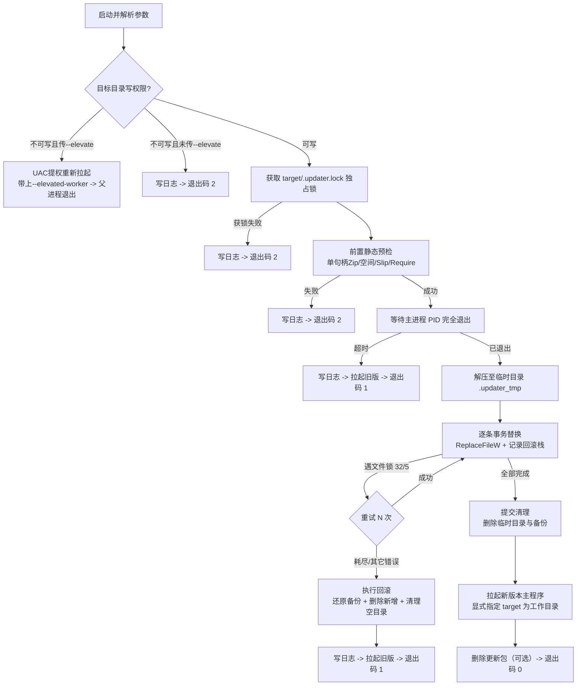

# Rust 版极简高可用 Windows 自动更新器 (updater-rs lite) 架构设计

> **版本**：v1.3.0 (Native Win32 GUI & Zero-Dependency Auto-Locale Switch)  
> **日期**：2026-09-14  
> **定位**：通用、轻量、高可靠的 Windows 单文件自动更新工具。  
> **核心原则**：**消除假想敌，聚焦真实风险；设计极致收敛，明确边界与权衡。**

---

## 1. 为什么需要“精简但可靠”的设计？

在过去的推演中，更新器设计引入了针对“万分之一概率极端事件”的大量防御机制（掉电 WAL 日志、看门狗套娃监控、世代备份 GC、Restart Manager 锁分析、非对称密钥轮换等），导致文档膨胀到 2000 多行，复杂度反客为主。

实际上，桌面应用的原地解压更新耗时通常仅为 **200ms ~ 2 秒**。在这短暂的窗口内：
- 电脑突然断电、硬件死机属于极端操作系统级灾难，无需在更新器内内置一套比 SQLite 还重的日志文件系统；
- 更新包通常由主程序通过 HTTPS/TLS 安全下载并由主程序自检 Hash，无需更新器内置完整的公钥基础设施；
- 用户需要的是：**不卡死、不误删数据、遇到文件被锁能自动重试、真的写失败了能自动回滚旧版本并重新拉起旧应用、不把应用搞丢**。

### 1.1 诚实面对工程边界：明确接受的风险与权衡 (Trade-offs)

1. **强杀场景风险明确接受**：
   - 本工具采用**进程内内存回滚栈**（In-Memory Rollback Stack）。它能 100% 覆盖**更新器在正常生命周期内遇到的所有运行时异常**（如杀软重试耗尽、权限失败、解压坏块、PE 校验失败等），并在失败时自动还原旧版本。
   - **边界**：如果更新器在写入的 1 秒钟内被外部不可抗力强杀（例如 `taskkill /f`、杀软终止、启动器清杀整个进程树），内存回滚栈随进程消亡，目录将停在“部分更新”状态，且本工具不提供 WAL 断点自愈。**我们明确接受这一极低概率风险**，这是剥离 1500 行 WAL 日志和看门狗套娃监控所必须付出的架构代价。遇此极端情况，由主程序提示或用户手动覆盖重新安装。
2. **自身在 target 内不自更新**：
   - 自身在 target 内运行时无条件跳过自身（防止自杀式文件锁），`target/updater.exe` 保持旧版不变；
   - 若主程序希望 updater 自身也能被更新，**必须将 updater 放置在 target 外部（如 `%TEMP%` 或应用私有临时目录）运行**。
3. **UAC 提权继承权衡**：
   - `--elevate` 提权后拉起的主程序将继承管理员令牌（不包含复杂的 Explorer 令牌降权复制）。需要普通权限的应用应避免将安装目录置于 `Program Files` 或由主程序自身先做好提权决策。

---

## 2. 总体架构与时序

更新器作为独立进程，遵循清晰的**单向线性生命周期**。所有状态均维护在内存与局部目录中，无需任何跨进程通信与事务日志。



---

## 3. 命令行契约

与原 Go 版保持高度兼容，参数精简直观：

```text
updater.exe --pid <PID> --zip <ZIP> --target <DIR> --launch <EXE> [options]
```

### 3.1 参数说明

| 参数 | 必选 | 默认值 | 说明 |
| :--- | :---: | :---: | :--- |
| `--pid` | 是 | - | 主程序进程 PID，更新器会等待其内核句柄完全释放 |
| `--zip` | 是 | - | 已下载完毕的更新包绝对路径 |
| `--target` | 是 | - | 待覆盖的目标安装目录 |
| `--launch` | 是 | - | 更新完成或回滚后拉起的可执行文件（相对 target 或绝对路径） |
| `--args` | 否 | `""` | 拉起主程序时附加的命令行参数 |
| `--keep` | 否 | - | 额外保护的相对路径，支持多次指定、支持通配符 |
| `--keep-file` | 否 | `.updatekeep` | 放置于 target 根目录的保护规则清单文件 |
| `--require` | 否 | - | 更新包中必须包含的相对路径（用于完整性防范，可多次指定） |
| `--sha256` | 否 | - | 可选的更新包 SHA-256 十六进制哈希，用于解压前校验 |
| `--strip` | 否 | `0` | 剥离更新包前 N 层目录（应对打包时多出的顶层根目录） |
| `--timeout` | 否 | `60` | 等待主进程完全退出的超时时间（秒） |
| `--write-retries` | 否 | `20` | 单文件替换失败时的重试次数（应对杀软/同步盘短暂锁） |
| `--write-delay-ms`| 否 | `500` | 每次重试等待毫秒数（20 × 500ms = 10秒，契合 Defender 扫描窗口） |
| `--max-uncompressed`| 否 | `4294967296` | 最大允许解压总量（字节，默认 4GB，防 Zip bomb 爆盘） |
| `--delete-zip` | 否 | `false` | 更新成功后自动删除 zip 包 |
| `--dry-run` | 否 | `false` | 仅输出写入/跳过计划与校验，不修改磁盘 |
| `--elevate` | 否 | `false` | 若目标目录无写权限，尝试通过 UAC 提权执行 |
| `--gui` | 否 | `false` | 开启原生 Win32 极简进度对话框（带跑马灯与百分比动效，杜绝假死） |
| `--gui-title` | 否 | 自动根据系统语言自适应 | 自定义 GUI 更新窗口标题（优先于默认标题） |
| `--silent` | 否 | `false` | 不输出到标准输出/控制台（若与 `--gui` 同时指定，则不显示窗口） |
| `--log` | 否 | `%TEMP%\updater-<时间戳>.log` | 日志输出路径 |
| `--elevated-worker` | 内部 | `false` | 内部标记：提权后的实例，防止递归提权死循环 |

### 3.2 退出码契约

| 退出码 | 含义 | 状态说明 |
| :---: | :--- | :--- |
| `0` | 更新成功 | 文件已全部更新，新版本主程序已拉起 |
| `1` | 运行时失败（已回滚） | 替换中途失败，已还原全部旧文件并尝试拉起旧版本，无数据损坏 |
| `2` | 预检或参数错误 | 未进行任何磁盘改动，主程序状态完好 |

---

## 4. 核心可靠性机制（汲取自 Win32 实战经验）

本设计虽然精简，但在处理 Windows 特有陷阱上绝不妥协，保留以下经过充分论证的可靠性方案：

### 4.1 句柄绑定的进程等待（彻底免疫 PID 重用）

在 Windows 下单纯根据 PID 轮询是不安全的，因为进程退出后 PID 极可能被系统迅速分配给无关的新进程。
- **机制**：通过 `OpenProcess(SYNCHRONIZE | PROCESS_QUERY_LIMITED_INFORMATION, FALSE, pid)` 获取进程内核句柄。
- **语义**：
  - 若返回 `ERROR_INVALID_PARAMETER (87)`，说明进程在打开前已完全退出，直接放行；
  - 若成功获取句柄，该句柄将永久绑定到**目标进程内核对象**。调用 `WaitForSingleObject(handle, timeout)` 等待。即使该 PID 随后被系统复用，句柄依然且仅在原进程彻底退出时触发。
  - 退出超时则直接报错退出，决不允许强行覆盖运行中的文件。

### 4.2 单实例互斥防并发

更新器在**确认拥有写权限后（或 UAC 提权成功后）**，在 target 目录下创建独占锁文件 `<target>/.updater.lock`（使用 `CreateFileW` 配合 `FILE_SHARE_READ`、独占写打开）。
- 若返回文件占用或共享冲突错误，说明已有另一更新实例正在运行，记录日志并以退出码 2 退出；
- 将锁的获取置于提权判定之后，彻底避免在普通权限下误将“无权写锁文件”当成锁冲突而阻断提权；
- 进程退出时（无论成功或失败）关闭句柄并清理该文件。

### 4.3 预检防 TOCTOU 与 Zip Bomb 防范

- **单句柄绑定**：使用 `CreateFileW` 以 `FILE_SHARE_READ` 独占/共享读模式打开 ZIP 文件一次，后续的 Hash 校验、中央目录解析、解压读取全部复用该句柄，防止在校验通过后、解压之前 ZIP 文件被外部篡改或替换（TOCTOU 风险）。
- **解压前全量校验**：
  - 检查 ZIP 是否合法、是否存在未支持的加密或压缩算法（仅支持 Store 0 与 Deflate 8）；
  - 校验 `--sha256`（若提供）；
  - **Zip Bomb 防范**：若解压总字节数超过 `--max-uncompressed`（默认 4GB），或单条目压缩比异常夸大（> 2000:1 且绝对解压体积 > 10MB），预检直接拒绝；
  - 检查目标磁盘剩余空间：`可用空间 >= 待写文件解压总量 + 最大单文件大小 + 10MB`；
  - 检查 `--require` 声明的必须文件是否齐全。

### 4.4 路径安全、Zip Slip 与内部保留名强拦截

解压条目写入目标磁盘前，必须经过严格的路径规范化与安全拦截：
1. **内部保留名强拦截（防备份树与锁篡改）**：条目规范化后若以 `.updater_tmp`、`.updater_bak`、`.updater.lock`、`.updater/` 开头或相等，**直接作为非法路径拒绝（退出码 2）**。绝不允许更新包通过打包恶意同名路径破坏回滚依赖的 `.updater_bak` 目录；
2. 剥离 `--strip` 声明的前 N 层目录；
3. 统一分隔符为 `\`，消除连续反斜杠与尾随空格/点；
4. 彻底拒绝带有盘符（如 `C:`）、绝对路径（以 `\` 开头）、包含 `..` 相对回退段的非法路径；
5. 目标路径拼接后，通过安全检查确保其规范化路径必须严格落在 `target` 目录树之内；
6. **长路径防护**：送入 Win32 API（`CreateFileW`、`ReplaceFileW` 等）的所有绝对路径统一规范化为 `\\?\` 扩展前缀（Verbatim Path），彻底免疫 Windows 默认 260 字符（`MAX_PATH`）限制，确保深层嵌套资源（如 Flutter assets）稳定可写。

### 4.5 保护清单与自身避让

- **保护清单（`.updatekeep` + `--keep`）**：
  - 目录规则：如 `userdata\`、`config/`（以斜杠结尾匹配该目录下全部内容）；
  - 通配符规则：如 `*.log`、`*.db`（使用 glob 模式）；
  - 精确规则：如 `settings.json`。
  - **命中保护规则的路径，更新器绝对不触碰（不覆盖、不删除、不重命名）。**
- **自身避让**：
  - 更新器启动时获取自身运行路径（`GetModuleFileNameW`）。
  - 若自身文件位于 `target` 目录内部，该**精确相对路径无条件加入永久跳过列表**（不区分大小写）。
  - 避免因 Windows 锁定自身可执行文件而导致自杀式写入失败。

---

## 5. 进程内事务回滚模型（取代 WAL 日志）

这是精简版能够丢弃 WAL 日志同时保持 100% 可靠的核心设计：**将事务维护在内存数据结构中，利用 `ReplaceFileW` 的原子备份特性进行内存级回滚。**

### 5.1 替换阶段划分

1. **准备阶段**：
   - 创建临时工作目录 `<target>/.updater_tmp`；
   - 创建备份工作目录 `<target>/.updater_bak`；
   - 内存中初始化回滚动作栈：`rollback_stack: Vec<Action>`。

2. **解压与条目分流**：
   - 遍历 ZIP 条目，进行**目录与文件分流处理**：
     - **若条目为目录（以 `/` 结尾）**：
       - 在 `target` 下递归创建该目录（`create_dir_all`）；
       - 记录回滚动作 `Action::RemoveDir(PathBuf)` 入栈，不调用文件替换 API。
     - **若条目为文件**：
       - 流式解压到临时文件 `<target>/.updater_tmp/<relative_path>`；
       - **【关键前置保证】**：调用 Win32 替换前，**必须递归创建 `dst`、`tmp`、`bak` 的父目录**（`ReplaceFileW` 内部不会自动创建 `bak` 的父目录，若父目录不存在将直接报错 `ERROR_PATH_NOT_FOUND (3)` 崩溃）；
       - 检查目标文件 `<target>/<relative_path>` 是否存在：
         - **若目标已存在**：
           - 调用 Win32 `ReplaceFileW(target_file, tmp_file, backup_file, REPLACEFILE_IGNORE_MERGE_ERRORS, NULL, NULL)`；
           - 旧文件原子挪入 `backup_file`，新文件替换至 `target_file`；
           - 记录回滚动作：`Action::RestoreReplaced { target_path, backup_path }` 入栈。
         - **若目标不存在（全新文件）**：
           - 调用 `MoveFileExW(tmp_file, target_file, MOVEFILE_REPLACE_EXISTING)`；
           - 记录回滚动作：`Action::RemoveAdded { target_path }` 入栈。

3. **锁冲突重试（应对杀软与系统扫描）**：
   - Windows 上的主要写入失败是瞬时锁冲突：`ERROR_SHARING_VIOLATION (32)` 或瞬时 `ERROR_ACCESS_DENIED (5)`（常见于 Windows Defender 实时扫描或同步盘）；
   - 对单文件替换提供循环重试（默认 15 次，每次间隔 300ms）；
   - 在重试窗口内若对方释放文件锁，即可顺利通过。

4. **异常回滚机制（Rollback）**：
   - 一旦某个文件重试耗尽仍然失败，立即**中止替换，触发回滚**：
     - 倒序遍历 `rollback_stack`：
       - `RestoreReplaced`：使用 `MoveFileExW` 将 `backup_path` 移回 `target_path`；
       - `RemoveAdded`：调用 `DeleteFileW` 删除新增的目标文件；
       - `RemoveDir`：逆序调用 `RemoveDirectoryW` 尝试删除新建的空目录（非空目录静默忽略，不报错）。
     - 清空并删除 `.updater_tmp` 与 `.updater_bak`；
     - 重新拉起旧版本主程序（`--launch`），让用户能够继续使用旧版本；
     - 记录错误日志，以退出码 `1` 退出。
   - **效果**：在极少数因环境异常失败的情况下，不会留下缺兵少将的损坏目录。

5. **成功提交（Commit）**：
   - 所有文件替换完成后，删除 `.updater_bak` 与 `.updater_tmp` 目录；
   - 若指定了 `--delete-zip`，释放 ZIP 文件句柄并执行删除；
   - 拉起新版本主程序，以退出码 `0` 退出。

---

## 6. UAC 提权防死循环

当目标应用安装在 `C:\Program Files` 等受保护目录且当前用户非管理员时：
1. 预检阶段如果探测到 `target` 目录不可写：
   - 若用户**未传** `--elevate`：直接报错退出码 2，提示权限不足；
   - 若用户**传了** `--elevate` 且当前实例**没有** `--elevated-worker` 参数：
     - 使用 `ShellExecuteExW`（verb: `"runas"`）以管理员身份重新拉起更新器自身，并追加 `--elevated-worker` 参数；
     - 当前父进程退出。
2. **防递归死循环守卫**：
   - 带有 `--elevated-worker` 的实例如果依然探测到 `target` 不可写（如只读介质、ACL 强行拒绝），**绝对不再调用 `runas`**，直接写日志并以退出码 2 退出。彻底杜绝无限弹 UAC 弹窗的死循环。

---

## 7. 拉起主程序

更新成功或回滚后，更新器负责拉起目标可执行文件：
- 目标路径解析：若 `--launch` 为相对路径，基于 `--target` 解析为绝对路径；
- 检查目标 EXE 存在且具有合法的 PE 结构（`MZ` 幻数及 `PE\0\0` 头）；
- 使用 `CreateProcessW` 启动，传入 `--args` 指定的命令行参数；
- **【关键工作目录】**：`CreateProcessW` 的 `lpCurrentDirectory` **必须显式传入 `target` 目录的绝对路径规范化字符串**（严禁传 `NULL`，避免继承临时目录导致主程序因找不到同级 DLL 与配置而闪退）；
- 创建标志包含 `DETACHED_PROCESS` 与 `CREATE_NEW_PROCESS_GROUP`，使其脱离更新器进程树独立生存；
- 随后更新器正常安全退出。

---

## 8. 零依赖原生 Win32 极简更新窗口与双语自适应机制 (Tier 2)

- **独立 UI 线程（彻底杜绝假死）**：
  - 为解决大包解压或杀软扫描导致窗口“(未响应)”变灰的问题，GUI 运行于专属后台线程，拥有独立的 Win32 `GetMessageW` 消息泵；
  - 主线程通过非阻塞 IPC 与 `PostMessageW(WM_APP + 1)` 投递进度，窗口重绘与拖动 100% 丝滑。
- **阶段化动效与安全防误杀**：
  - 等待旧版退出 / 哈希校验：自动启用原生跑马灯进度条 (`PBS_MARQUEE`)；
  - 文件替换阶段：平滑切换为百分比进度条 (`PBS_SMOOTH`，`0% ~ 100%`)，并在副标签显示当前文件名；
  - 关键替换期置灰禁用右上角关闭按钮 (`SC_CLOSE`)，防止用户误操作中断；
  - 窗体调用 `CreateFontW` 自动绑定系统微软雅黑平滑字体。
- **原生 Win32 零依赖系统语言与区域自适应**：
  - 调用 `kernel32.dll` 原生 API `GetUserDefaultUILanguage()`；
  - 若系统首选 UI 语言为 `0x0804`（简体中文大陆，`zh-CN`），全量文案自动展示中文；
  - 若系统为其它任意语言或区域（如 `en-US`, `zh-TW`, `ja-JP`, `de-DE` 等），一律自动平滑 Fallback 为英文；
  - 所有文案统一集中定义于 `rust/src/strings.rs`；若传入 `--gui-title`，以用户自定义为最高优先级。
- **Tier 2 降级隔离**：
  - 窗体创建失败或在 Session 0 下时，自动静默降级，不影响核心更新事务。

---

## 9. 依赖与模块设计

为了保证产物极小（400KB 以内）且无任何多余抽象，本方案采用经过实战验证的现代活跃生态：

### 9.1 依赖列表 (`Cargo.toml`)

```toml
[dependencies]
lexopt = "0.3.2"       # 活跃维护的高性能零开销命令行解析器
sha2 = "0.11.0"        # 现代活跃维护的标准 SHA-256 校验
windows-sys = { version = "0.61.2", features = [
    "Win32_Foundation",
    "Win32_Storage_FileSystem",
    "Win32_System_Threading",
    "Win32_Security",
    "Win32_UI_Shell",
    "Win32_System_ProcessStatus",
    "Win32_System_Registry",
    "Win32_UI_WindowsAndMessaging",
    "Win32_UI_Controls",
    "Win32_Graphics_Gdi",
    "Win32_System_LibraryLoader",
    "Win32_Globalization",
] }
zip = { version = "8.6.0", default-features = false, features = ["deflate"] }
```

### 9.2 模块划分 (约 800 行 Rust 代码)

```text
src/
├── main.rs         # 入口：流程控制与生命周期调度
├── args.rs         # 参数解析与校验 (含 --gui / --gui-title)
├── gui.rs          # 原生 Win32 极简进度对话框与独立 UI 线程
├── strings.rs      # 集中式 UI 文案与 Win32 原生区域自动切换 (zh-CN / 英文)
├── preflight.rs    # 前置预检：Zip 解析、哈希比对、Zip Slip 与空间检查
├── process.rs      # Win32 进程等待与拉起 (OpenProcess / CreateProcessW)
├── keep.rs         # 保护清单规则匹配 (.updatekeep 语义)
├── transaction.rs  # ReplaceFileW 替换、内存回滚表与进度回调
└── winutil.rs      # Win32 路径规范化、文件锁、UAC 提权辅助
```

---

## 10. 验收与测试策略

无需复杂的故障注入框架，精简版通过直接的集成回归用例与真实宿主程序进行验证：

1. **真实宿主测试**：由真实编译的 Windows 可执行文件（`mock_host_v1.exe`）主动触发更新并自我退出，验证更新器等待句柄、覆盖并拉起 `mock_host_v2.exe`。
2. **保护清单测试**：验证 `.updatekeep` 中指定的目录与文件在更新前后内容完全不变。
3. **自身位于 target 避让测试**：将 `updater.exe` 放置在安装目录中运行，更新包含同名 `updater.exe` 的更新包，验证自身被安全跳过，更新不崩溃。
4. **进程占用与回滚测试**：在替换过程中由测试脚本占用某个关键 DLL，制造 `ERROR_SHARING_VIOLATION`，验证更新器在重试耗尽后成功回滚所有已替换文件，恢复旧版状态，并成功拉起旧版主程序。
5. **安全攻击拦截测试**：验证包含内部保留名（`.updater_bak/` 等）、Zip Slip（`../evil.exe`）及 Zip bomb 的恶意包在预检阶段被直接拒绝。
6. **GUI 与中英文自适应测试**：验证中文路径、中文包内文件名、中文自定义参数，以及非 zh-CN 环境下的英文平滑切换。

---

## 11. 总结：与原设计及 v4.2 的诚实对比

| 特性维度 | 原 Go 版本 | v4.2/v4.3 架构设计 | 本精简版 (v1.3 Lite) |
| :--- | :--- | :--- | :--- |
| **代码量/实现规模** | ~960 行 Go | ~2600 行 Rust (设计文档 2200 行) | **~850 行 Rust (设计文档 350 行)** |
| **断电/强杀 WAL 日志**| 无 | 有 (多阶段 fsync/GEN 隔离) | **无 (极简设计，明确接受强杀不一致风险)** |
| **进程被外部强杀表现**| 目录半损坏，无回滚 | 依据 Journal 跨进程/跨启动自愈恢复 | **目录停在半更新，无自愈（需全量重装/重跑）** |
| **正常中途失败回滚** | 无 (部分损坏) | 有 (依据 Journal 对账回滚) | **有 (基于 ReplaceFileW 内存回滚表)** |
| **自身在 target 内更新**| 不支持（跳过自身） | 支持（影子 Worker + .del 机制） | **不支持（跳过自身，需从外部目录运行更新）** |
| **内部保留名安全拦截**| 部分拦截 | 权威层强拦截 | **权威层强拦截（.updater_bak 等禁止入包）** |
| **界面表现** | 纯命令行静默 | 规划中被删除 | **支持可选原生 Win32 GUI + 双语自适应** |
| **看门狗套娃进程** | 无 | 有 (L2 恢复看门狗) | **无 (单进程简洁设计)** |
| **上一版本留存/GC** | 无 | 有 (previous 目录 + 7天 TTL) | **无 (不越界做包管理器)** |
| **Win32 进程等待** | PID 轮询 | 内核句柄绑定 | **内核句柄绑定 (免疫 PID 重用)** |
| **锁冲突重试** | 10 次 × 300ms | 20 次 × 500ms + RM 诊断 | **20 次 × 500ms (10秒 Defender 覆盖)** |
| **产物体积与依赖** | 2.3 MB | 依赖较多 | **~366 KB 单文件（零第三方 GUI 依赖）** |

本设计去除了令人生畏的过度工程与分析瘫痪，明确界定了自身边界与风险接受范围（接受强杀风险以换取极简），同时在 Win32 进程等待、`ReplaceFileW` 原子覆盖、运行时异常回滚以及内部保留名防御上实现了坚实的工程闭环。
